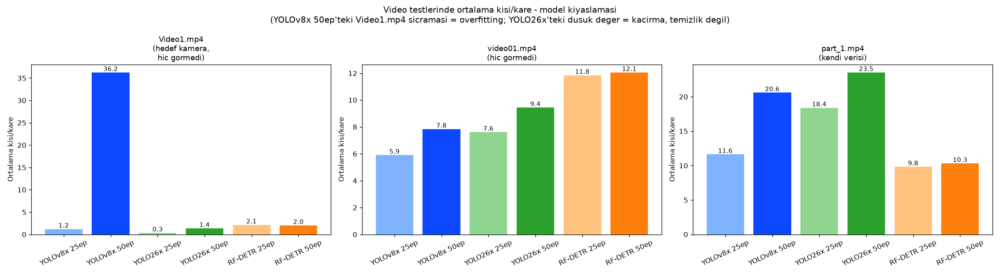
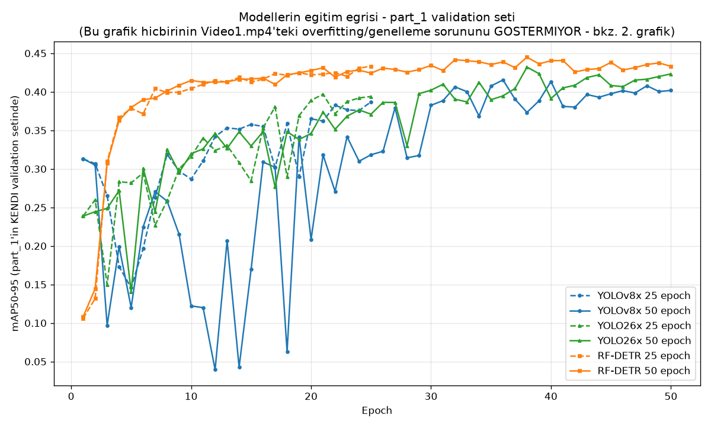

# Model Karşılaştırması — YOLOv8x, YOLO26x, RF-DETR

Bu dosya, `part_1` verisiyle eğitilen tüm model denemelerini bir arada özetler:

| # | Model | Klasör | report.md |
|---|---|---|---|
| 1 | YOLOv8x, 25 epoch | `yolov8x_part1_finetune/` | [rapor](yolov8x_part1_finetune/report.md) |
| 2 | YOLOv8x, 50 epoch | `yolov8x_part1_finetune_50ep/` | [rapor](yolov8x_part1_finetune_50ep/report.md) — **OVERFIT, kullanma** |
| 3 | YOLO26x, 25 epoch | `yolo26x_part1_finetune/` | [rapor](yolo26x_part1_finetune/report.md) |
| 4 | YOLO26x, 50 epoch | `yolo26x_part1_finetune_50ep/` | [rapor](yolo26x_part1_finetune_50ep/report.md) |
| 5 | RF-DETR-Medium, 25 epoch | `rfdetr_part1_finetune/` | [rapor](rfdetr_part1_finetune/report.md) |
| 6 | RF-DETR-Medium, 50 epoch | `rfdetr_part1_finetune_50ep/` | [rapor](rfdetr_part1_finetune_50ep/report.md) |

---

## En önemli bulgu: YOLO ailesi (her iki nesli de) hedef kamerada RF-DETR'in gerisinde

`Video1.mp4` (modelin HİÇBİRİNİN eğitimde görmediği, projenin asıl hedef kamerası) üzerinde ortalama kişi/kare:

| | Değer | Yorum |
|---|---|---|
| YOLOv8x 25ep | 1.22 | Zayıf — çoğu gerçek kişiyi kaçırıyor |
| **YOLOv8x 50ep** | **36.24** | **Overfitting — ağaç/çalı gibi rastgele dokulara "insan" diyor** |
| YOLO26x 25ep | 0.32 | Çok zayıf — bilinen test karesindeki 2 kişiden hiçbirini bulamıyor |
| YOLO26x 50ep | 1.35 | Hâlâ zayıf — sayı yükseldi ama aynı test karesinde yine hiçbir gerçek kişiyi bulamadı, sadece belirsiz bir kutu daha |
| RF-DETR 25ep | 2.14 | Sağlıklı |
| RF-DETR 50ep | 2.00 | Sağlıklı, neredeyse sabit |

**Sonuç:** YOLO ailesinin HER İKİ nesli de (v8x ve v26x), HER İKİ epoch sayısında da (25 ve 50), bu küçük/dar (240 görsel, tek kamera) veri setiyle fine-tune edildiğinde, hedef kamerada RF-DETR'e göre belirgin şekilde daha zayıf genelliyor — YOLOv8x-50ep'in "aşırı gürültü", diğer YOLO denemelerinin "eksik tespit" olmak üzere iki farklı şekilde başarısız oluyorlar, ama hiçbiri RF-DETR kadar güvenilir değil.

---

## conf (güven eşiği) denemeleri — eşik ayarı kök sorunu çözmüyor

`part_1.mp4` üzerinde eşiği 0.15'ten 0.3'e çıkarınca:

| Model | conf=0.15 | conf=0.3 | Yorum |
|---|---|---|---|
| YOLOv8x 50ep | 20.60 | 11.66 | Neredeyse 25ep seviyesine indi (11.63) — gürültünün çoğu düşük güvenliymiş |
| YOLO26x 50ep | 23.52 | 18.56 | Kısmen azaldı ama hâlâ yüksek — YOLOv8x kadar temiz bir düzelme değil |

**Ders:** Eşik ayarı bazı modellerde (YOLOv8x) yüzeysel gürültüyü temizleyebiliyor, ama `Video1.mp4`'teki asıl genelleme sorununu (gerçek insanları kaçırma) HİÇBİRİNDE çözmüyor — kök neden veri/model, eşik değil.

---

## Eğitim eğrileri — neden bu sorunu ÖNCEDEN göremedik

Modellerin kendi `part_1` validation setindeki mAP50-95 eğrisi — **hepsi normal/iyi görünüyor**, hiçbirinde Video1.mp4'teki zayıflığa dair bir işaret yok. Sebebi basit: validation seti de `part_1`'in AYNI kamerasından, yani "bu model kendi alanında ne kadar iyi" ölçüyor, "başka bir kamerada ne kadar iyi" sorusuna cevap veremez. RF-DETR'in eğrisi (turuncu) YOLO ailesine (mavi/yeşil) göre çok daha hızlı ve DÜZGÜN yakınsıyor.

**Ders:** Formal metrikler (mAP, precision, recall) TEK BAŞINA yeterli değil — gerçek, farklı bir kamerada video testi yapmadan bir modelin genelleme yeteneğini bilemezsin.

---

## Tüm sayısal metrikler bir arada

| Metrik | YOLOv8x 25ep | YOLOv8x 50ep | YOLO26x 25ep | YOLO26x 50ep | RF-DETR 25ep | RF-DETR 50ep |
|---|---|---|---|---|---|---|
| Precision (kendi val. seti) | 0.709 | 0.719 | 0.663 | 0.704 | 0.718 | 0.706 |
| Recall (kendi val. seti) | 0.674 | 0.721 | 0.713 | 0.767 | 0.762 | 0.765 |
| mAP50 (kendi val. seti) | 0.707 | 0.720 | 0.706 | 0.746 | 0.765 | 0.756 |
| mAP50-95 (kendi val. seti) | 0.387 | 0.402 | 0.394 | 0.431 | 0.433 | 0.433 |
| Eğitim süresi | ~8 dk | ~16 dk | ~9 dk | ~18 dk | ~11 dk | ~22 dk |
| Inference hızı (part_1.mp4) | ~10 fps | ~9.9 fps | ~14.1 fps | ~14.4 fps | ~23 fps | ~23 fps |
| **Video1.mp4 ort. kişi/kare** | 1.22 | **36.24 (bozuk)** | 0.32 (kaçırıyor) | 1.35 (kaçırıyor) | 2.14 | 2.00 |
| video01.mp4 ort. kişi/kare | 5.90 | 7.84 | 7.61 | 9.44 | 11.84 | 12.05 |
| part_1.mp4 ort. kişi/kare | 11.63 | 20.60 | 18.39 | 23.52 | 9.82 | 10.32 |

**Not:** RF-DETR, inference hızında da YOLO ailesinin ~1.6-2.3 katı hızlı — yani sadece daha doğru/güvenilir değil, aynı zamanda daha hızlı.

---

## Genel sonuç ve öneri

1. **RF-DETR-Medium, 25 epoch** (`rfdetr_part1_finetune/`) açık ara en dengeli/güvenilir seçim: iyi metrikler, en hızlı inference, hem kendi verisinde hem yabancı kameralarda tutarlı, fazla eğitime karşı dayanıklı.
2. **YOLOv8x, 50 epoch** kullanılmamalı — ciddi overfitting var.
3. Diğer 3 YOLO denemesi (YOLOv8x-25ep, YOLO26x-25ep, YOLO26x-50ep) makul ama RF-DETR'in belirgin gerisinde, özellikle hedef kamerada (Video1.mp4) — hepsi gerçek insanları kaçırma eğiliminde.
4. Ne YOLOv8x ne YOLO26x için 50 epoch'un 25'e göre net bir faydası çıkmadı; RF-DETR için de aynı durum. Bu veri boyutunda (240 görsel) 25 epoch genelde yeterli.
5. Eşik (confidence) ayarı yüzeysel gürültüyü azaltabilir ama asıl genelleme sorununu çözmüyor.

**Sıradaki mantıklı adım:** Modeli değil, VERİYİ büyütmek — `Video1.mp4`'ten ve Bellevue veri setinden yeni örnekler etiketleyip `part_1` ile birlikte eğitmek, RF-DETR'in zaten güçlü olan genelleme yeteneğini daha da pekiştirmek.
