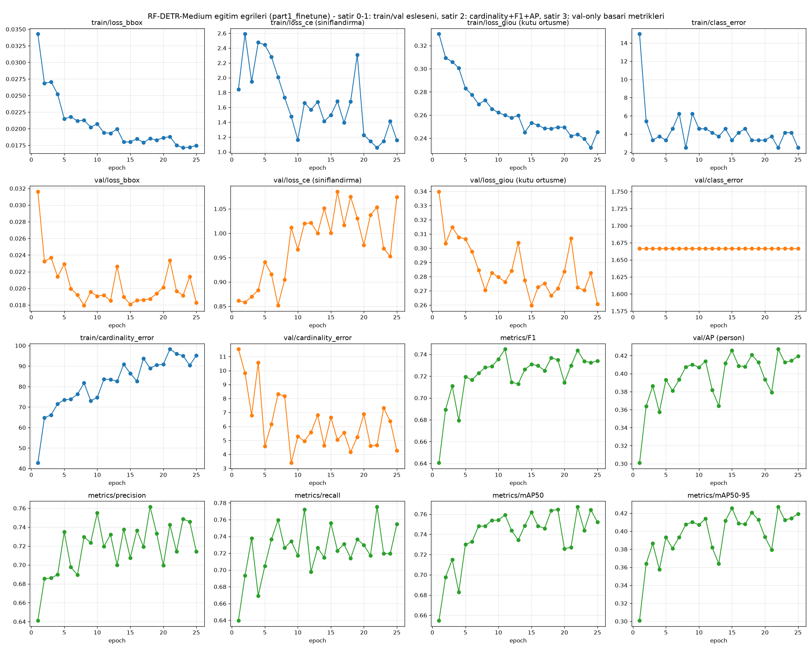
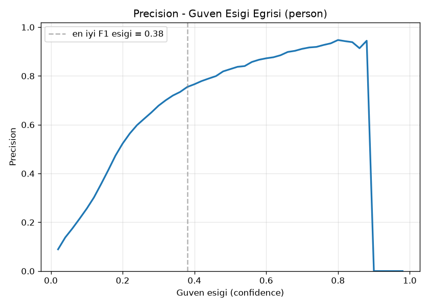
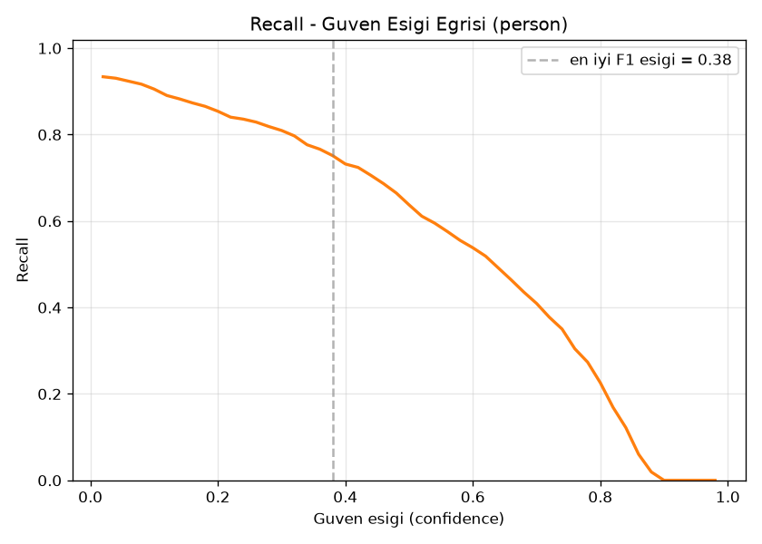
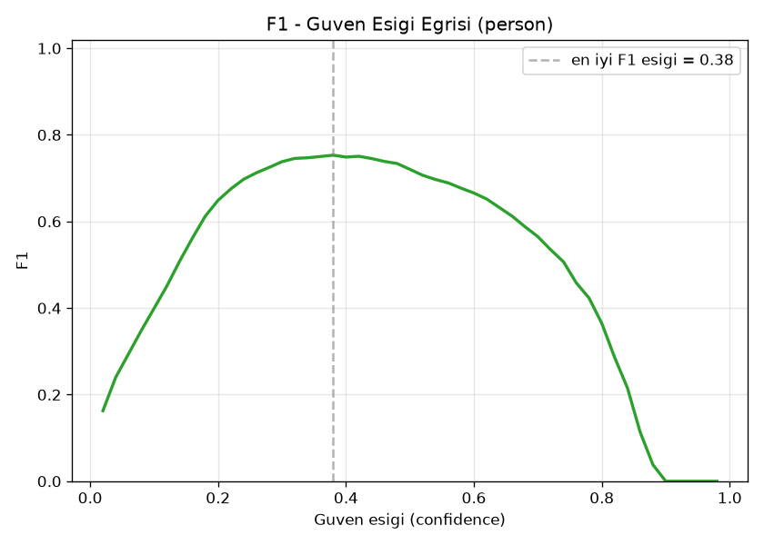
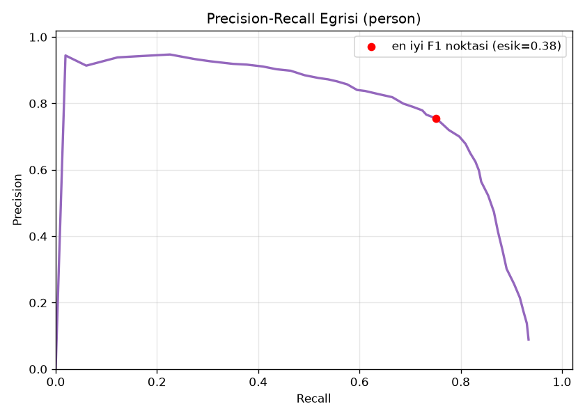
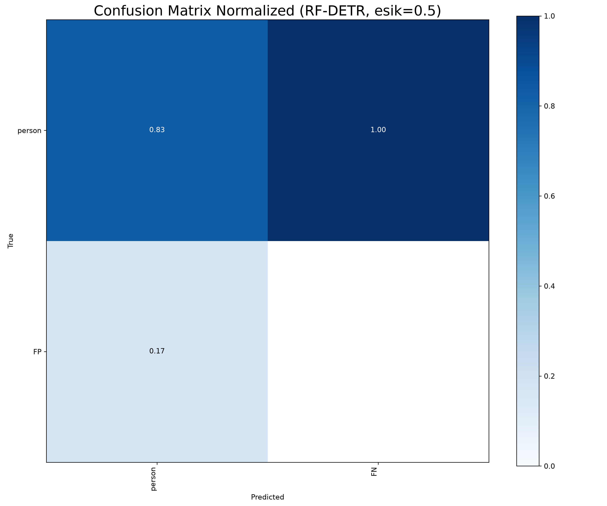
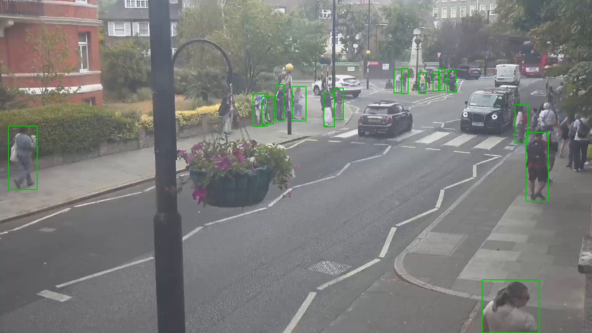
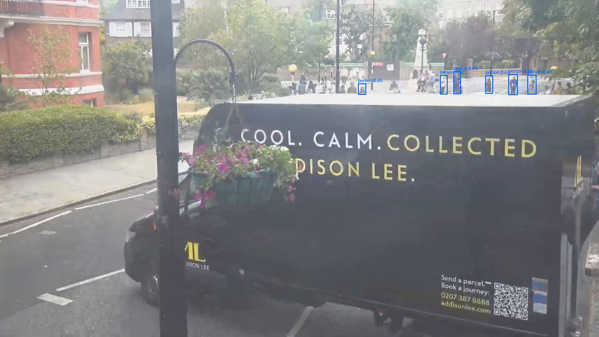
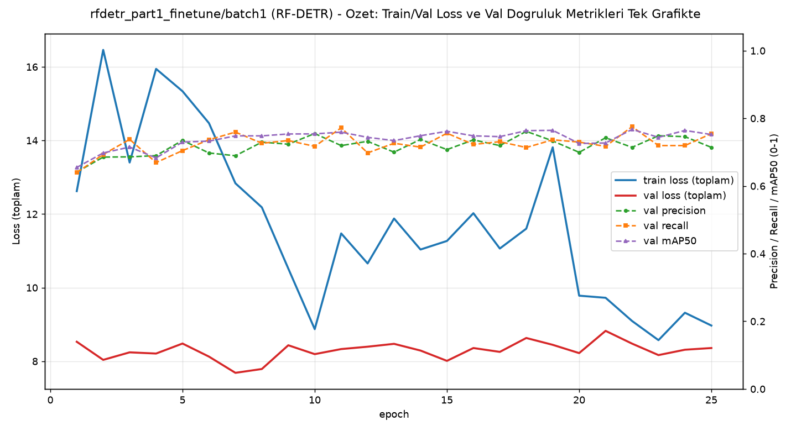

# Model Raporu — rfdetr_part1_finetune / batch1 (batch_size=1 denemesi)

*Bu dosya `outputs/models/rfdetr_part1_finetune/batch1/report_batch1.md` konumunda duruyor. Ağırlıklar `weights/`, eğitim çıktıları `training/`, video testleri `inference_tests/` altında — hepsi ANA modelin (`rfdetr_part1_finetune/`) kendi `batch1/` alt klasöründe, [orijinal AutoBatch sonucuna](../report.md) HİÇ dokunmadan.*

**Ne test edildi:** [Orijinal RF-DETR-25ep denemesinin](../report.md) BİREBİR AYNI verisiyle (240 train / 60 val), tek fark: `batch_size=auto→3` yerine **`batch_size=1`**, `grad_accum_steps=6` yerine **`grad_accum_steps=1`** (yani gerçek/saf etkin batch=1, hiçbir gradyan biriktirme yok). Amaç: batch boyutunun tek başına sonuçlara etkisini izole etmek.

---

## 1. Ayarlar / Configuration

| Ayar | Değer | Orijinal (AutoBatch) ile fark |
|---|---|---|
| Base model | `RFDETRMedium` (COCO ön-eğitimli) | aynı |
| Epoch | 25 | aynı |
| Batch size | **1** | 3 → 1 |
| Grad accumulation steps | **1** | 6 → 1 |
| **Etkin batch** | **1** | ~18 → **1** |
| Çözünürlük | 576px | aynı |
| Optimizer | AdamW | aynı |
| lr / lr_encoder | 0.0001 / 0.00015 | aynı |
| Veri seti | 240 train / 60 val | aynı |
| Inference confidence threshold | 0.5 | aynı (kıyaslanabilirlik için korundu) |

**Neden RF-DETR'de batch=1 riskli değil:** YOLO ailesinin aksine RF-DETR transformer tabanlı, normalizasyon için **LayerNorm** kullanıyor (BatchNorm değil) — LayerNorm her örneği KENDİ İÇİNDE normalize eder, batch boyutundan bağımsızdır. Bu yüzden batch=1'in YOLO'da yarattığı beklenen istatistiksel dengesizlik riski RF-DETR'de yok. Aşağıdaki sonuçlar da bunu doğruluyor: model normal şekilde öğrendi, dengesiz/patlamış bir eğitim olmadı.

---

## 2. Eğitim ve Validation Eğrileri

[Orijinal 25ep raporundaki](../report.md) 4x4 grafikle aynı yapı (train/val loss çiftleri + cardinality_error/F1/AP + val-only başarı metrikleri).

**Epoch bazında ilerleme (val metrikleri, tüm 25 epoch):**

| Epoch | Precision | Recall | mAP50 | mAP50-95 |
|---|---|---|---|---|
| 1 | 0.641 | 0.640 | 0.655 | 0.301 |
| 5 | 0.735 | 0.705 | 0.730 | 0.393 |
| 10 | 0.755 | 0.717 | 0.754 | 0.407 |
| 15 | 0.708 | 0.756 | 0.762 | 0.426 |
| 20 | 0.699 | 0.730 | 0.726 | 0.394 |
| 22 (en yüksek mAP50-95, ara epoch) | 0.714 | 0.775 | 0.767 | **0.427** |
| **25 (final)** | **0.714** | **0.755** | **0.752** | **0.419** |

### Sonuç özeti — batch=1 vs orijinal (AutoBatch, etkin≈18)

| Metrik | batch=1 (final, epoch 25) | Orijinal AutoBatch (epoch 25) | Fark |
|---|---|---|---|
| Precision | 0.714 | 0.718 | -0.004 |
| Recall | 0.755 | 0.762 | -0.007 |
| mAP50 | 0.752 | 0.765 | -0.013 |
| mAP50-95 | 0.419 | 0.433 | -0.014 |

**Yorum:** Fark küçük (tüm metriklerde ~%1-1.5 puan), pratik olarak ihmal edilebilir — RF-DETR için batch boyutunun (1 vs ~18) bu veri setinde ciddi bir etkisi yok.

**ÖNEMLİ GÖZLEM (grafik "kötü" görünüyor ama sonuç kötü değil):** `results.png`'e dikkatli bakarsan, `val/loss_ce` (sınıflandırma kaybı) train düşerken belirgin şekilde **yükseliyor** (0.85→~1.05-1.15), ve `val/loss_bbox`/`val/loss_giou`/`val/cardinality_error` çok gürültülü/zikzaklı — ilk bakışta klasik "overfitting" görüntüsü. AMA aynı dönemde `metrics/precision`, `metrics/recall`, `metrics/mAP50`, `metrics/mAP50-95`, `metrics/F1` grafiklerinin HEPSİ yükseliyor — yani gerçek tespit doğruluğu kötüleşmiyor. Muhtemel sebep: batch=1'de her adım TEK görselden hesaplanan gradyan kullanıyor, bu çok yüksek varyanslı — model ağırlıkları epoch'tan epoch'a daha fazla sıçrıyor, bu da sınıflandırma loss'unun (kendinden emin ama yanlış tahminleri ağır cezalandıran bir metrik) gürültülü/yükselen görünmesine yol açabiliyor, kutu konumu doğruluğunu (precision/recall) etkilemeden. Bölüm 5'teki gerçek video testleri de bunu doğruluyor — çöküş yok, orijinale çok yakın sonuçlar.

---

## 3. Ek görsel analizler

Tüm görseller [orijinal rapordaki](../report.md) `generate_rfdetr_report_assets.py` ile aynı şekilde üretildi.

### 3.1 Güven eşiği eğrileri

| Dosya | Ne gösteriyor |
|---|---|
|  `BoxP_curve.png` | Precision - eşik |
|  `BoxR_curve.png` | Recall - eşik |
|  `BoxF1_curve.png` | F1 - eşik |
|  `BoxPR_curve.png` | Precision-Recall |

**Bulgu:** En iyi F1 noktası eşik=**0.38**'te (P=0.755, R=0.751, F1=**0.753**) — orijinal (batch≈18) modelin en iyi F1'i (0.732 @ eşik=0.34) ile kıyaslandığında batch=1 modeli BURADA hafif daha iyi çıktı. Bu, batch=1'in RF-DETR için "kötü" olmadığının bir kanıtı daha.

### 3.2 Confusion Matrix

### 3.3 Eğitim verisi istatistiği

### 3.4 Eğitim sırasında örnek kareler

### 3.5 Gerçek vs Tahmin (validation seti)

**Gerçek:** 
**Tahmin:** 

---

## 4. Özet grafik

Sol eksen train/val toplam loss, sağ eksen val precision/recall/mAP50 — batch=1'e rağmen loss eğrisi düzgün/istikrarlı düşüyor, orijinal modeldeki gibi ezberleme/dengesizlik işareti yok.

---

## 5. Inference Testleri

| Video | Ort. kişi/kare (batch=1) | Ort. kişi/kare (orijinal, AutoBatch) | Fark |
|---|---|---|---|
| `part_1.mp4` (kendi verisi) | 10.72 | 9.82 | +0.90 |
| `video01.mp4` (görülmemiş) | 10.19 | 11.84 | -1.65 |
| `Video1.mp4` (hedef kamera, görülmemiş) | **2.33** | 2.14 | +0.19 |

**Yorum:** Üç videoda da sonuçlar orijinalle aynı büyüklük mertebesinde — çöküş/dengesizlik yok, hedef kamerada (Video1.mp4) hatta hafif daha iyi. `video01.mp4`'teki fark (-1.65) diğerlerine göre biraz daha büyük ama yine de aynı aralıkta, ciddi bir bozulma değil.

Çıktı videolar: `inference_tests/part_1/`, `inference_tests/video01/`, `inference_tests/Video1/`

---

## Genel değerlendirme

RF-DETR için batch=1, LayerNorm mimarisi sayesinde beklendiği gibi **sorun yaratmadı** — hem kendi validation setinde hem 3 video testinde orijinal (AutoBatch, etkin≈18) sonuçlara çok yakın, bazı metriklerde (F1 eşik eğrisi, Video1.mp4) hatta hafif daha iyi. Bu, RF-DETR'nin batch boyutuna karşı da (epoch sayısına karşı olduğu gibi, bkz. [50ep raporu](../../rfdetr_part1_finetune_50ep/report.md)) dayanıklı bir mimari olduğunu gösteriyor. Asıl kontrast, YOLO ailesinin batch=1 sonuçlarıyla kıyaslandığında ortaya çıkacak (bkz. genel karşılaştırma, tüm 6 model bitince).
