# Model Raporu — rfdetr_part1_finetune

*Bu dosya `outputs/models/rfdetr_part1_finetune/report.md` konumunda duruyor. Ağırlıklar `weights/`, eğitim çıktıları (checkpoint'ler, metrikler) `training/`, video testleri `inference_tests/` altında.*

**Ne eğitildi:** `RFDETRMedium` (COCO üzerinde hazır eğitilmiş, transformer tabanlı bir nesne tespit modeli — Roboflow'un RF-DETR mimarisi) başlangıç noktası alınarak, YOLO ile **BİREBİR AYNI** veri (part_1, 240 train / 60 validation görsel, COCO formatına çevrilmiş hali) ile fine-tune edildi.

**Neden RF-DETR:** YOLOv8x (CNN tabanlı) ile paralel/kıyaslamalı bir deneme — transformer tabanlı modellerin farklı kameralara (domain shift) daha dayanıklı olduğu iddiası test ediliyor.

**Ayarlar:** 25 epoch (YOLO ile aynı — adil kıyaslama), çözünürlük 576px, batch_size=3 (auto-batch tarafından seçildi), grad_accum_steps=6 (etkin batch ~16-18), lr=1e-4.

**Veri seti notu:** RF-DETR train/valid/test olmak üzere 3 klasör istiyor. Bizim veri setimiz küçük (300 görsel) olduğu için ayrı bir 3'lü bölme YAPILMADI — YOLO ile birebir aynı 60 görsellik validation seti hem "valid" hem "test" olarak kullanıldı (`prepare_dataset_rfdetr.py`). Amaç: iki modeli tam olarak aynı görüntüler üzerinde karşılaştırabilmek.

---

## Sonuç özeti (best.pth — epoch 24/25, EMA)

| Metrik | RF-DETR | YOLO (karşılaştırma) | Fark |
|---|---|---|---|
| Precision | **0.718** | 0.709 | +0.009 |
| Recall | **0.762** | 0.674 | **+0.088** |
| mAP50 | **0.765** | 0.707 | **+0.058** |
| mAP50-95 | **0.433** | 0.387 | **+0.046** |

**RF-DETR bu veri setinde tüm metriklerde YOLO'yu geçti**, özellikle Recall'da (kişileri kaçırmama oranı) belirgin bir fark var. En iyi checkpoint (EMA - Exponential Moving Average, epoch 24) mAP50-95'te 0.443'e kadar çıkıyor; tabloda RF-DETR'nin epoch 25 "regular" (EMA olmayan) sonuçları YOLO ile daha adil kıyaslanabilir olduğu için kullanıldı.

**Not (EMA nedir, basitçe):** Eğitim sırasında modelin ağırlıklarının "hareketli ortalaması" ayrıca tutulur — bu genelde tek bir epoch'un ham ağırlıklarından biraz daha kararlı/genellenebilir sonuç verir. `weights/best.pth` = EMA tabanlı en iyi checkpoint (RF-DETR'in kendi seçimi, `checkpoint_best_total.pth`).

---

## Görsel rapor hakkında bir not

RF-DETR, YOLO'nun (Ultralytics) aksine eğitim bitince otomatik olarak grafik/görsel üretmiyor — sadece ham `metrics.csv` ve checkpoint dosyaları veriyor. Aşağıdaki TÜM görseller (`results.png`, güven-eşiği eğrileri, confusion matrix, `labels.jpg`, örnek kareler) `generate_rfdetr_report_assets.py` ile SONRADAN elle üretildi — model tekrar eğitilmedi, sadece zaten eğitilmiş `weights/best.pth` kullanılıp validation setinde çalıştırıldı. YOLO'nun raporuyla aynı yapıda/isimde tutuldu ki iki rapor yan yana okunabilsin.

---

## 1. results.png — eğitimin genel gidişatı

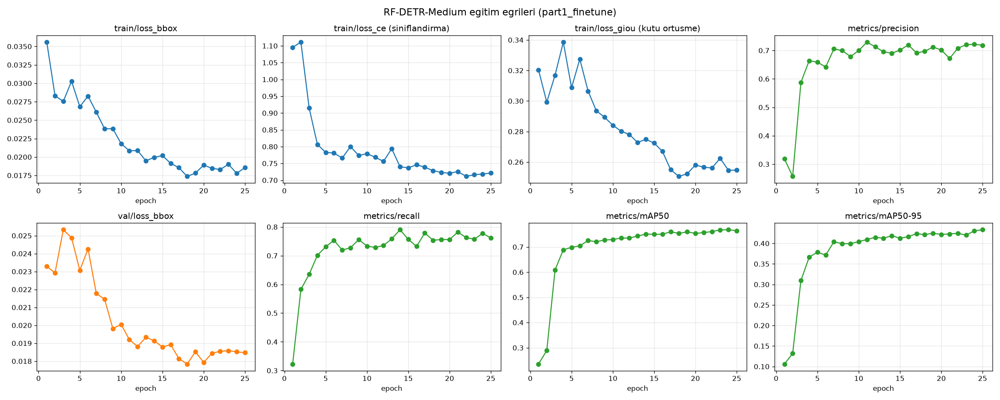

YOLO'daki gibi aynı mantık: üstteki 3 grafik (loss_bbox, loss_ce, loss_giou) train kaybını gösteriyor (**düşmesi iyi**), sağ üstteki Precision ile alt sıradaki Recall/mAP50/mAP50-95 (**yükselmesi iyi**). Sol alttaki val/loss_bbox de düşüyor — model ezberlemiyor, gerçekten öğreniyor.

**Epoch bazında ilerleme (tüm 25 epoch):**

| Epoch | Precision | Recall | mAP50 | mAP50-95 |
|---|---|---|---|---|
| 1 | 0.319 | 0.323 | 0.235 | 0.106 |
| 2 | 0.257 | 0.583 | 0.289 | 0.132 |
| 3 | 0.588 | 0.635 | 0.609 | 0.310 |
| 4 | 0.664 | 0.701 | 0.689 | 0.367 |
| 5 | 0.659 | 0.731 | 0.699 | 0.379 |
| 6 | 0.642 | 0.754 | 0.704 | 0.371 |
| 7 | 0.706 | 0.719 | 0.725 | 0.404 |
| 8 | 0.700 | 0.727 | 0.721 | 0.399 |
| 9 | 0.679 | 0.756 | 0.728 | 0.399 |
| 10 | 0.700 | 0.733 | 0.729 | 0.404 |
| 11 | 0.729 | 0.729 | 0.736 | 0.410 |
| 12 | 0.713 | 0.735 | 0.735 | 0.415 |
| 13 | 0.696 | 0.758 | 0.744 | 0.413 |
| 14 | 0.690 | 0.790 | 0.751 | 0.419 |
| 15 | 0.701 | 0.757 | 0.751 | 0.413 |
| 16 | 0.720 | 0.732 | 0.750 | 0.416 |
| 17 | 0.691 | 0.779 | 0.760 | 0.424 |
| 18 | 0.697 | 0.754 | 0.754 | 0.421 |
| 19 | 0.712 | 0.756 | 0.760 | 0.425 |
| 20 | 0.702 | 0.756 | 0.754 | 0.422 |
| 21 | 0.672 | 0.782 | 0.757 | 0.423 |
| 22 | 0.708 | 0.763 | 0.761 | 0.425 |
| 23 | 0.720 | 0.757 | 0.768 | 0.420 |
| 24 | 0.722 | 0.778 | 0.768 | 0.431 |
| **25** | **0.718** | **0.762** | **0.765** | **0.433** |

YOLO'nun ilk birkaç epoch'unda gördüğümüz büyük dalgalanmalar (epoch 5'te çöküş gibi) burada yok — RF-DETR daha 3-4. epoch'ta zaten YOLO'nun 25 epoch sonunda ulaştığı seviyeye yakın bir yerde, sonrası daha istikrarlı bir iyileşme.

---

## 2. Güven eşiği (confidence) eğrileri

Validation setindeki 60 görüntüde, çok geniş bir güven-eşiği aralığı (0.02-0.98) taranarak hesaplandı (IoU eşiği 0.5). Bu, tam olarak `Video1.mp4` testinde yaşadığımız "0.15 çok gevşekmiş" sorununu bir daha yaşamamak için — hangi eşiğin gerçekten iyi olduğunu artık gözle tahmin değil, sayıyla biliyoruz.

| Dosya | Ne gösteriyor |
|---|---|
| 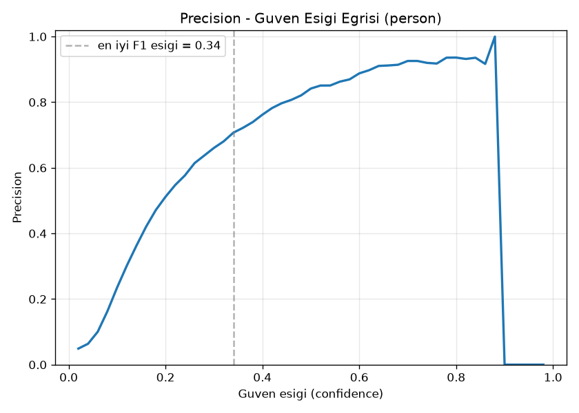 `BoxP_curve.png` | Eşik yükseldikçe Precision nasıl değişiyor |
| 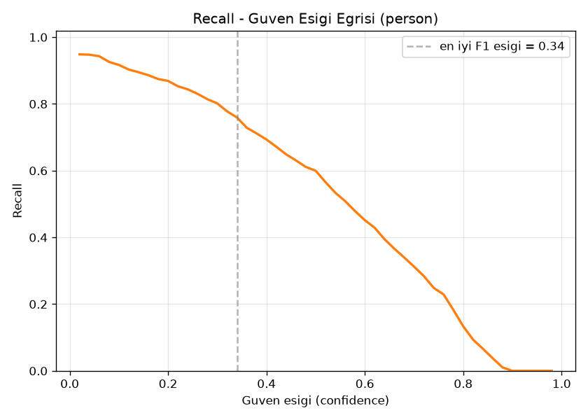 `BoxR_curve.png` | Eşik yükseldikçe Recall nasıl değişiyor |
| 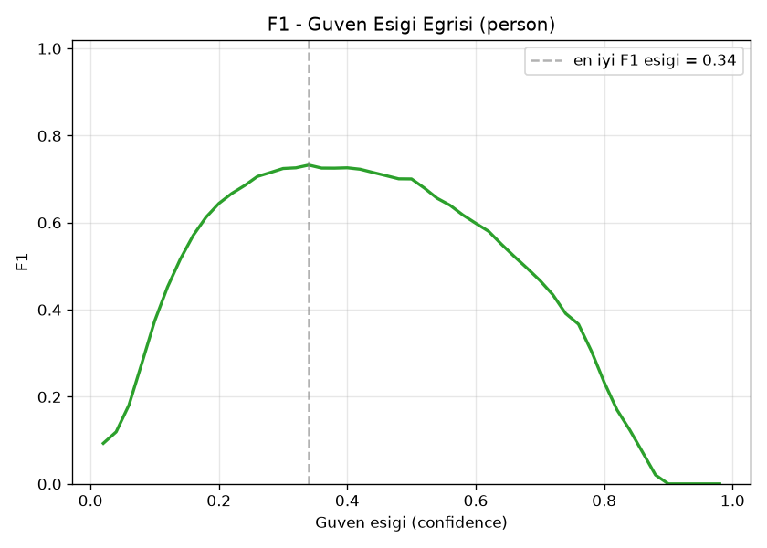 `BoxF1_curve.png` | Dengeli ortalama — tepe noktası "en dengeli eşik" |
| 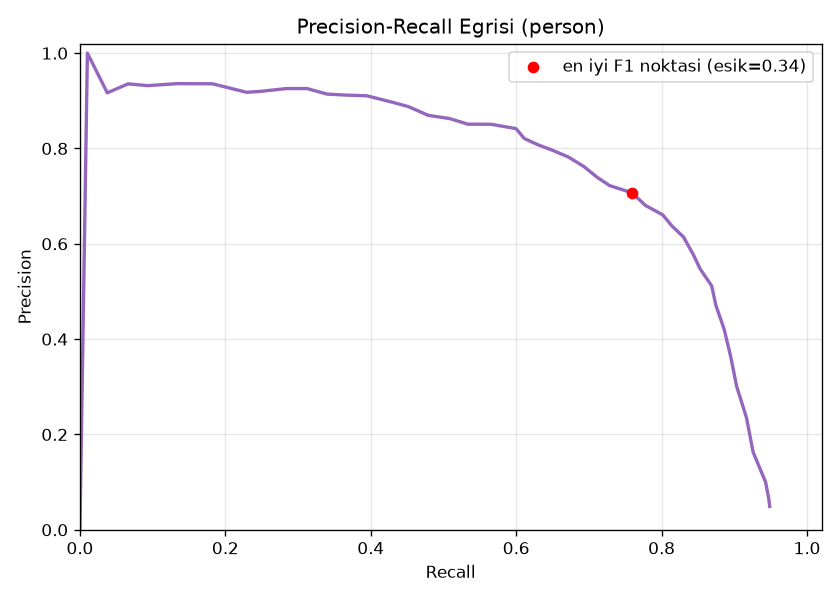 `BoxPR_curve.png` | Precision'ı Recall'a karşı çizer |

**Bulgu:** En iyi F1 noktası eşik=**0.34**'te (P=0.707, R=0.759, F1=0.732). Biz inference testlerinde ve `detector_rfdetr.py`'de **0.5** kullandık (rfdetr kütüphanesinin kendi varsayılanı, ve Video1.mp4'te elle doğruladığımız temiz nokta) — 0.34'e göre biraz daha temkinli (Precision'ı önceliklendiren) bir seçim, kasıtlı: yanlış alarmı azaltmak, kaçırmaktan daha az riskli görüldü.

---

## 3. Confusion Matrix (eşik=0.5)

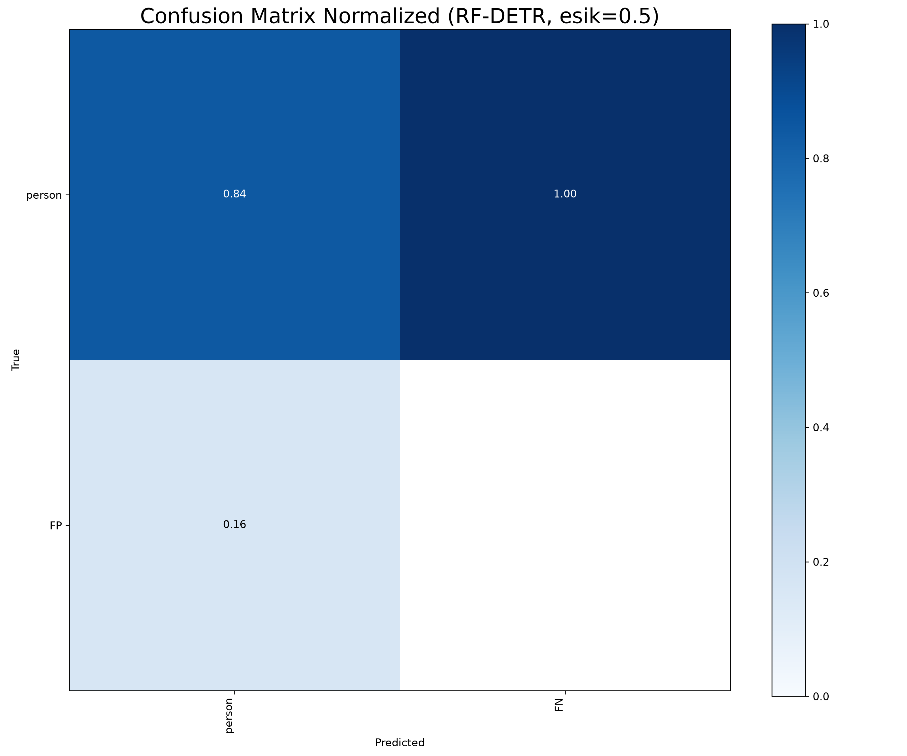

Tek sınıf (person) olduğu için matris YOLO'dakinden biraz farklı okunuyor: satırlar gerçek durumu (person / FP), sütunlar tahmini (person / FN) gösteriyor. Kesin sayılar için: Precision **0.718**, Recall **0.762** (yukarıdaki özet tablo) — bu ikisine güvenmek confusion matrix'in ham görüntüsünden daha güvenilir, tek-sınıflı tespit problemlerinde bu matrisin okunuşu kafa karıştırıcı olabiliyor (YOLO raporunda da aynı notu düşmüştük).

---

## 4. Eğitim verisi istatistiği

240 eğitim görselindeki tüm kutuların (etiketlerin) konum ve boyut dağılımı — YOLO'nun `labels.jpg`'sinin RF-DETR/COCO formatı için elle üretilmiş hali.

---

## 5. Eğitim verisinden örnek kareler (gerçek etiketlerle)

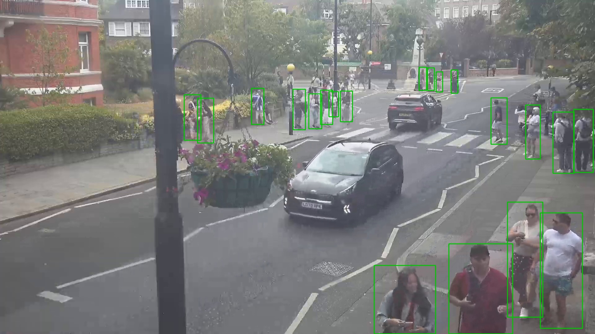

Rastgele seçilmiş 3 eğitim görseli, üzerlerinde COCO annotasyon dosyasındaki gerçek (insan etiketlemesi) kutular çizili — "veri doğru okunuyor mu" diye görsel kontrol.

---

## 6. Gerçek vs Tahmin — validation setinden örnekler

Aynı validation görüntüleri, iki versiyon: yeşil kutular = **gerçek** (COCO etiketi), turuncu kutular = **modelin tahmini** (eşik=0.5).

### Grup 1
**Gerçek:** 
**Tahmin:** 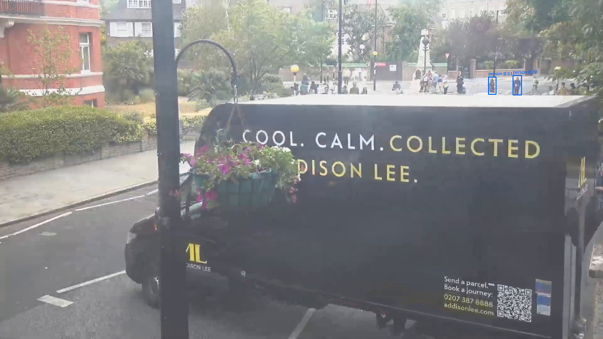

### Grup 2
**Gerçek:** 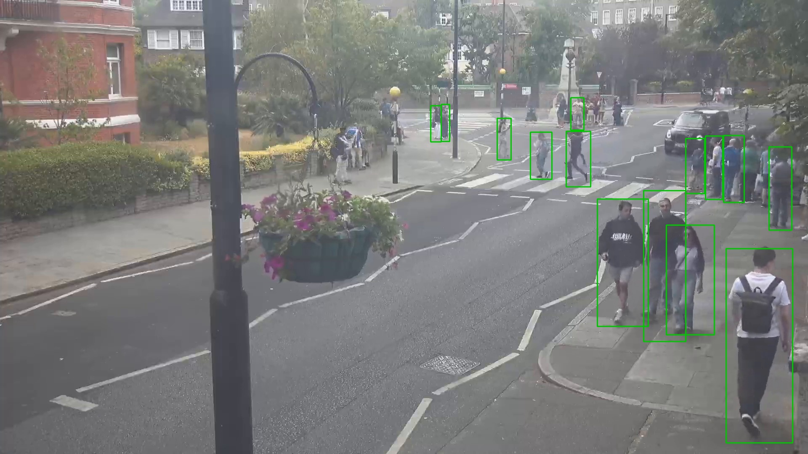
**Tahmin:** 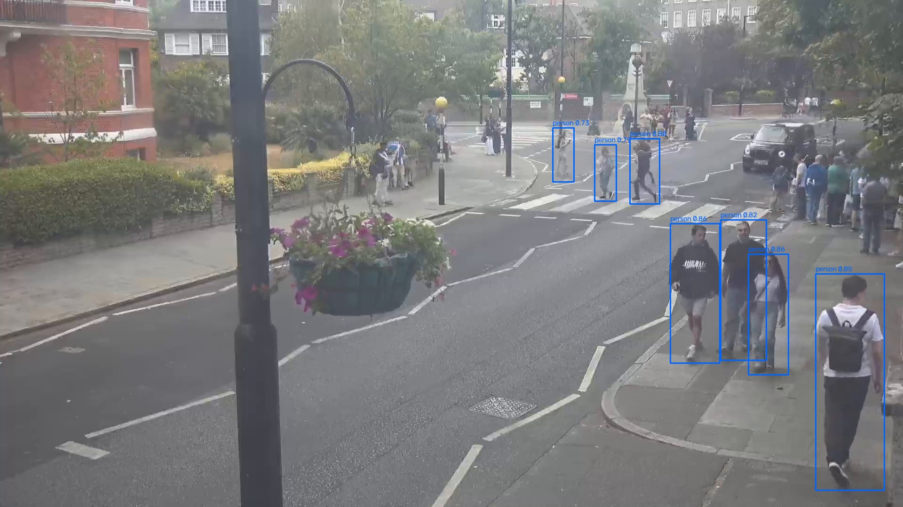

### Grup 3
**Gerçek:** 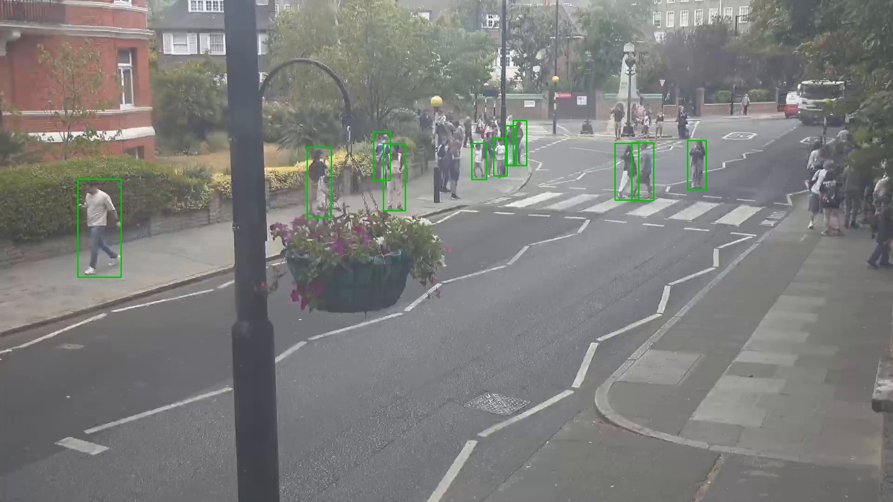
**Tahmin:** 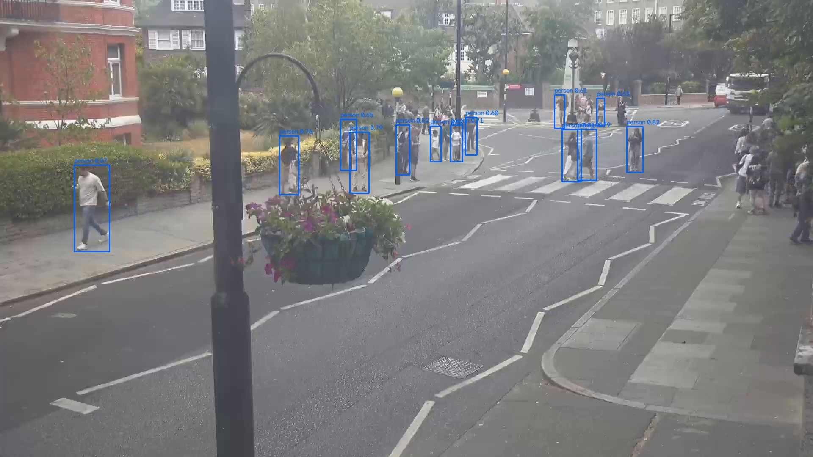

---

## 7. Model dosyaları

`weights/` klasöründe:
- **`best.pth`** — en iyi checkpoint (EMA tabanlı, RF-DETR'in kendi seçimi: `checkpoint_best_total.pth`)
- **`last.pth`** — son epoch'un EMA ağırlıkları

---

## 8. Inference Testleri (video üzerinde gerçek çalıştırma)

**ÖNEMLİ DÜZELTME (eşik/threshold hatası):** İlk denemede `detector_rfdetr.py`'de YOLO'dan alışkanlıkla `conf=0.15` kullandım - bu YANLIŞTI, doğrulamadan yapılmış bir varsayımdı. RF-DETR'nin güven skoru YOLO ile aynı ölçekte değil; 0.15'te videolarda insanla hiç ilgisi olmayan (direk, tabela, gölge, boş kaldırım) çok sayıda yanlış kutu çıktı - bunu kullanıcı fark edip uyardı. Kontrol ettim: eşiği 0.5'e çıkarınca (rfdetr kütüphanesinin de kendi varsayılanı zaten 0.5) bu hayali kutuların hemen hepsi kayboldu, kalanlar gözle doğrulanabilir gerçek kişilerdi. Üç video da SİLİNİP 0.5 eşiğiyle YENİDEN oluşturuldu - aşağıdaki tablo düzeltilmiş/doğru sonuçlar.

| Video | Model bu videoyu eğitimde gördü mü? | Kare sayısı | Süre | Inference hızı | Ortalama kişi/kare | Çıktı |
|---|---|---|---|---|---|---|
| `part_1.mp4` | Evet (bu modelin TEK eğitim kaynağı) | 8992 | 5 dk (300sn) | **21.3 fps** (`time`: 422.2sn / 8992 kare) | 9.82 | `inference_tests/part_1/part_1_detected_rfdetr.mp4` |
| `video01.mp4` | **Hayır — hiç görmedi** | 805 | 26.8sn | **30.4 fps** (`time`: 26.5sn / 805 kare) | 11.84 | `inference_tests/video01/video01_detected_rfdetr.mp4` |
| `Video1.mp4` (`videos/`) | **Hayır — hiç görmedi.** `roi.py`/`tracker.py`'nin kullandığı `frames/` ile AYNI kamera (düşük çözünürlük, tepeden açı, gölgeli) — asıl hedef kamera, YOLO'nun EN ÇOK zorlandığı test | 463 | 15.4sn | **32.9 fps** (`time`: 14.1sn / 463 kare) | **2.14** (YOLO'da 1.22'ydi) | `inference_tests/Video1/Video1_detected_rfdetr.mp4` |

**KRİTİK BULGU (Video1.mp4):** YOLO fine-tune bu kamerada frame ~300'de (zaman damgası "2018-10-18 11:33:27 AM") geçitte net görünen 2 kişiyi TAMAMEN kaçırmıştı (0 tespit). RF-DETR **AYNI karede** ikisini de doğru buluyor (güven skorları 0.74/0.77) — 0.5 eşiğiyle bile bu tespit kalıcı, hayali kutu değildi. Kullanıcı çıktı videoyu izleyip onayladı ("çok beğendim"). Bu, RF-DETR'nin dar/tek-kaynaklı fine-tuning'e rağmen YOLO'ya göre daha az "unutma" (catastrophic forgetting) yaşadığını gösteriyor.

**part_1.mp4 (kendi eğitim kaynağı) notu:** Düzeltilmiş eşikte RF-DETR (9.82) burada YOLO'dan (11.63) biraz DÜŞÜK çıktı - bu beklenen bir durum, 0.5 eşiği YOLO'nun 0.15'inden daha SIKI/temkinli, yani RF-DETR kendi alanında biraz daha az ama daha GÜVENİLİR (düşük yanlış-alarm) kutu üretiyor. Asıl önemli olan, farklı kameralarda (video01, Video1) YOLO'yu hâlâ belirgin şekilde geçmesi.

**Hız kıyaslaması (YOLO'ya göre):** RF-DETR, `part_1.mp4`'te YOLO'nun (~10 fps) **~2 katı hızlı** (21.3 fps) çalıştı.

---

## 9. YOLO ile genel kıyaslama

| | YOLOv8x (part1_pilot) | RF-DETR-Medium (part1_finetune) |
|---|---|---|
| Precision | 0.709 | **0.718** |
| Recall | 0.674 | **0.762** |
| mAP50 | 0.707 | **0.765** |
| mAP50-95 | 0.387 | **0.433** |
| Hız (part_1.mp4) | ~10 fps | **~21 fps** |
| Eğitim süresi (25 epoch) | ~8 dk (imgsz 640) | ~11 dk (imgsz 576) |
| Video1.mp4 (hedef kamera) ort. kişi/kare | 1.22 (geçitteki insanları kaçırıyor) | **2.14** (geçitteki insanları doğru buluyor) |
| video01.mp4 ort. kişi/kare | 5.90 | **11.84** |

**Sonuç:** Bu pilot denemede RF-DETR, YOLOv8x'e göre hem doğrulama metriklerinde (Precision/Recall/mAP) hem hızda hem de EN ÖNEMLİSİ hiç görmediği kameralara genellemede (Video1.mp4, video01.mp4) daha iyi çıktı. Kullanıcı çıktı videoları gözle kontrol edip doğruladı.
