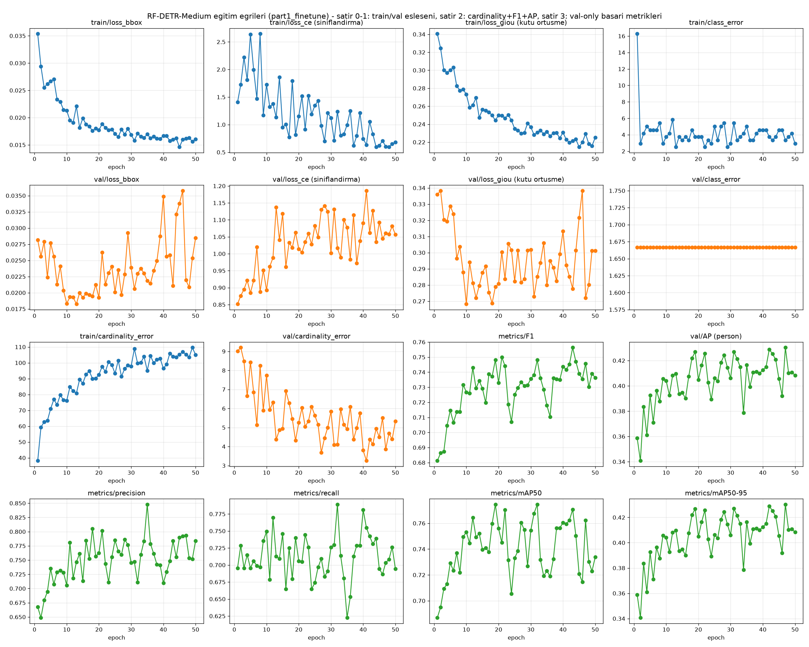
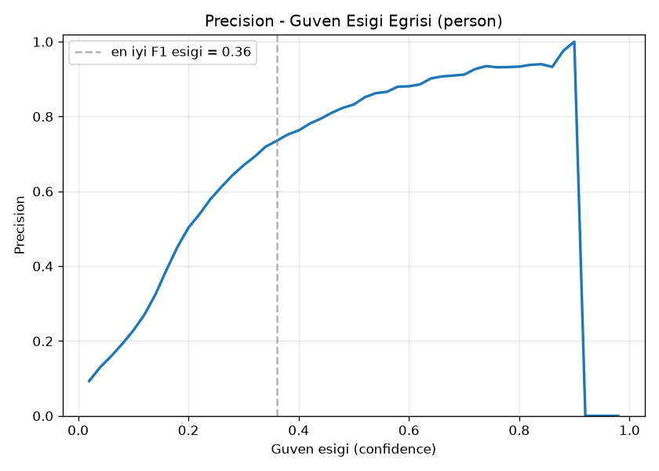
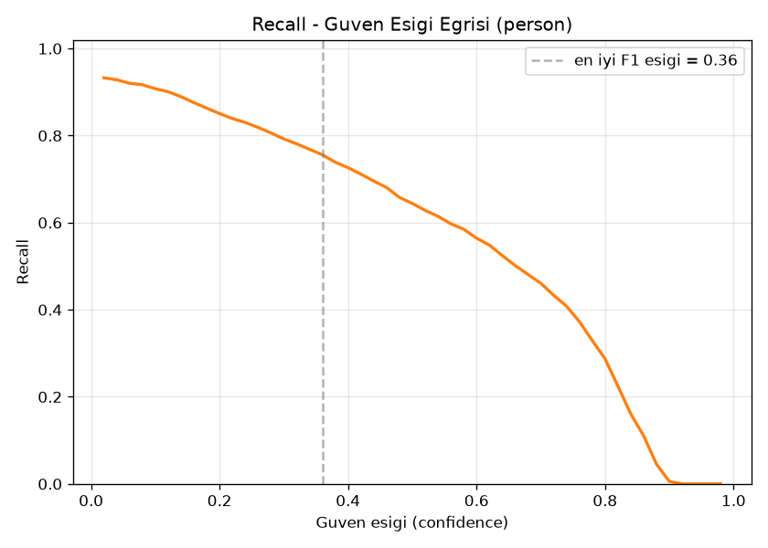
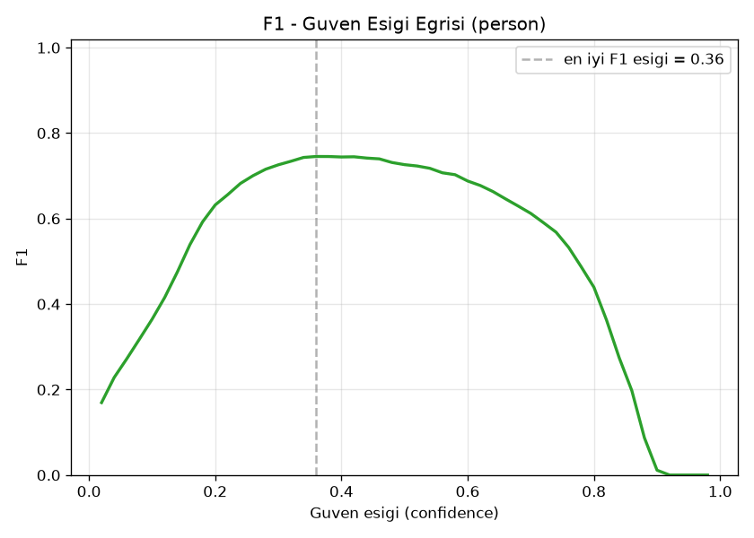
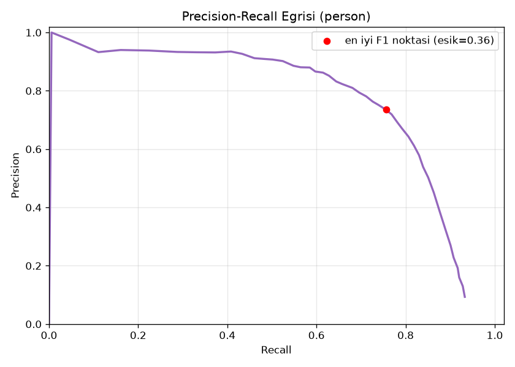
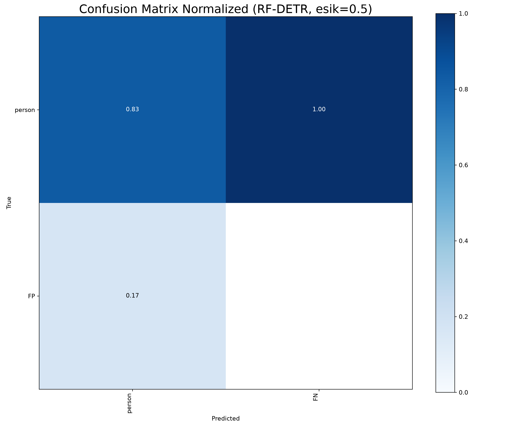
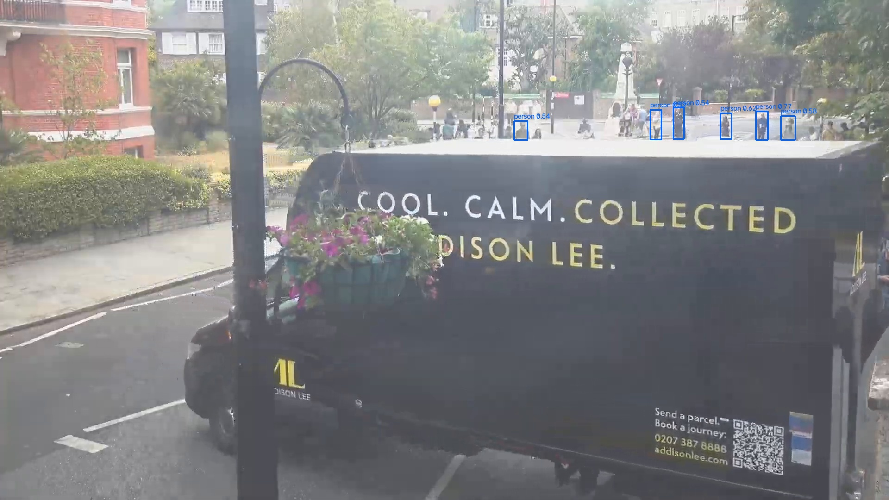
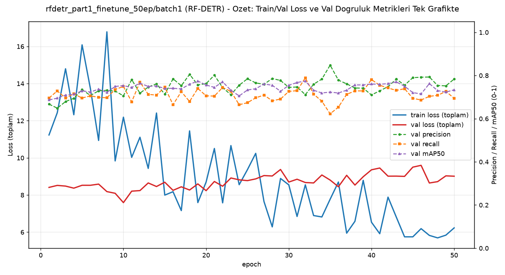

# Model Raporu — rfdetr_part1_finetune_50ep / batch1 (batch_size=1 denemesi)

*Bu dosya `outputs/models/rfdetr_part1_finetune_50ep/batch1/report_batch1.md` konumunda duruyor. [Orijinal AutoBatch sonucuna](../report.md) HİÇ dokunulmadı.*

**Ne test edildi:** [Orijinal RF-DETR-50ep denemesinin](../report.md) BİREBİR AYNI verisiyle, tek fark: **`batch_size=1`, `grad_accum_steps=1`** (etkin batch=1, [batch1/25ep denemesindeki](../../rfdetr_part1_finetune/batch1/report_batch1.md) gibi).

---

## 1. Ayarlar / Configuration

| Ayar | Değer | Orijinal (AutoBatch) ile fark |
|---|---|---|
| Base model | `RFDETRMedium` | aynı |
| Epoch | 50 | aynı |
| Batch size / grad accum / etkin batch | **1 / 1 / 1** | 3 / 6 / ~18 → 1 |
| Çözünürlük | 576px | aynı |
| Optimizer | AdamW | aynı |
| Veri seti | 240 train / 60 val | aynı |
| Inference confidence threshold | 0.5 | aynı |
| Ağırlık dosyaları | `weights/best.pth` (**epoch 47** — fitness'a göre en iyi, [yolo26x-50ep'teki](../../../yolo26x_part1_finetune_50ep/report.md) epoch-38 bulgusuna benzer bir doygunluk işareti), `weights/last.pth` (epoch 50) |

---

## 2. Eğitim ve Validation Eğrileri

**Epoch bazında ilerleme (val metrikleri, özet):**

| Epoch | Precision | Recall | mAP50 | mAP50-95 |
|---|---|---|---|---|
| 1 | 0.667 | 0.696 | 0.687 | 0.359 |
| 10 | 0.706 | 0.749 | 0.753 | 0.404 |
| 20 | 0.762 | 0.706 | 0.756 | 0.405 |
| 30 | 0.745 | 0.726 | 0.754 | 0.406 |
| 40 | 0.710 | 0.781 | 0.761 | 0.413 |
| **47 (best.pth)** | — | — | — | **0.430** |
| 50 (last.pth, final) | 0.784 | 0.694 | 0.734 | 0.408 |

### Sonuç özeti — batch=1 vs orijinal (AutoBatch)

| Metrik | batch=1 (50ep) | Orijinal AutoBatch (50ep) | batch=1 (25ep, kıyaslama) |
|---|---|---|---|
| mAP50-95 (best) | 0.430 | 0.433 | 0.419-0.427 |

**Yorum:** 50 epoch'ta da fark ihmal edilebilir düzeyde (~0.003 puan) — [25ep bulgusuyla](../../rfdetr_part1_finetune/batch1/report_batch1.md) tutarlı, RF-DETR batch=1'den etkilenmiyor. Ayrıca burada da ([YOLO26x-50ep'teki](../../../yolo26x_part1_finetune_50ep/report.md) gibi) `best.pth` son epoch değil, epoch 47 — 47-50 arası ekstra fayda sağlamamış, doygunluk işareti.

**ÖNEMLİ GÖZLEM (grafik "kötü" görünüyor ama sonuç kötü değil):** [25ep'teki batch1 raporunda](../../rfdetr_part1_finetune/batch1/report_batch1.md) tespit edilen desen burada DAHA BELİRGİN: `val/loss_ce` train düşerken net şekilde yükseliyor, `val/loss_bbox`/`val/loss_giou`/`val/cardinality_error` çok gürültülü. Ama `metrics/precision`, `recall`, `mAP50`, `mAP50-95`, `F1` yine aynı dönemde yükseliyor (bkz. `results.png`, satır 3-4). Açıklama aynı: batch=1'in tek-örnekli, yüksek varyanslı gradyanları model ağırlıklarını epoch'tan epoch'a daha çok sıçratıyor, bu sınıflandırma loss'unu (kendinden emin-yanlış tahminleri ağır cezalandıran bir ölçüt) gürültülü/yükselen gösteriyor ama kutu-konumu doğruluğunu (precision/recall, dolayısıyla gerçek video testlerini) bozmuyor. Bölüm 5'teki sonuçlar (Video1.mp4: 2.21, orijinale çok yakın) bunu doğruluyor.

---

## 3. Ek görsel analizler

### 3.1 Güven eşiği eğrileri

En iyi F1: eşik=**0.36** (P=0.735, R=0.756, F1=**0.745**) — 25ep'teki (0.753) ve orijinal 50ep'teki (0.741) ile aynı aralıkta.

| Dosya | Ne gösteriyor |
|---|---|
|  `BoxP_curve.png` | Precision - eşik |
|  `BoxR_curve.png` | Recall - eşik |
|  `BoxF1_curve.png` | F1 - eşik |
|  `BoxPR_curve.png` | Precision-Recall |

### 3.2 Confusion Matrix

### 3.3 Eğitim verisi istatistiği

### 3.4 Eğitim sırasında örnek kareler

### 3.5 Gerçek vs Tahmin (validation seti)

**Gerçek:** 
**Tahmin:** 

---

## 4. Özet grafik

---

## 5. Inference Testleri

| Video | Ort. kişi/kare (batch=1, 50ep) | Orijinal (AutoBatch, 50ep) | batch=1 (25ep, kıyaslama) |
|---|---|---|---|
| `part_1.mp4` | 10.68 | 10.32 | 10.72 |
| `video01.mp4` | 10.34 | 12.05 | 10.19 |
| `Video1.mp4` (hedef kamera) | **2.21** | 2.00 | 2.33 |

Çıktı videolar: `inference_tests/part_1/`, `inference_tests/video01/`, `inference_tests/Video1/`

---

## Genel değerlendirme

RF-DETR-50ep'te de batch=1, [25ep'teki bulguyu](../../rfdetr_part1_finetune/batch1/report_batch1.md) doğruluyor: LayerNorm mimarisi sayesinde batch boyutuna karşı dayanıklı, sonuçlar orijinal (AutoBatch) ile pratik olarak aynı. RF-DETR ailesi için (hem 25 hem 50 epoch'ta) sonuç net: **batch boyutu bu modelde önemli bir değişken değil.** Asıl kontrast YOLO tarafında bekleniyor (bkz. genel karşılaştırma).
