# Model Raporu — rfdetr_part1_finetune_50ep

*Bu dosya `outputs/models/rfdetr_part1_finetune_50ep/report.md` konumunda duruyor. Ağırlıklar `weights/`, eğitim çıktıları `training/`, video testleri `inference_tests/` altında.*

**Ne eğitildi:** `RFDETRMedium`, `part_1` verisiyle (YOLO ile aynı 240/60 görsel) **50 epoch** fine-tune edildi — [25 epoch'luk ilk denemenin](../rfdetr_part1_finetune/report.md) TEKRARI, sadece epoch sayısı 2 katına çıkarıldı.

---

## İYİ HABER: RF-DETR bu overfitting sorununu YAŞAMADI

YOLO'yu 25'ten 50 epoch'a çıkarınca `Video1.mp4` (hedef kamera) kamerada tamamen bozulmuştu (ort. kişi/kare 1.22 → 36.24, bkz. [YOLO 50ep raporu](../yolov8x_part1_finetune_50ep/report.md)). RF-DETR'de AYNI deneyi yaptık, sonuç ÇOK FARKLI:

| Video1.mp4 | 25 epoch | 50 epoch |
|---|---|---|
| Ort. kişi/kare | 2.14 | **2.00** |

**Neredeyse hiç değişmedi** — RF-DETR, YOLO'nun aksine 2 katı eğitimle bile hedef kameradaki genelleme yeteneğini kaybetmedi. Bu, RF-DETR'in transformer mimarisinin (ve/veya EMA ağırlık ortalaması gibi eğitim tekniklerinin) küçük/dar veri setlerinde YOLO'ya göre overfitting'e karşı daha dayanıklı olduğuna dair somut bir kanıt.

---

## 1. Ayarlar / Configuration

| Ayar | Değer |
|---|---|
| Base model | `RFDETRMedium` (COCO ön-eğitimli, `rf-detr-medium.pth`) |
| Epoch | 50 |
| Batch size | **3** (auto-batch, `training_config.json`'dan) |
| Grad accumulation steps | 6 (etkin batch ≈ 18) |
| Çözünürlük | 576px |
| Optimizer | AdamW |
| lr (backbone) / lr_encoder | 0.0001 / 0.00015 |
| weight_decay | 0.0001 |
| Veri seti | `part_1`, 240 train / 60 validation (25ep ile birebir aynı) |
| Inference confidence threshold | 0.5 (varsayılan), ayrıca 0.3 da denendi (bkz. bölüm 5) |
| Ağırlık dosyaları | `weights/best.pth`, `weights/last.pth` |

---

## 2. Eğitim ve Validation Eğrileri

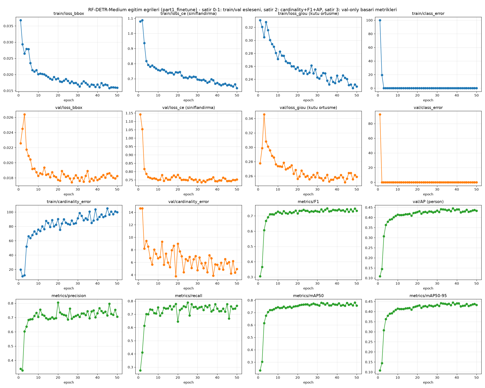

[25 epoch raporundaki](../rfdetr_part1_finetune/report.md) gibi 4x4'lük grafik: satır 0-1'de train/val loss çiftleri (`loss_bbox`, `loss_ce`, `loss_giou`, `class_error`), satır 2'de `cardinality_error` çifti + F1 + AP(person), satır 3'te val-only başarı metrikleri (precision/recall/mAP50/mAP50-95).

### Sonuç özeti (best.pth — epoch 50, final)

| Metrik | 25 epoch | 50 epoch | Fark |
|---|---|---|---|
| Precision | 0.718 | 0.706 | -0.012 |
| Recall | 0.762 | 0.765 | +0.003 |
| mAP50 | 0.765 | 0.756 | -0.009 |
| mAP50-95 | 0.433 | 0.433 | 0.000 |

**Yorum:** Sayılar pratik olarak AYNI — RF-DETR zaten 25 epoch'ta doygunluğa ulaşmış (bkz. 25 epoch raporundaki eğri, epoch 15-20 civarında düzleşiyor). 50 epoch'a çıkarmanın ne bariz bir faydası ne de (YOLO'daki gibi) bir zararı oldu — sadece 2 katı süre harcadık. Pratik sonuç: bu veri boyutunda RF-DETR için **25 epoch yeterli**, 50'ye gerek yok.

---

## 3. Ek görsel analizler

*Tıpkı 25 epoch'luk versiyonda olduğu gibi, tüm görseller (`results.png`, eğriler, confusion matrix, `labels.jpg`, örnek kareler) `generate_rfdetr_report_assets.py rfdetr_part1_finetune_50ep` ile sonradan üretildi (RF-DETR otomatik üretmiyor).*

### 3.1 Güven eşiği eğrileri

En iyi F1 noktası: eşik=**0.42** (P=0.791, R=0.697, F1=0.741) — 25 epoch'ta bu 0.34'tü, hafif kaydı ama 0.5'lik operasyon noktamız hâlâ makul aralıkta.

| Dosya | Ne gösteriyor |
|---|---|
| 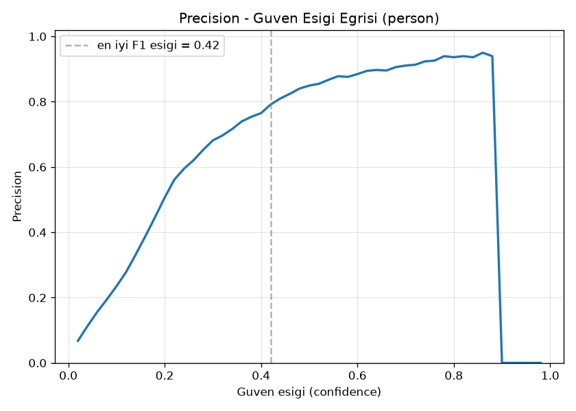 `BoxP_curve.png` | Precision - eşik |
| 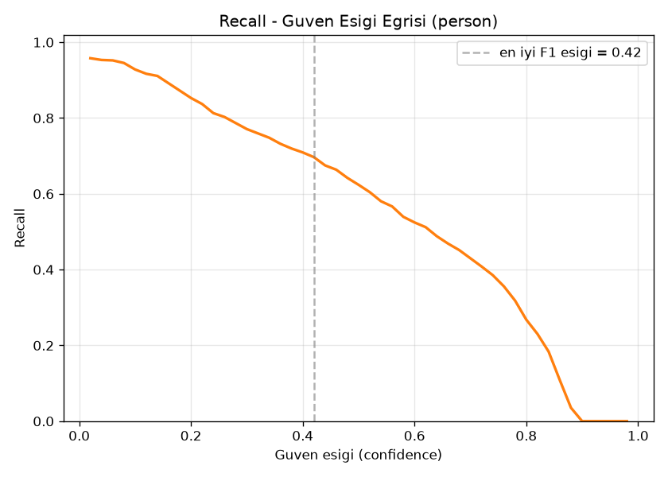 `BoxR_curve.png` | Recall - eşik |
| 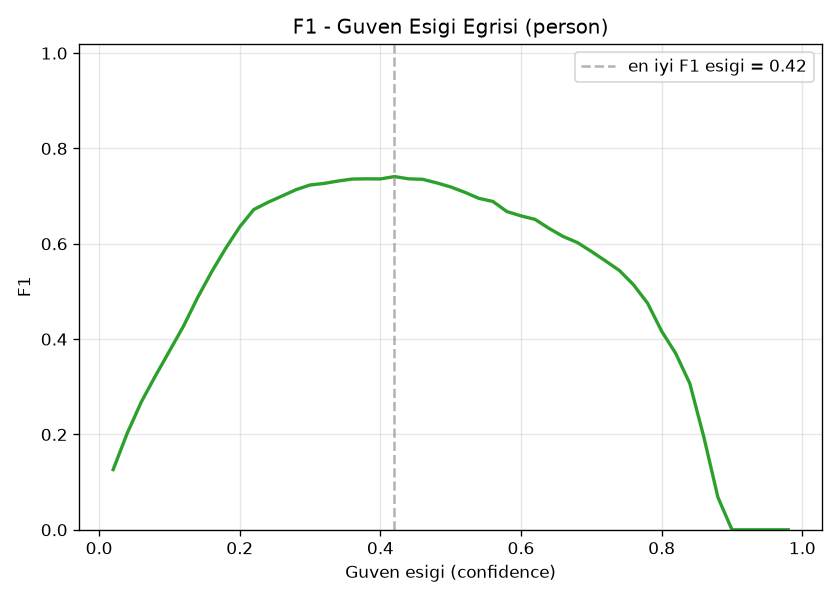 `BoxF1_curve.png` | F1 - eşik |
| 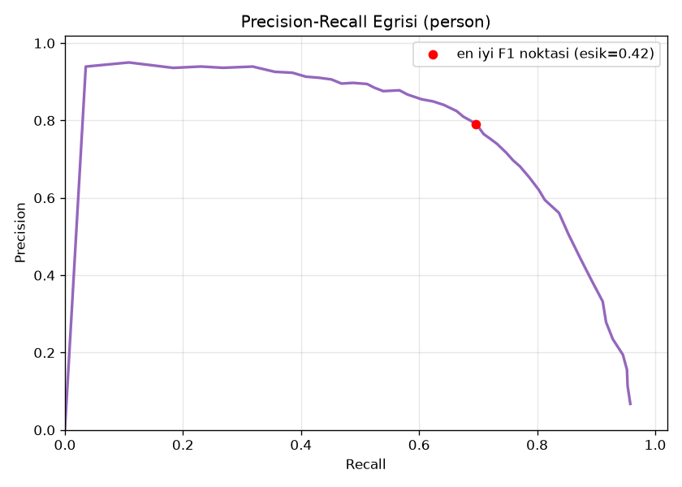 `BoxPR_curve.png` | Precision-Recall |

### 3.2 Confusion Matrix

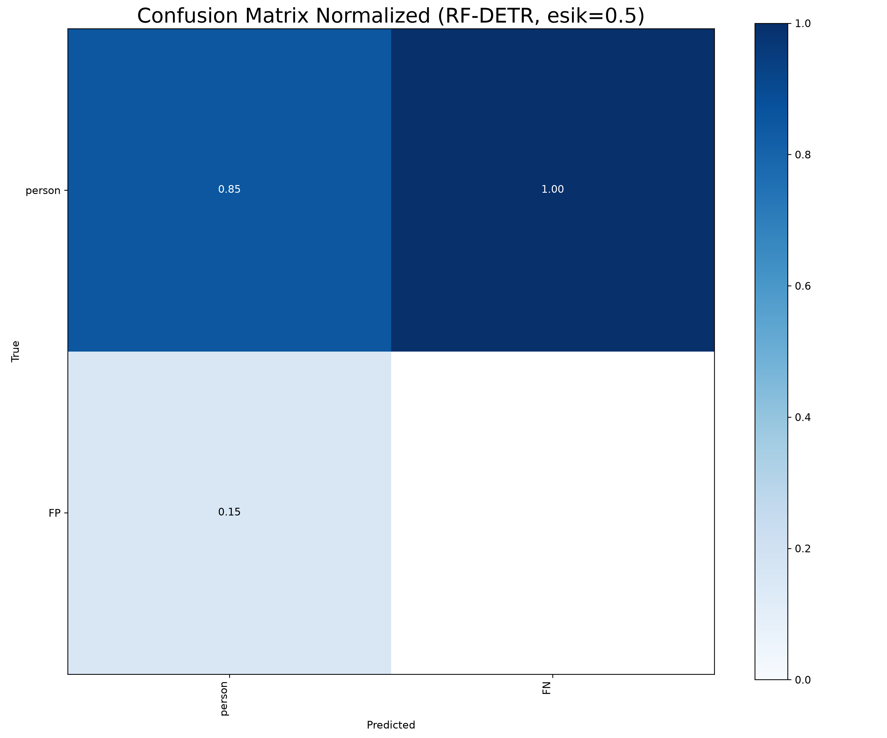

### 3.3 Eğitim verisi istatistiği

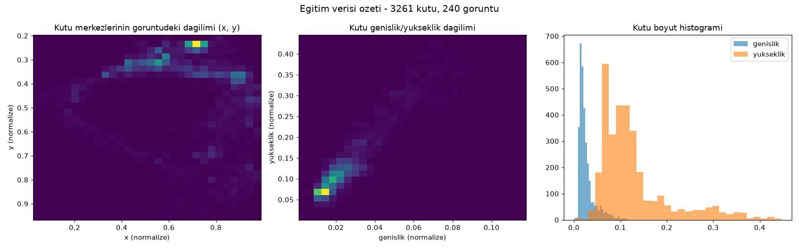

### 3.4 Eğitim sırasında örnek kareler

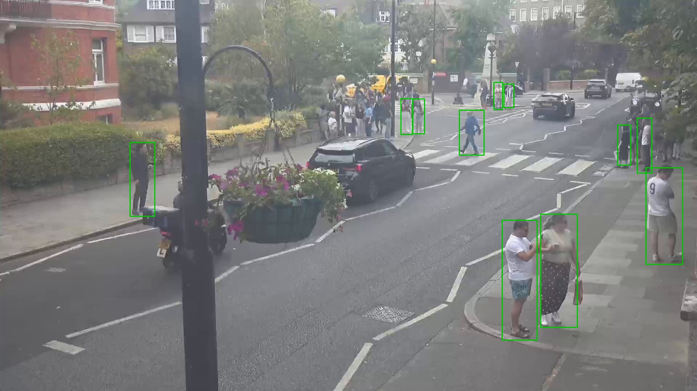

### 3.5 Gerçek vs Tahmin (validation seti)

**Gerçek:** 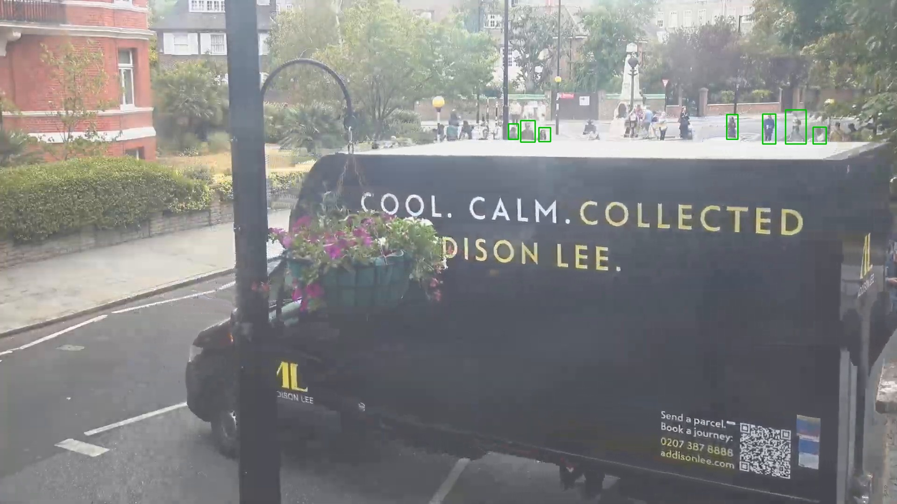
**Tahmin:** 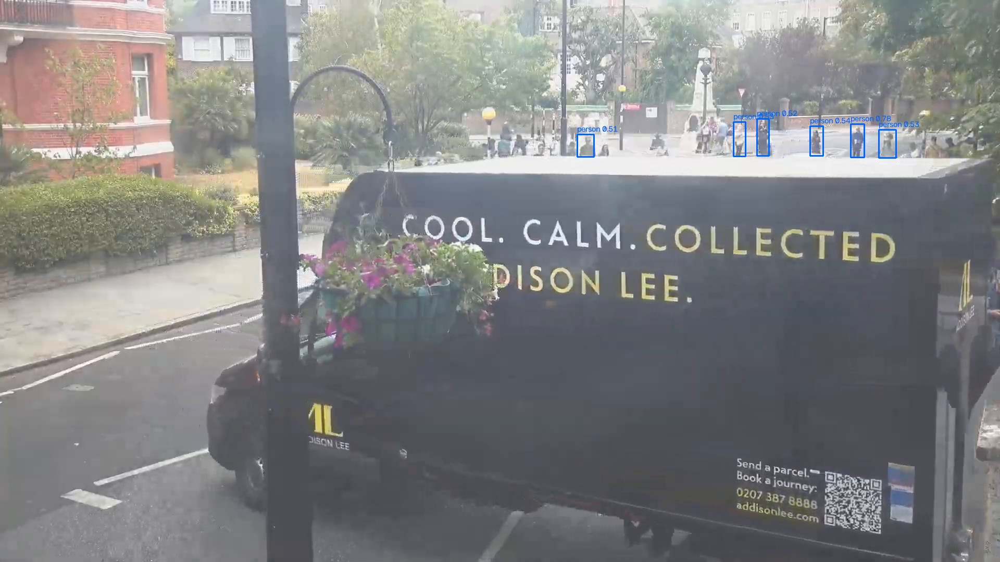

---

## 4. Özet grafik

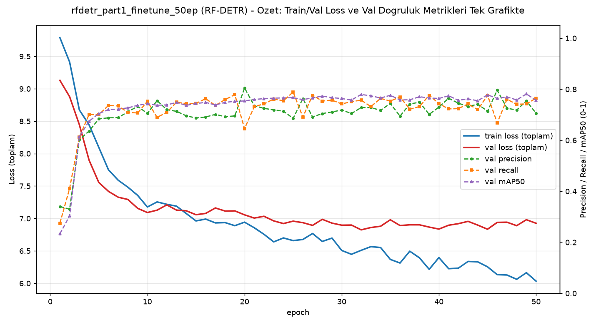

Sol eksen train/val toplam loss, sağ eksen val precision/recall/mAP50 — 25 epoch'ta olduğu gibi burada da train/val loss birbirinden ayrışmıyor (overfitting yok), eğri epoch ~20'den sonra büyük ölçüde düzleşiyor (doygunluk).

---

## 5. Inference Testleri

| Video | Kare | Süre | Hız | Ort. kişi/kare (50ep) | Ort. kişi/kare (25ep) | Çıktı |
|---|---|---|---|---|---|---|
| `Video1.mp4` (hedef kamera) | 463 | 15.4sn | 33.1 fps (14.0sn) | **2.00** | 2.14 | `inference_tests/Video1/Video1_detected_rfdetr.mp4` |
| `video01.mp4` | 805 | 26.8sn | 30.5 fps (26.4sn) | 12.05 | 11.84 | `inference_tests/video01/video01_detected_rfdetr.mp4` |
| `part_1.mp4` (kendi verisi) | 8992 | 5dk | 23.1 fps (6dk 29sn) | 10.32 | 9.82 | `inference_tests/part_1/part_1_detected_rfdetr.mp4` |

Üç videoda da 25ep ile 50ep sonuçları neredeyse aynı — RF-DETR için ekstra epoch'un ne büyük fayda ne zarar getirmediğini video testleri de doğruluyor.

### conf (güven eşiği) denemesi — 0.3, `part_1.mp4` üzerinde

RF-DETR'in yerleşik eşiği (0.5) yerine 0.3 denendi:

| Eşik | Ort. kişi/kare | Yorum |
|---|---|---|
| 0.5 (varsayılan/kullanılan) | 10.32 | Temiz |
| 0.3 (deneme) | **15.81** | Gözle kontrol edildi: fazladan kutuların büyük kısmı **gürültü** (insan olmayan nesneler/gölgeler) — YOLO'daki gibi bir "eksik tespiti kapatma" değil, tam tersi, eşiği gevşetince gürültü artıyor |

**Sonuç:** RF-DETR-50ep için 0.5 eşiği doğru seçim olmaya devam ediyor; 0.3'e düşürmek doğruluğu artırmıyor, sadece yanlış pozitifleri çoğaltıyor. Çıktı: `inference_tests/part_1_conf0.3/part_1_detected_conf0.3.mp4`

---

## Genel değerlendirme

Bu deney RF-DETR'in YOLO'ya göre önemli bir avantajını daha ortaya çıkardı — sadece hiç görmediği kameralarda daha iyi genellemesi değil, aynı zamanda **fazla eğitime karşı daha dayanıklı olması**. Detaylı 6 model karşılaştırması için [COMPARISON.md](../COMPARISON.md).
