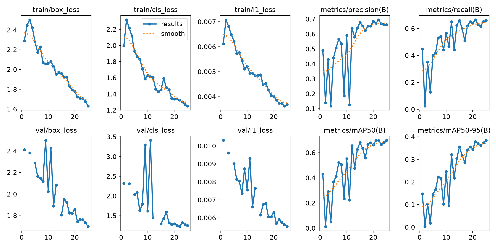
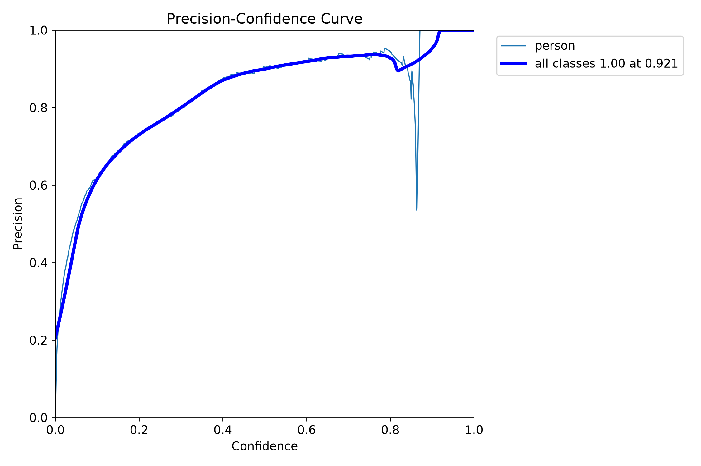
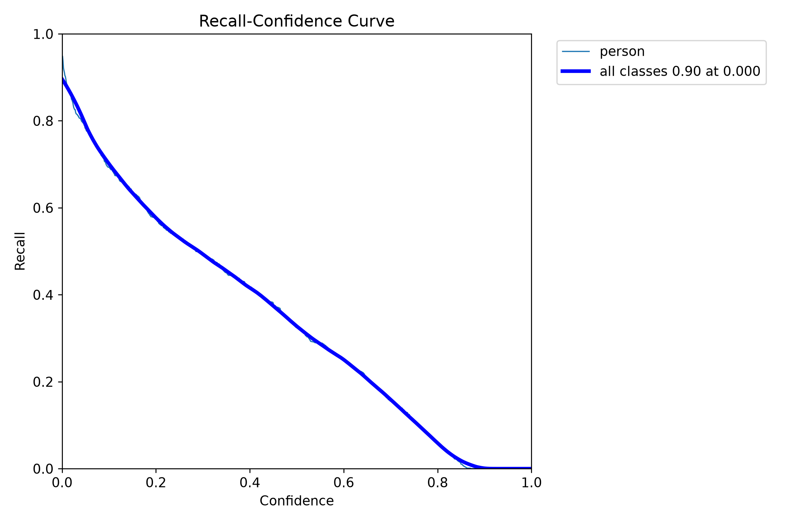
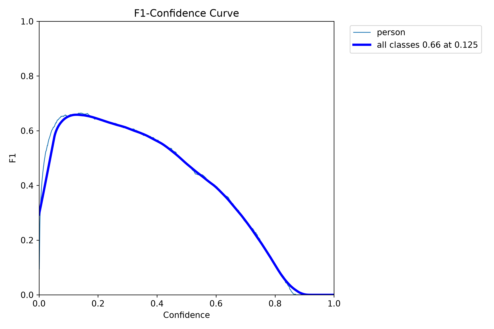
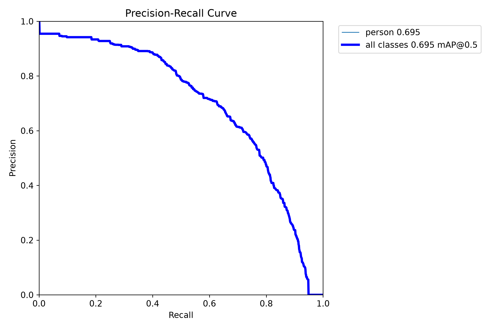
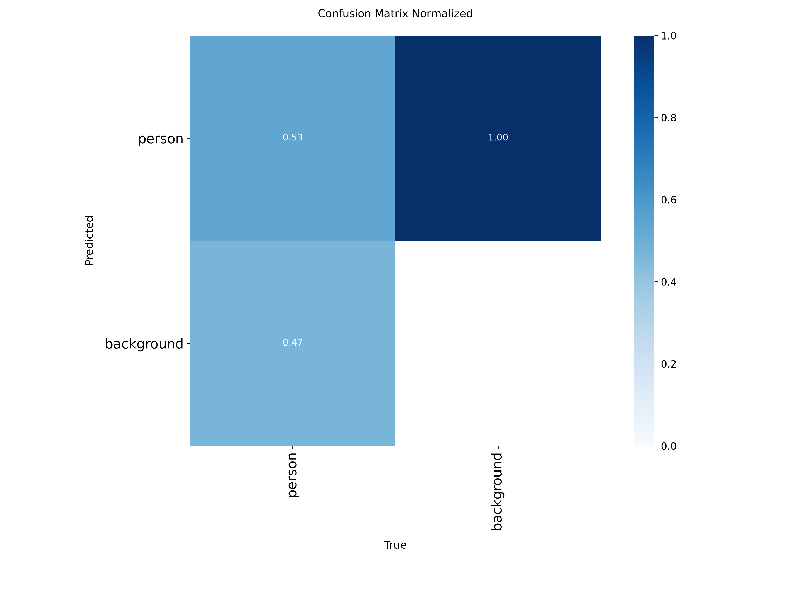
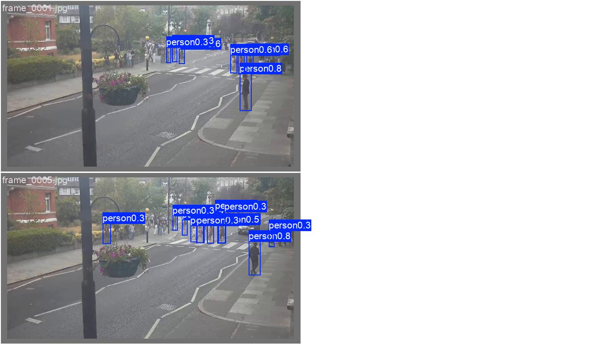
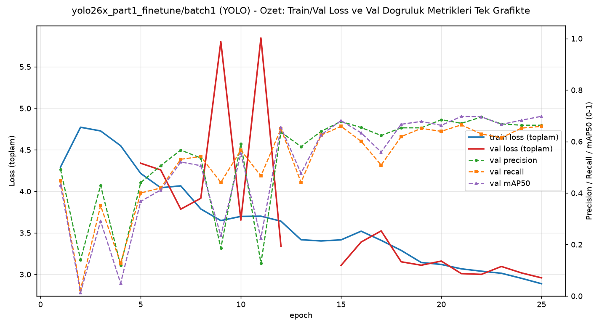

# Model Raporu — yolo26x_part1_finetune / batch1 (batch_size=1 denemesi)

*Bu dosya `outputs/models/yolo26x_part1_finetune/batch1/report_batch1.md` konumunda duruyor. [Orijinal AutoBatch sonucuna](../report.md) HİÇ dokunulmadı.*

**Ne test edildi:** [Orijinal YOLO26x-25ep denemesinin](../report.md) BİREBİR AYNI verisiyle, gerçek/ham `batch_size=1` (`nbs=1` — [YOLOv8x batch1 raporlarındaki](../../yolov8x_part1_finetune/batch1/report_batch1.md) metodolojiyle AYNI, biriktirme yok).

---

## ÖNEMLİ BULGU: Hedef kamerada (Video1.mp4) batch=1, orijinalin zayıflığını DÜZELTMİŞ görünüyor

[Orijinal AutoBatch/25ep YOLO26x](../report.md) modeli Video1.mp4'te (hedef kamera) çok zayıftı: ortalama **0.32** kişi/kare — gerçek insanları kaçırıyordu (YOLOv8x'in orijinal 1.22'sinden bile düşük). Bu batch=1 modeli ise Video1.mp4'te **2.24** kişi/kare veriyor — RF-DETR'nin (~2.1-2.3) sonucuna yakın, sağlıklı bir aralık. Bu, [YOLOv8x-50ep batch1'de gözlemlenen](../../yolov8x_part1_finetune_50ep/batch1/report_batch1.md) TERS yöndeki bulgunun (orada batch=1 hedef kamerada kötüleşmişti) aksine, burada batch=1 İYİLEŞME yönünde. Henüz görsel olarak doğrulanmadı (çıktı video izlenmedi) — sayı iyi görünse de bunun "gerçek insan tespiti" mi yoksa "gürültülü ekstra kutular" mı olduğu kesin değil, ama en azından YOLOv8x'teki gibi neredeyse-sıfır bir çöküş değil.

---

## 1. Ayarlar / Configuration

| Ayar | Değer | Orijinal (AutoBatch) ile fark |
|---|---|---|
| Base model | `yolo26x.pt` | aynı |
| Epoch | 25 | aynı |
| Batch size | **1** | 12 → 1 |
| **nbs (nominal batch size)** | **1** (gizli biriktirme KAPALI) | 64 (varsayılan) → 1 |
| imgsz | 640 | aynı |
| Optimizer | `auto` (AdamW seçti) | aynı |
| Veri seti | 240 train / 60 val | aynı |
| Inference confidence threshold | 0.15 | aynı |
| Toplam eğitim süresi | 0.195 saat (~11.7 dk) | — |
| Ağırlık dosyaları | `weights/best.pt` (epoch 25, final — doygunluk yok), `weights/last.pt` (aynı) | — |

---

## 2. Eğitim ve Validation Eğrileri

**Epoch bazında ilerleme:**

| Epoch | Precision | Recall | mAP50 | mAP50-95 |
|---|---|---|---|---|
| 1 | 0.492 | 0.448 | 0.431 | 0.148 |
| 5 | 0.440 | 0.400 | 0.368 | 0.145 |
| 10 | 0.592 | 0.567 | 0.553 | 0.246 |
| 15 | 0.678 | 0.659 | 0.681 | 0.355 |
| 20 | 0.685 | 0.640 | 0.663 | 0.344 |
| **25 (final, best.pt)** | **0.663** | **0.659** | **0.698** | **0.384** |

**Doygunluk yok:** mAP50-95'e göre en iyi epoch = 25 (son epoch), [YOLOv8x-50ep batch1'deki](../../yolov8x_part1_finetune_50ep/batch1/report_batch1.md) gibi model 25 epoch boyunca istikrarlı iyileşmeye devam etmiş.

### Sonuç özeti — batch=1 vs orijinal (AutoBatch)

| Metrik | batch=1 (final) | Orijinal AutoBatch (final) | Fark |
|---|---|---|---|
| Precision | 0.663 | 0.663 | 0.000 |
| Recall | 0.659 | 0.713 | -0.054 |
| mAP50 | 0.698 | 0.706 | -0.008 |
| mAP50-95 | 0.384 | 0.394 | -0.010 |

**Yorum:** Kendi validation setinde batch=1 orijinale çok yakın, hafif düşük (özellikle recall'da -0.054) — RF-DETR kadar "fark yok" değil ama YOLOv8x-25ep'teki kadar (epoch-1 çöküşü gibi) dramatik bir istikrarsızlık da yok. Asıl fark bölüm 5'teki hedef kamera testinde.

---

## 3. Ek görsel analizler

### 3.1 Güven eşiği eğrileri

| Dosya | Ne gösteriyor |
|---|---|
|  `BoxP_curve.png` | Precision - eşik |
|  `BoxR_curve.png` | Recall - eşik |
|  `BoxF1_curve.png` | F1 - eşik |
|  `BoxPR_curve.png` | Precision-Recall |

### 3.2 Confusion Matrix

### 3.3 Eğitim verisi istatistiği

### 3.4 Eğitim sırasında örnek kareler

### 3.5 Gerçek vs Tahmin (validation seti)

**Gerçek:** 
**Tahmin:** 

---

## 4. Özet grafik

---

## 5. Inference Testleri

| Video | Ort. kişi/kare (batch=1) | Orijinal (AutoBatch) | Fark |
|---|---|---|---|
| `part_1.mp4` (kendi verisi) | 18.99 | 18.39 | +0.60 |
| `video01.mp4` (görülmemiş) | 7.99 | 7.61 | +0.38 |
| `Video1.mp4` (hedef kamera, görülmemiş) | **2.24** ⚠️ | 0.32 (zayıf, kaçırıyordu) | **+1.92 (~7 kat)** |

**⚠️ DOĞRULAMA GEREKİYOR:** `Video1.mp4`'teki ~7 kat artış (0.32→2.24) HENÜZ görsel olarak izlenmedi (`inference_tests/Video1/Video1_detected.mp4`). İki olası açıklama var: (1) batch=1'in gürültülü/yüksek varyanslı gradyanları modelin bu spesifik kamerada aşırı temkinli olma eğilimini kırmış, gerçek tespitleri artırmış (olumlu senaryo), veya (2) model artık gürültüyü/yanlış pozitifleri de tespit ediyor ([orijinal YOLOv8x-50ep'teki](../../yolov8x_part1_finetune_50ep/report.md) 36.24'lük halüsinasyona benzer, daha küçük ölçekte). `part_1.mp4` ve `video01.mp4` sonuçları beklenen aralıkta, sorun yok.

Çıktı videolar: `inference_tests/part_1/`, `inference_tests/video01/`, `inference_tests/Video1/`

---

## Genel değerlendirme

YOLO26x-25ep'te batch=1, kendi validation setinde orijinale çok yakın (hafif düşük) sonuç verdi — [YOLOv8x-25ep'teki](../../yolov8x_part1_finetune/batch1/report_batch1.md) gibi ilk epoch çöküşü yaşanmadı. Asıl dikkat çekici bulgu: orijinal AutoBatch modelinin Video1.mp4'teki zayıflığı (0.32, gerçek insanları kaçırıyordu) batch=1'de ~7 kat artışla (2.24) düzelmiş görünüyor — bu, [YOLOv8x-50ep'teki](../../yolov8x_part1_finetune_50ep/batch1/report_batch1.md) TERS yöndeki bulguyla birlikte, batch boyutunun hedef kamera genellemesini öngörülemez şekilde etkileyebildiğini gösteriyor. İkisi de henüz görsel doğrulama bekliyor, 6 model bitince genel karşılaştırmada birlikte değerlendirilecek.
