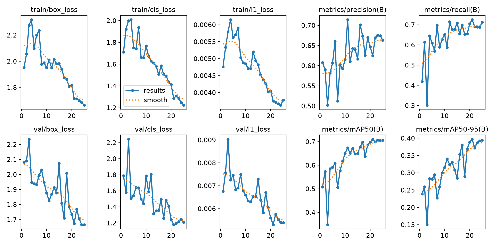
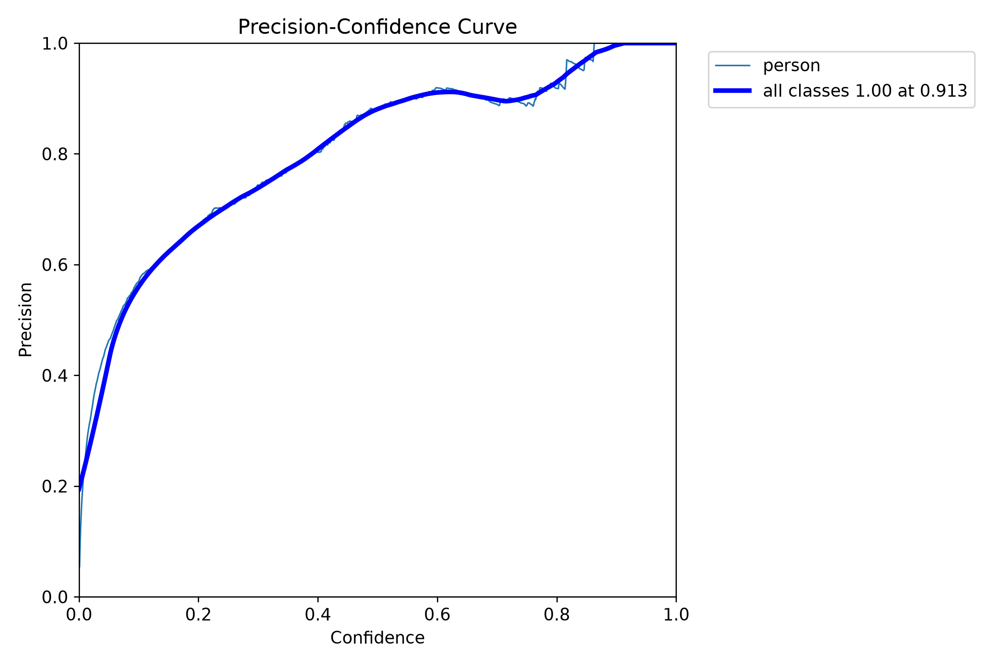
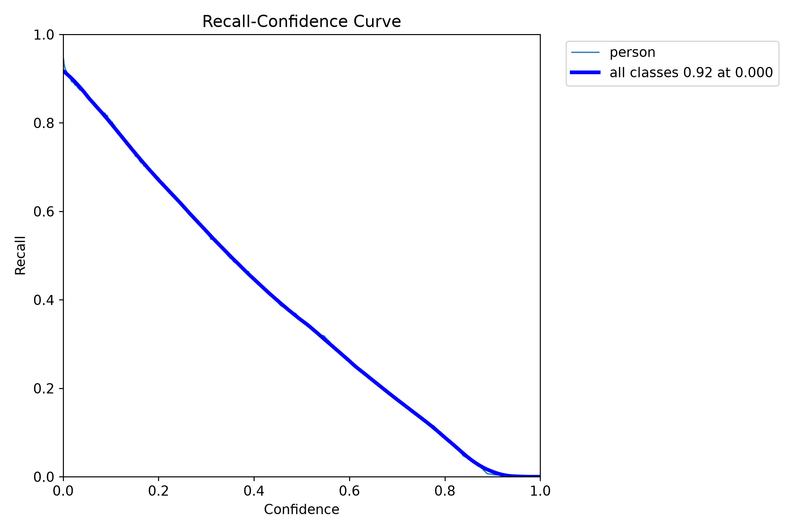
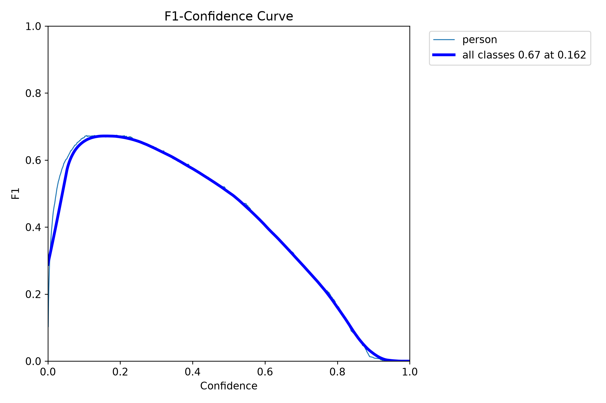
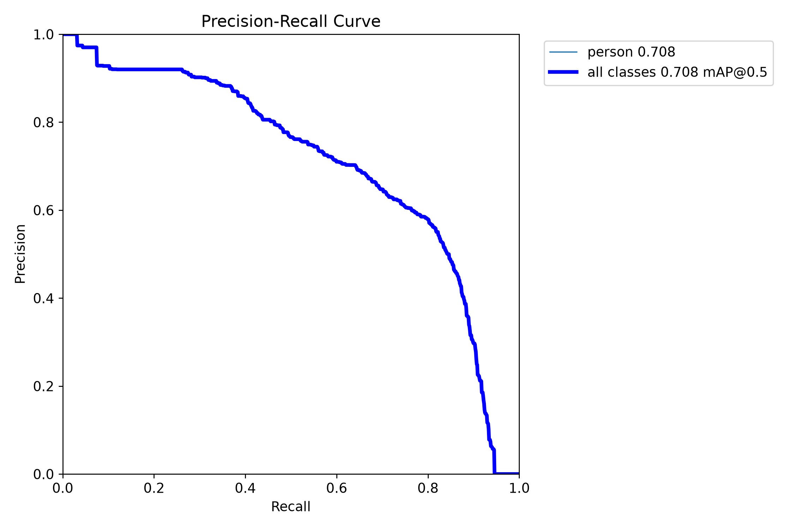
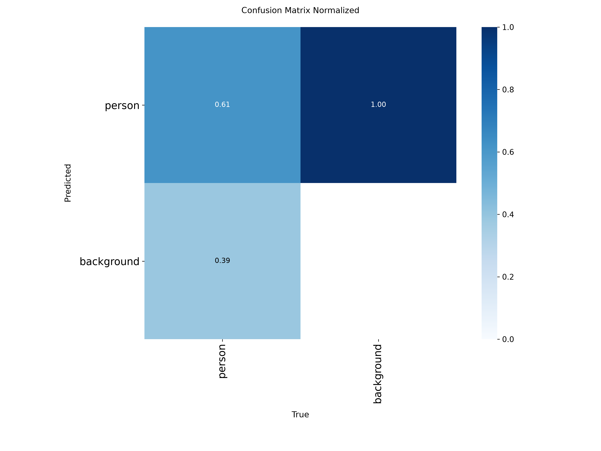
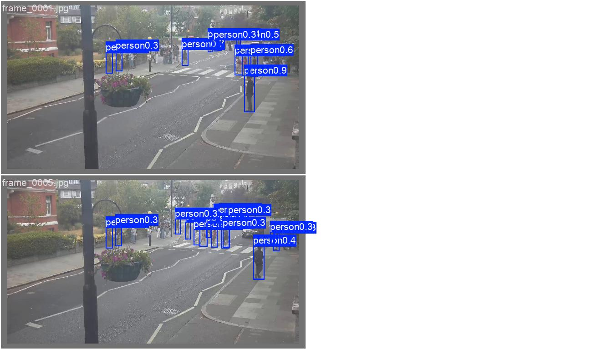

# Model Raporu — yolo26x_part1_finetune

*Bu dosya `outputs/models/yolo26x_part1_finetune/report.md` konumunda duruyor. Ağırlıklar `weights/`, eğitim grafikleri `training/`, video testleri `inference_tests/` altında.*

**Ne eğitildi:** `yolo26x.pt` (Ultralytics'in YOLOv8'den daha yeni nesil modeli, aynı "x" - en büyük - boyutu), `part_1` verisiyle (YOLOv8x/RF-DETR ile AYNI 240/60 görsel) **25 epoch** fine-tune edildi. Diğer ayarlar (imgsz=640, batch=auto) [YOLOv8x denemesiyle](../yolov8x_part1_finetune/report.md) birebir aynı — tek fark başlangıç modeli.

---

## Sonuç özeti (best.pt — epoch 25, final)

| Metrik | YOLO26 25ep | YOLOv8x 25ep (kıyaslama) |
|---|---|---|
| Precision | 0.663 | 0.709 |
| Recall | 0.713 | 0.674 |
| mAP50 | 0.706 | 0.707 |
| mAP50-95 | 0.394 | 0.387 |

Kendi validation setinde YOLOv8x'e çok yakın — küçük farklar var ama net bir kazanan yok.

---

## ÖNEMLİ BULGU: Video1.mp4'te YOLOv8x'ten de zayıf

| Video1.mp4 (hedef kamera) | Ort. kişi/kare |
|---|---|
| YOLOv8x 25ep | 1.22 |
| **YOLO26 25ep** | **0.32** |
| RF-DETR 25ep | 2.14 |

Düşük sayı "daha temiz/daha az yanlış alarm" gibi görünebilir ama DEĞİL — kontrol ettim, aynı bilinen karede (2 kişi net görünüyor, `2018-10-18 11:33:27 AM`) YOLO26 de YOLOv8x gibi HİÇBİRİNİ bulamıyor (0 kutu). Yani bu düşük sayı, gerçek insanları KAÇIRMAKTAN kaynaklanıyor, daha temiz/isabetli olmasından değil. **Sonuç: YOLO'nun her iki nesli de (v8x ve v26x) bu hedef kamerada RF-DETR'in gerisinde kalıyor** — sorun YOLOv8x'e özgü değilmiş, YOLO mimarisinin genelinde (en azından bu küçük/dar veri setiyle) benzer bir zayıflık var gibi görünüyor.

---

## 1. results.png — eğitimin genel gidişatı

**Epoch bazında ilerleme (özet, her 5 epoch'ta bir):**

| Epoch | Precision | Recall | mAP50 | mAP50-95 |
|---|---|---|---|---|
| 1 | 0.608 | 0.419 | 0.507 | 0.239 |
| 6 | 0.661 | 0.569 | 0.608 | 0.295 |
| 11 | 0.714 | 0.587 | 0.674 | 0.340 |
| 16 | 0.702 | 0.655 | 0.677 | 0.353 |
| 21 | 0.625 | 0.725 | 0.710 | 0.397 |
| **25 (final)** | **0.663** | **0.713** | **0.706** | **0.394** |

YOLOv8x'e göre daha az dalgalanma/daha istikrarlı bir eğri (bkz. `results.png`) — YOLO26'nın eğitim dinamiği görünüşe göre biraz daha stabil, ama nihai sonuç benzer.

---

## 2. Güven eşiği eğrileri

| Dosya | Ne gösteriyor |
|---|---|
|  `BoxP_curve.png` | Precision - eşik |
|  `BoxR_curve.png` | Recall - eşik |
|  `BoxF1_curve.png` | F1 - eşik |
|  `BoxPR_curve.png` | Precision-Recall |

---

## 3. Confusion Matrix

---

## 4. Eğitim verisi istatistiği

---

## 5. Eğitim sırasında örnek kareler

---

## 6. Gerçek vs Tahmin (validation seti)

**Gerçek:** 
**Tahmin:** 

---

## 7. Model dosyaları

`weights/best.pt`, `weights/last.pt`

---

## 8. Inference Testleri

| Video | Kare | Süre | Hız | Ort. kişi/kare | Çıktı |
|---|---|---|---|---|---|
| `Video1.mp4` (hedef kamera) | 463 | 15.4sn | 12.7 fps (36.5sn) | **0.32** (zayıf - gerçek insanları kaçırıyor) | `inference_tests/Video1/Video1_detected.mp4` |
| `video01.mp4` | 805 | 26.8sn | 14.8 fps (54.4sn) | 7.61 | `inference_tests/video01/video01_detected.mp4` |
| `part_1.mp4` (kendi verisi) | 8992 | 5dk | **14.1 fps** (10dk 39sn) | 18.39 | `inference_tests/part_1/part_1_detected.mp4` |

**Hız notu:** YOLO26, YOLOv8x'ten (part_1.mp4'te ~10 fps) belirgin daha hızlı (~14 fps) — yeni nesil mimarinin bir avantajı. Ama doğruluk/genelleme tarafında (özellikle hedef kamerada) bir iyileşme görülmedi.

Detaylı 4+ model karşılaştırması için [COMPARISON.md](../COMPARISON.md).
