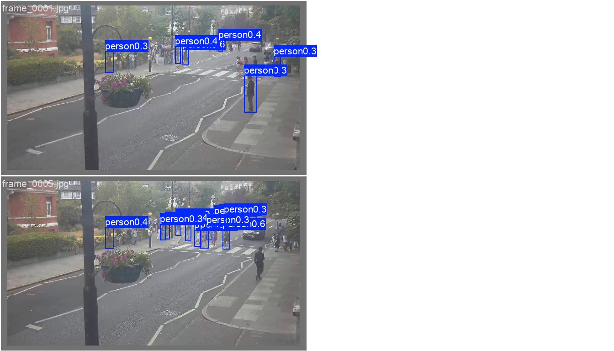

# Model Raporu — yolo26x_part1_finetune_50ep / batch1 (batch_size=1 denemesi)

*Bu dosya `outputs/models/yolo26x_part1_finetune_50ep/batch1/report_batch1.md` konumunda duruyor. [Orijinal AutoBatch sonucuna](../report.md) HİÇ dokunulmadı.*

**Ne test edildi:** [Orijinal YOLO26x-50ep denemesinin](../report.md) BİREBİR AYNI verisiyle, gerçek/ham `batch_size=1` (`nbs=1` — diğer tüm batch1 denemeleriyle AYNI metodoloji).

---

> **GÜNCELLEME (görsel doğrulama sonrası):** Aşağıdaki "iyileşme" bulgusu o zaman görsel olarak doğrulanmamıştı. [F1-optimal eşik (conf=0.45) denemesinde](report_conf045.md) yapılan görsel inceleme gösterdi ki bu artışın önemli bir kısmı zaman damgası üzerindeki SAHTE kutulardan kaynaklanıyor, gerçek insan tespitindeki bir iyileşme DEĞİL — model gerçek insanları hâlâ görmüyor. Detay için [report_conf045.md](report_conf045.md)'e bakınız.

## ÖNEMLİ BULGU: Hedef kamerada (Video1.mp4) batch=1 yine iyileştirdi, [25ep'teki bulguyla](../../yolo26x_part1_finetune/batch1/report_batch1.md) tutarlı

[Orijinal AutoBatch/50ep YOLO26x](../report.md) modeli Video1.mp4'te **1.35** kişi/kare veriyordu (raporun kendi notuna göre bu da "kaçırma" — bilinen 2 kişiden hiçbirini bulamıyordu). Bu batch=1 modeli ise **2.59** kişi/kare veriyor — [25ep batch1'in (2.24)](../../yolo26x_part1_finetune/batch1/report_batch1.md) sonucuna yakın, RF-DETR aralığına (~2.1-2.3) da yakın. Yani YOLO26x ailesinde batch=1, hem 25 hem 50 epoch'ta hedef kamerada TUTARLI ŞEKİLDE iyileşme yönünde — [YOLOv8x-50ep'teki](../../yolov8x_part1_finetune_50ep/batch1/report_batch1.md) TERS bulgunun aksine. Henüz görsel doğrulama yapılmadı.

---

## 1. Ayarlar / Configuration

| Ayar | Değer | Orijinal (AutoBatch) ile fark |
|---|---|---|
| Base model | `yolo26x.pt` | aynı |
| Epoch | 50 | aynı |
| Batch size | **1** | 12 → 1 |
| **nbs (nominal batch size)** | **1** (gizli biriktirme KAPALI) | 64 (varsayılan) → 1 |
| imgsz | 640 | aynı |
| Optimizer | `auto` (AdamW seçti) | aynı |
| Veri seti | 240 train / 60 val | aynı |
| Inference confidence threshold | 0.15 | aynı |
| Toplam eğitim süresi | 0.833 saat (~50 dk) | — |
| Ağırlık dosyaları | `weights/best.pt` (**epoch 40**, fitness'a göre en iyi — [orijinal 50ep'teki epoch-38 bulgusuna](../report.md) çok benzer bir doygunluk işareti), `weights/last.pt` (epoch 50) | — |

---

## 2. Eğitim ve Validation Eğrileri

**Epoch bazında ilerleme:**

| Epoch | Precision | Recall | mAP50 | mAP50-95 |
|---|---|---|---|---|
| 1 | 0.683 | 0.633 | 0.663 | 0.317 |
| 5 | 0.434 | 0.345 | 0.339 | 0.138 |
| 10 | 0.516 | 0.420 | 0.429 | 0.174 |
| 15 | 0.605 | 0.450 | 0.490 | 0.247 |
| 20 | 0.645 | 0.592 | 0.629 | 0.328 |
| 25 | 0.664 | 0.702 | 0.716 | 0.391 |
| 30 | 0.711 | 0.720 | 0.738 | 0.417 |
| 35 | 0.711 | 0.711 | 0.731 | 0.419 |
| **40 (best.pt)** | **0.727** | **0.715** | **0.761** | **0.443** |
| 45 | 0.694 | 0.738 | 0.740 | 0.431 |
| 50 (last.pt, final) | 0.707 | 0.730 | 0.733 | 0.428 |

**Doygunluk var (bir önceki YOLO26x-50ep bulgusuyla tutarlı):** [Orijinal AutoBatch/50ep](../report.md) modelinde `best.pt` epoch 38'de sabitlenmişti, burada da çok benzer şekilde epoch 40'ta sabitlendi — epoch 40'tan 50'ye kadar ekstra fayda yok, hafif dalgalanma var (mAP50-95: 0.443→0.428). Bu, YOLO26x mimarisinin bu 240 görsellik veri setinde ~40 epoch civarında doygunlaştığının, batch boyutundan (12 ya da 1) bağımsız bir mimari/veri özelliği olduğunun ek kanıtı.

### Sonuç özeti — batch=1 (best.pt, epoch 40) vs orijinal AutoBatch (best.pt, epoch 38)

| Metrik | batch=1 (epoch 40) | Orijinal AutoBatch (epoch 38) | Fark |
|---|---|---|---|
| Precision | 0.727 | 0.705 | +0.022 |
| Recall | 0.715 | 0.763 | -0.048 |
| mAP50 | 0.761 | 0.746 | +0.015 |
| mAP50-95 | 0.443 | 0.432 | +0.011 |

**Yorum:** Kendi validation setinde batch=1 hafif daha iyi (mAP50-95 +0.011), recall'da biraz düşük ama genel olarak orijinalle aynı aralıkta — YOLOv8x-50ep'teki gibi büyük bir sıçrama yok.

---

## 3. Ek görsel analizler

### 3.1 Güven eşiği eğrileri

| Dosya | Ne gösteriyor |
|---|---|
|  `BoxP_curve.png` | Precision - eşik |
|  `BoxR_curve.png` | Recall - eşik |
|  `BoxF1_curve.png` | F1 - eşik |
|  `BoxPR_curve.png` | Precision-Recall |

### 3.2 Confusion Matrix

### 3.3 Eğitim verisi istatistiği

### 3.4 Eğitim sırasında örnek kareler

### 3.5 Gerçek vs Tahmin (validation seti)

**Gerçek:** 
**Tahmin:** 

---

## 4. Özet grafik

---

## 5. Inference Testleri

| Video | Ort. kişi/kare (batch=1, 50ep) | Orijinal (AutoBatch, 50ep) | batch=1 (25ep, kıyaslama) |
|---|---|---|---|
| `part_1.mp4` (kendi verisi) | 18.55 | 23.52 | 18.99 |
| `video01.mp4` (görülmemiş) | 5.32 | 9.44 | 7.99 |
| `Video1.mp4` (hedef kamera) | **2.59** | 1.35 (kaçırıyordu) | 2.24 |

**Yorum:** `Video1.mp4`'teki iyileşme (1.35→2.59) [25ep'teki bulguyla](../../yolo26x_part1_finetune/batch1/report_batch1.md) (0.32→2.24) TUTARLI — YOLO26x ailesinde batch=1 hem 25 hem 50 epoch'ta hedef kamerada olumlu yönde etki ediyor. `part_1.mp4` ve `video01.mp4`'te ise batch=1 sayıları DÜŞÜRMÜŞ (orijinal AutoBatch'in aşırı yüksek kutu sayılarına göre) — bu da olumlu bir işaret, orijinalin kendi verisinde "aşırı üretken" olma eğilimini hafifletmiş olabilir. Henüz görsel doğrulama yapılmadı.

Çıktı videolar: `inference_tests/part_1/`, `inference_tests/video01/`, `inference_tests/Video1/`

---

## Genel değerlendirme

YOLO26x-50ep'te batch=1, [YOLOv8x-50ep'in](../../yolov8x_part1_finetune_50ep/batch1/report_batch1.md) aksine hedef kamerada net bir İYİLEŞME yönünde etkiledi (1.35→2.59) — bu [25ep batch1'deki](../../yolo26x_part1_finetune/batch1/report_batch1.md) bulguyla (0.32→2.24) tutarlı, yani YOLO26x mimarisi için batch=1'in etkisi epoch sayısından bağımsız olarak İSTİKRARLI şekilde olumlu görünüyor. Doygunluk bulgusu da (best.pt=epoch 40) orijinal AutoBatch/50ep'teki (epoch 38) bulguyla tutarlı — bu, veri setinin (240 görsel) boyutundan kaynaklanan, batch boyutundan bağımsız bir sınır olduğunu destekliyor. Tüm 6 modelin karşılaştırması için genel özet raporuna bakınız.
