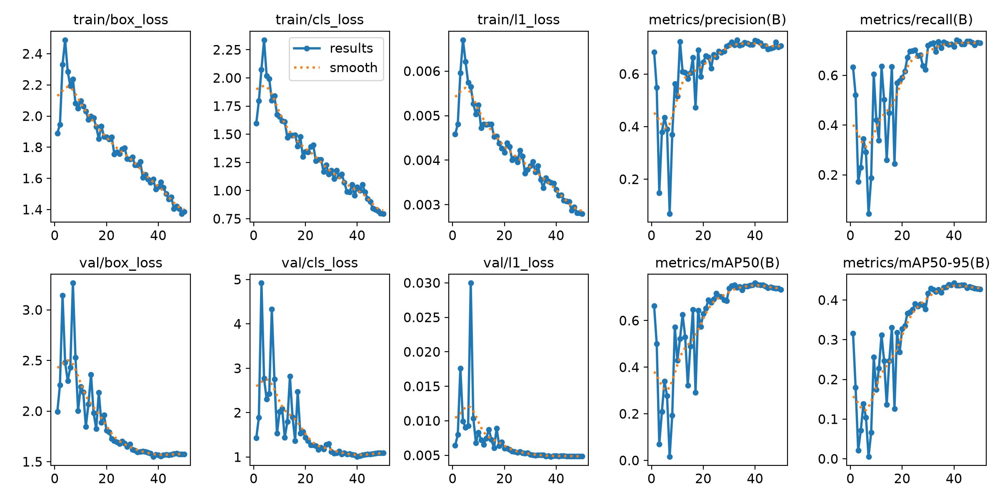
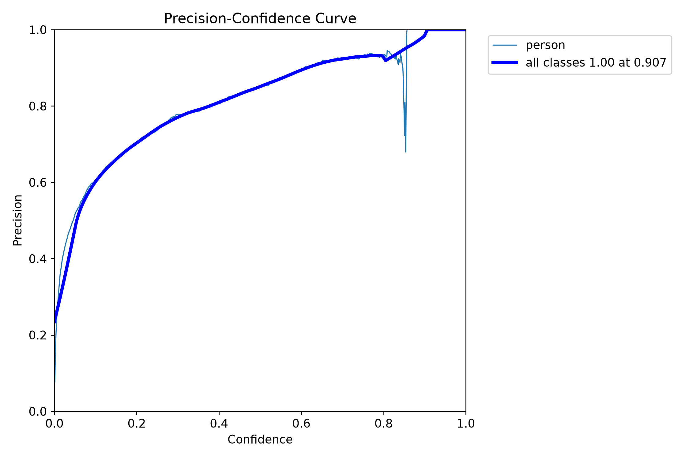
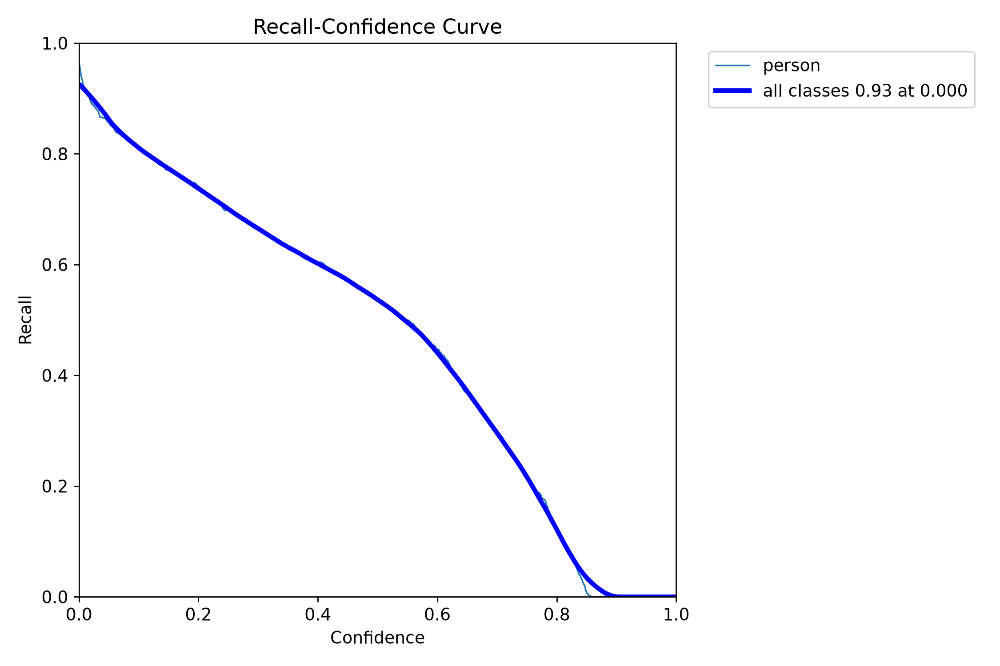
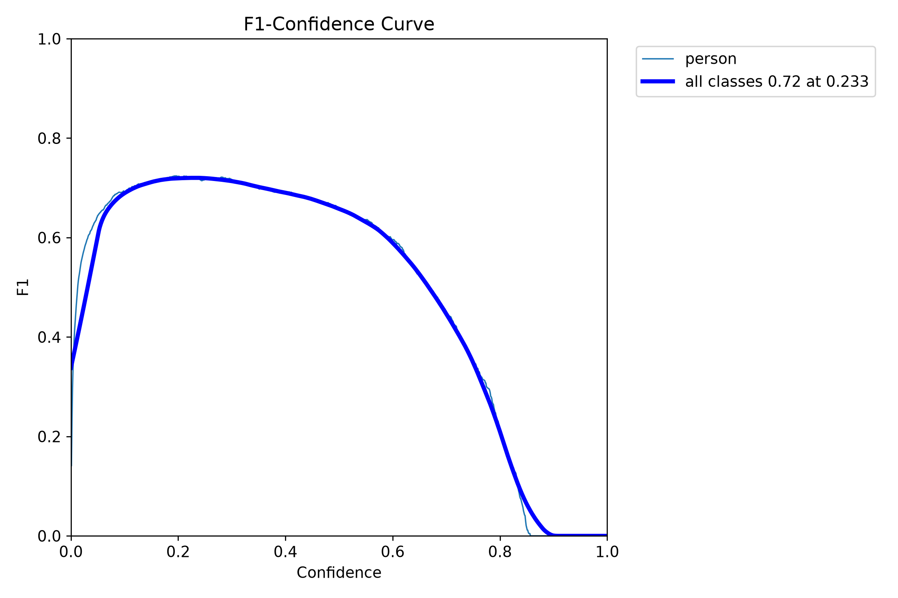
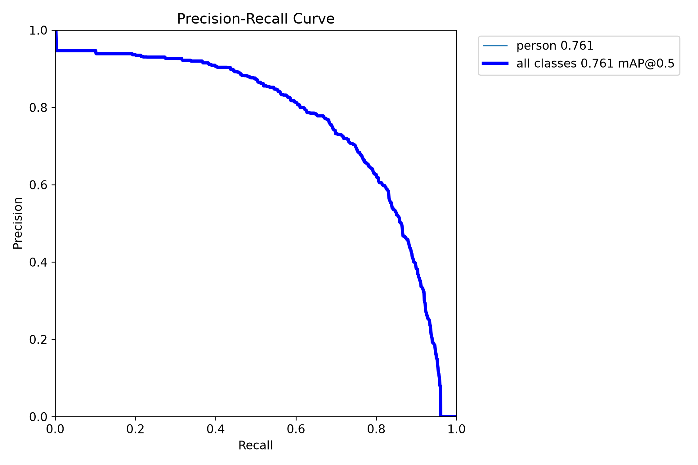
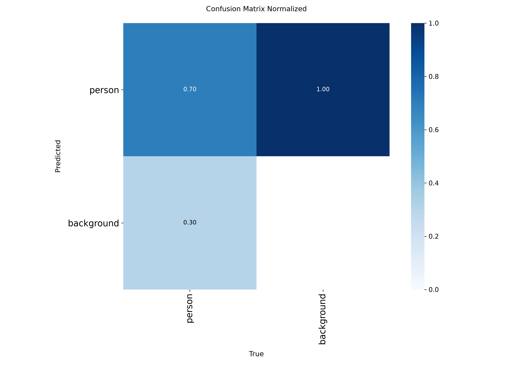
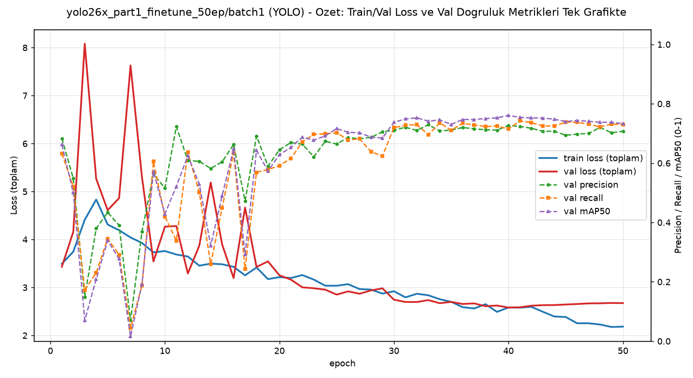

# Model Raporu — yolo26x_part1_finetune_50ep / batch1 / conf=0.45 denemesi

*Bu dosya `outputs/models/yolo26x_part1_finetune_50ep/batch1/report_conf045.md` konumunda duruyor. Eğitim/ağırlıklara HİÇ dokunulmadı — bu, MEVCUT `weights/best.pt` (gerçek batch=1 eğitimi) üzerinde SADECE inference güven eşiğini değiştiren bir denemedir, yeniden eğitim YAPILMADI.*

**Ne test edildi:** [batch=1 eğitilmiş YOLO26x-50ep modelinin](report_batch1.md) `weights/best.pt` ağırlığı, F1-optimal eşik **conf=0.45** ile `Video1.mp4`, `part_1.mp4`, `video02.mp4` ve `video03.mp4` üzerinde test edildi. imgsz, model seçimi gibi başka HİÇBİR ayara dokunulmadı.

---

## ÖNEMLİ BULGU: batch=1'in Video1.mp4'teki "iyileşmesi" büyük ölçüde gürültüymüş

[batch=1 raporunda](report_batch1.md) Video1.mp4'te 2.59 kişi/kare ile orijinal AutoBatch'e (1.35) göre bir "iyileşme" olarak yorumlanmıştı, ama bu HENÜZ görsel doğrulanmamıştı. Şimdi görsel karşılaştırma gösteriyor ki: eski eşikte (conf=0.15) sahnenin sağ-alt köşesinde, zaman damgası yazısının üzerinde/yakınında **4 örtüşen sahte kutu** vardı (person 0.68, 0.29, 0.29, 0.15) — gerçek insan DEĞİL, saat/tarih yazısını "insan" sanan bir hata. conf=0.45'e çıkınca bunlardan 3'ü elendi ama **biri (person 0.68) HÂLÂ DURUYOR** — F1-optimal eşik bile bu spesifik hatayı tam temizleyemiyor. Bu arada sahnedeki gerçek İKİ insan (yaya geçidini geçenler) NE ESKİ NE YENİ eşikte tespit edilmedi. **Sonuç: batch=1'in "iyileşmesi" gerçek tespit değil, kısmen zaman damgası üzerindeki sahte kutulardan kaynaklanıyordu — asıl kaçırma sorunu (gerçek insanları görmeme) hem AutoBatch'te hem batch=1'de aynı şekilde devam ediyor.**

---

## 1. Ayarlar

| Ayar | Değer |
|---|---|
| Ağırlık | `weights/best.pt` (gerçek batch=1 eğitimi, epoch 40, [rapor](report_batch1.md)) |
| Confidence threshold | **0.45** (F1 eğrisinden optimal) — önceki/varsayılan: 0.15 |
| Model/imgsz/vs. | DEĞİŞTİRİLMEDİ |

---

## 2. Eğitim ve Validation Eğrileri (DEĞİŞMEDİ)

Bu denemede yeniden eğitim yapılmadı — sadece mevcut `best.pt` ağırlığının inference eşiği değişti. Aşağıdaki grafikler [batch=1 raporundakiyle](report_batch1.md) BİREBİR AYNI, referans için tekrar gösteriliyor:

---

## 3. Ek görsel analizler (DEĞİŞMEDİ)

### 3.1 Güven eşiği eğrileri

| Dosya | Ne gösteriyor |
|---|---|
|  `BoxP_curve.png` | Precision - eşik |
|  `BoxR_curve.png` | Recall - eşik |
|  `BoxF1_curve.png` | F1 - eşik (optimal eşik 0.45 buradan bulundu) |
|  `BoxPR_curve.png` | Precision-Recall |

### 3.2 Confusion Matrix

---

## 4. Özet grafik

---

## 5. Inference Testleri

| Video | Ort. kişi/kare (conf=0.45) | Ort. kişi/kare (eski eşik, conf=0.15) | Fark | Not |
|---|---|---|---|---|
| `Video1.mp4` (hedef kamera) | 0.29 | 2.59 | -2.30 | ⚠️ Bkz. yukarıdaki önemli bulgu — büyük kısmı gürültüymüş |
| `part_1.mp4` (kendi verisi) | 11.25 | 18.55 | -7.30 | Beklenen düşüş |
| `video02.mp4` (yeni video) | 0.43 | *(daha önce test edilmedi)* | — | — |
| `video03.mp4` (yeni video) | 1.02 | *(daha önce test edilmedi)* | — | — |

Çıktı videolar: `inference_tests_conf045/Video1/`, `inference_tests_conf045/part_1/`, `inference_tests_conf045/video02/`, `inference_tests_conf045/video03/`

**Titreşim/görsel gözlem:** `Video1.mp4`'te aynı zaman damgasında (t=10sn) eski (0.15) ve yeni (0.45) eşiği karşılaştırdım. Eski eşikte sağ-alt köşede (zaman damgası yazısı üzerinde) 4 örtüşen sahte kutu vardı (0.68, 0.29, 0.29, 0.15). Yeni eşikte 3'ü elendi ama `person 0.68` hâlâ orada — F1-optimal eşik bu hatayı çözmüyor, sadece azaltıyor. Sahnedeki asıl iki gerçek insan hiçbir eşikte tespit edilmedi. [AutoBatch'teki bulguyla](../report_conf045.md) aynı desen.

---

## Genel değerlendirme

Bu conf=0.45 denemesi, [batch=1 raporundaki](report_batch1.md) "Video1.mp4'te iyileşme" bulgusunu ÇÜRÜTÜYOR — o iyileşmenin büyük kısmı zaman damgası üzerindeki sahte kutulardan kaynaklanıyormuş, gerçek insan tespitindeki bir iyileşme değil. Hem AutoBatch hem batch=1 YOLO26x modelleri, eşik ne olursa olsun, Video1.mp4'teki gerçek insanları GÖRMÜYOR — bu, batch boyutundan bağımsız, modelin temel bir genelleme sınırlaması.
