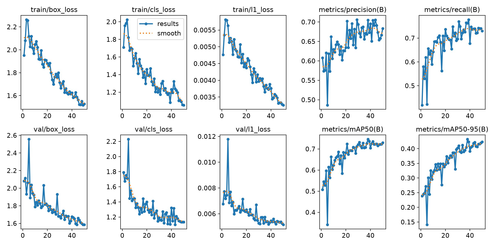
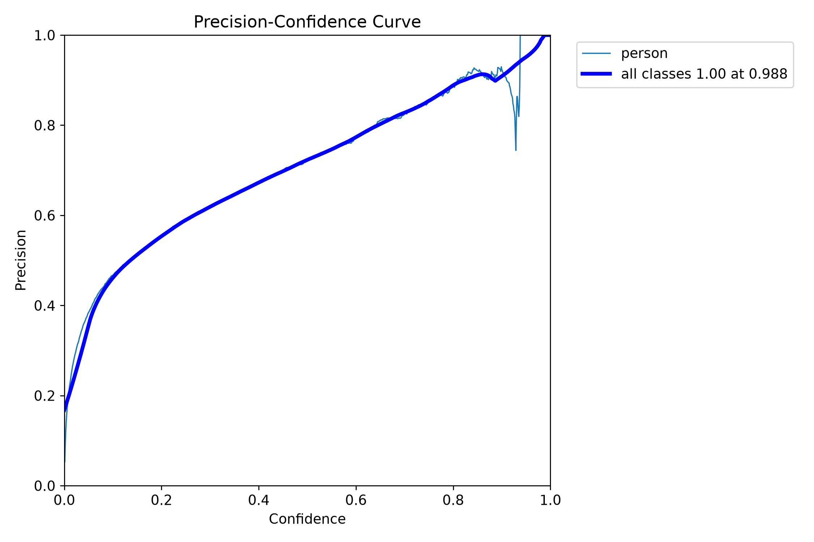
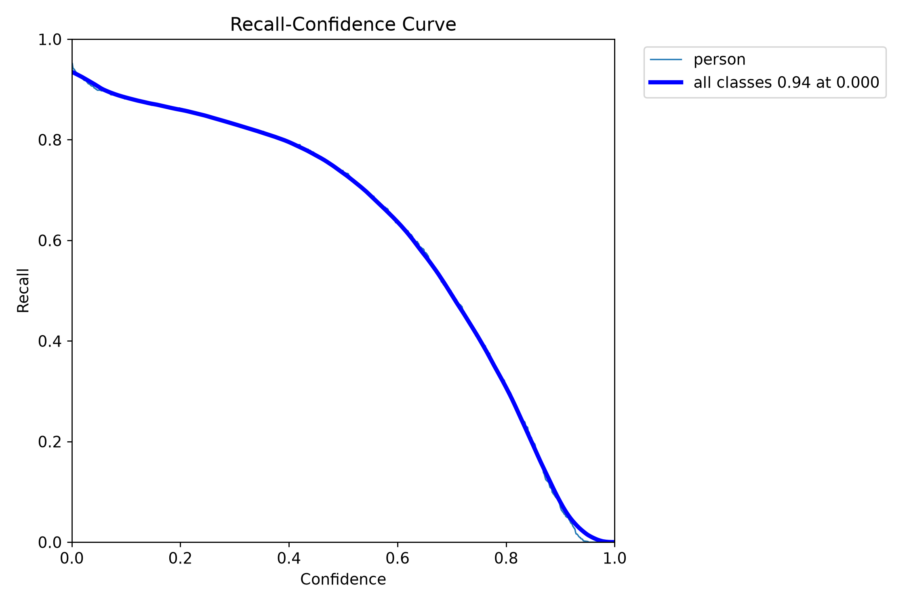
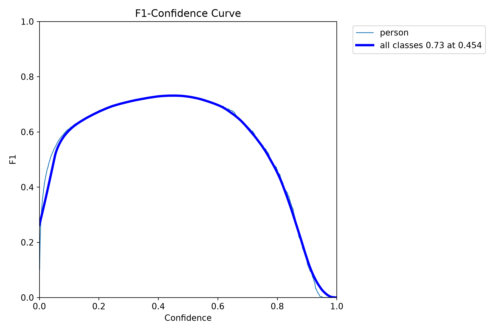
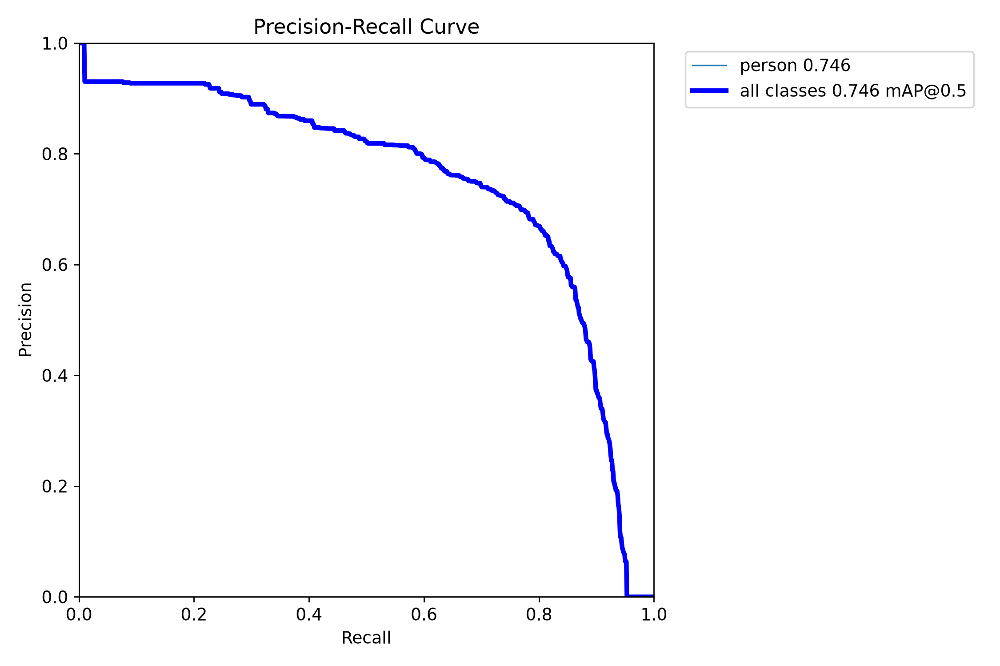
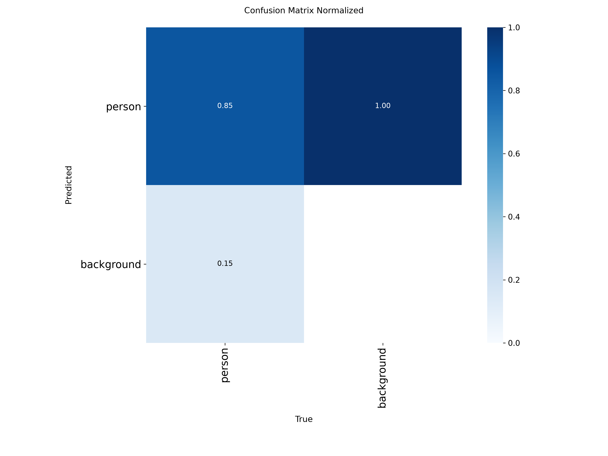
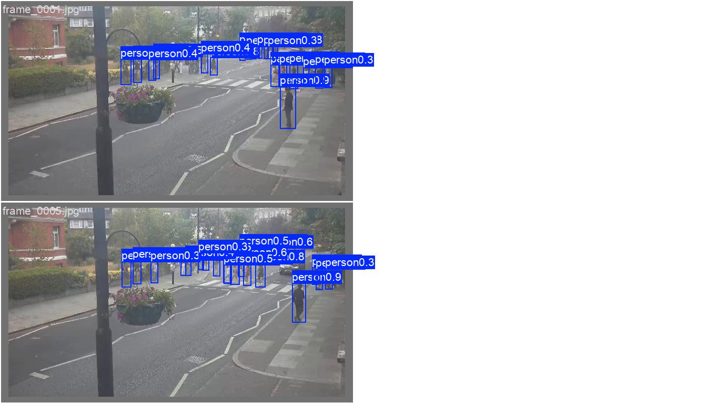
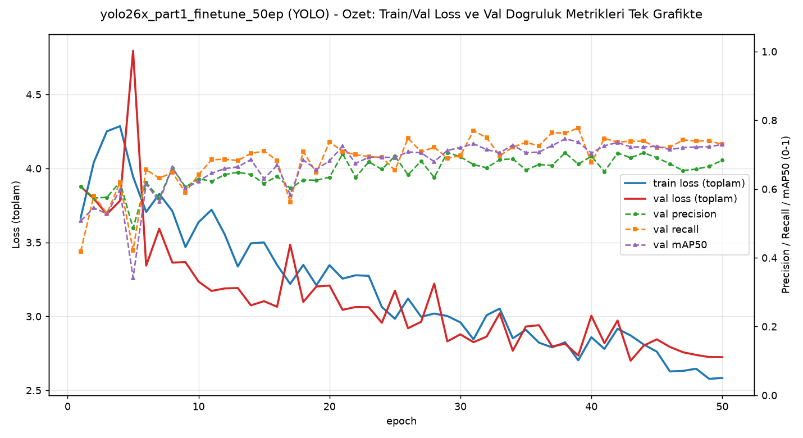

# Model Raporu — yolo26x_part1_finetune_50ep

*Bu dosya `outputs/models/yolo26x_part1_finetune_50ep/report.md` konumunda duruyor. Ağırlıklar `weights/`, eğitim grafikleri `training/`, video testleri `inference_tests/` altında.*

**Ne eğitildi:** `yolo26x.pt`, `part_1` verisiyle **50 epoch** fine-tune edildi — [25 epoch'luk denemenin](../yolo26x_part1_finetune/report.md) tekrarı, epoch sayısı 2 katına çıkarıldı.

---

## ÖNEMLİ BULGU: "50 epoch"un en iyi ağırlığı aslında epoch 38 — bu HATA DEĞİL, geçerli bir sonuç

Bu, 25 vs 50 epoch karşılaştırmamızın kendi başına önemli bir sonucu: 50 epoch'luk bu eğitimde Ultralytics, fitness skoruna (mAP50-95 ağırlıklı) göre en iyi noktayı **epoch 38**'de bulmuş ve `weights/best.pt`'yi oraya kaydetmiş — epoch 38'den epoch 50'ye kadar geçen son 12 epoch model bu metrikte net bir iyileşme sağlamamış, hatta hafif dalgalanmış (bkz. bölüm 1 tablosu: epoch 38'de mAP50-95=0.432, epoch 50'de 0.423 — epoch 50 daha DÜŞÜK). Bu, RF-DETR'de gördüğümüz "25 epoch'ta zaten doygunluğa ulaşmış" bulgusuna benzer bir işaret: YOLO26x da bu veri boyutunda (240 görsel) ~38 epoch civarında doygunlaşmış olabilir, kalan epoch'lar ekstra fayda sağlamamış.

**Rapor boyunca kullanılan/önerilen ağırlık `best.pt` (epoch 38)** — bu standart pratik (Ultralytics'in kendi fitness seçimi) ve doğru seçim. `weights/last.pt` (gerçek epoch 50 ağırlıkları) da klasörde duruyor, silinmedi — istenirse ayrıca video testine tabi tutulup epoch 38 ile karşılaştırılabilir, ama şu ana kadar sadece `best.pt` (epoch 38) test edildi.

---

## 1. Ayarlar / Configuration

| Ayar | Değer |
|---|---|
| Base model | `yolo26x.pt` (COCO ön-eğitimli) |
| Epoch | 50 |
| Batch size | **12** (AutoBatch, `batch=-1` — [25ep raporundaki](../yolo26x_part1_finetune/report.md) gibi retroaktif doğrulandı) |
| imgsz | 640 |
| Optimizer | `auto` |
| lr0 / lrf | 0.01 / 0.01 |
| momentum | 0.937 |
| weight_decay | 0.0005 |
| Veri seti | `part_1`, 240 train / 60 validation (25ep ile birebir aynı) |
| Inference confidence threshold | 0.15 (varsayılan), ayrıca 0.3 da denendi (bkz. bölüm 5) |
| Ağırlık dosyaları | `weights/best.pt` (**epoch 38**, raporda kullanılan/önerilen — bkz. not aşağıda), `weights/last.pt` (gerçek epoch 50, henüz ayrıca test edilmedi ama klasörde duruyor, istenirse test edilebilir) |

**"best.pt hangi epoch?" notu (denetim sırasında bulundu):** `results.csv`'yi kontrol ettim — `best.pt` eğitimin SON epoch'u (50) değil, Ultralytics'in fitness skoruna göre seçtiği **epoch 38**'e ait ağırlıklar (mAP50-95'in en yüksek olduğu nokta: 0.432). Epoch 50'nin kendi satırındaki değerler bundan farklı ve daha düşük (mAP50-95=0.423) — yani model epoch 38'den sonra hafifçe dalgalanmış/gerilemiş, Ultralytics bunu otomatik tespit edip en iyi noktayı saklamış. Aşağıdaki "final" tablo epoch 38'i (best.pt) gösteriyor.

---

## 2. Eğitim ve Validation Eğrileri

YOLOv8x/YOLO26x-25ep ile aynı mantık: üstte train, altta val loss bileşenleri (`box_loss`, `cls_loss`, `l1_loss`), sağda precision/recall/mAP50/mAP50-95.

**Epoch bazında ilerleme (özet, her 5 epoch'ta bir + best.pt satırı):**

| Epoch | Precision | Recall | mAP50 | mAP50-95 |
|---|---|---|---|---|
| 1 | 0.608 | 0.419 | 0.507 | 0.239 |
| 5 | 0.486 | 0.422 | 0.341 | 0.141 |
| 10 | 0.630 | 0.642 | 0.623 | 0.320 |
| 15 | 0.616 | 0.710 | 0.630 | 0.330 |
| 20 | 0.634 | 0.737 | 0.682 | 0.346 |
| 25 | 0.696 | 0.654 | 0.692 | 0.371 |
| 30 | 0.694 | 0.697 | 0.721 | 0.402 |
| 35 | 0.656 | 0.735 | 0.706 | 0.390 |
| **38 (best.pt)** | **0.705** | **0.763** | **0.746** | **0.432** |
| 40 | 0.695 | 0.677 | 0.705 | 0.391 |
| 45 | 0.691 | 0.721 | 0.724 | 0.408 |
| 50 (last.pt, final) | 0.684 | 0.730 | 0.729 | 0.423 |

### Sonuç özeti (best.pt — epoch 38)

| Metrik | 25 epoch (best) | 50 epoch (best.pt, epoch 38) |
|---|---|---|
| Precision | 0.663 | 0.705 |
| Recall | 0.713 | 0.763 |
| mAP50 | 0.706 | 0.746 |
| mAP50-95 | 0.394 | 0.432 |

Kendi validation setinde YOLOv8x'te gördüğümüze benzer şekilde her şey "iyi" görünüyor — ama biliyoruz ki bu tek başına güvenilir değil.

---

## 3. Ek görsel analizler

### 3.1 Güven eşiği eğrileri

| Dosya | Ne gösteriyor |
|---|---|
|  `BoxP_curve.png` | Precision - eşik |
|  `BoxR_curve.png` | Recall - eşik |
|  `BoxF1_curve.png` | F1 - eşik |
|  `BoxPR_curve.png` | Precision-Recall |

### 3.2 Confusion Matrix

### 3.3 Eğitim verisi istatistiği

### 3.4 Eğitim sırasında örnek kareler

### 3.5 Gerçek vs Tahmin (validation seti)

**Gerçek:** 
**Tahmin:** 

---

## 4. Özet grafik

Sol eksen train/val toplam loss, sağ eksen val precision/recall/mAP50. Bu grafik de (diğer YOLO modellerinde olduğu gibi) `part_1`'in kendi validation setinden geldiği için Video1.mp4'teki zayıf genellemeyi göstermez.

---

## 5. Inference Testleri

| Video | Ort. kişi/kare (conf=0.15) | Ort. kişi/kare (conf=0.3) | Yorum |
|---|---|---|---|
| `Video1.mp4` (hedef kamera) | **1.35** | *(test edilmedi)* | Görsel kontrol: bilinen karede (2 gerçek kişi) YİNE HİÇBİRİNİ bulamadı, sadece köşede belirsiz 1 düşük-güvenli kutu var. Düşük sayı "temiz" değil, "kaçırma". |
| `video01.mp4` | 9.44 | *(test edilmedi)* | — |
| `part_1.mp4` (kendi verisi) | 23.52 | **18.56** | Eşiği artırmak biraz azalttı ama YOLOv8x'teki gibi net bir düzelme değil (YOLOv8x'te 20.60→11.66, neredeyse 25ep seviyesine inmişti; burada 23.52→18.56, hâlâ yüksek) |

**Video1.mp4 karşılaştırması (25 vs 50 epoch):**

| | 25 epoch | 50 epoch |
|---|---|---|
| Ort. kişi/kare | 0.32 | 1.35 |
| Bilinen karede gerçek kişileri buluyor mu? | Hayır | Hayır |

50 epoch'ta sayı yükseldi (0.32→1.35) ama bu "düzelme" değil — hâlâ gerçek insanları kaçırıyor, sadece başka (muhtemelen yanlış) yerlerde birkaç düşük güvenli kutu daha üretmiş.

---

## Genel değerlendirme

YOLO26x, 50 epoch'ta ne YOLOv8x-50ep'in çarpıcı overfitting patlamasını (36.24) yaşadı, ne de gerçek bir düzelme gösterdi. `part_1.mp4`'te (kendi verisi) hem 25 hem 50 epoch'ta YOLOv8x'ten daha fazla kutu üretiyor (18-24 arası), `Video1.mp4`'te ise (hedef kamera) her iki epoch sayısında da gerçek kişileri güvenilir şekilde bulamıyor. Genel sonuç değişmedi: **RF-DETR hâlâ en güvenilir seçim.** Detaylar için [COMPARISON.md](../COMPARISON.md).
