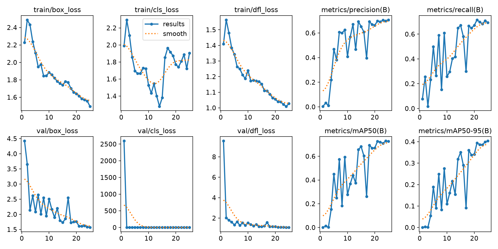
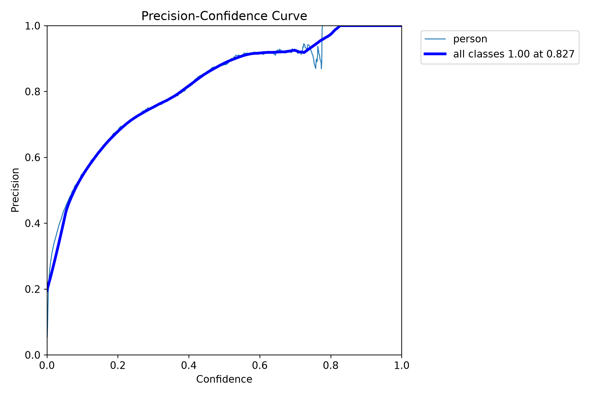
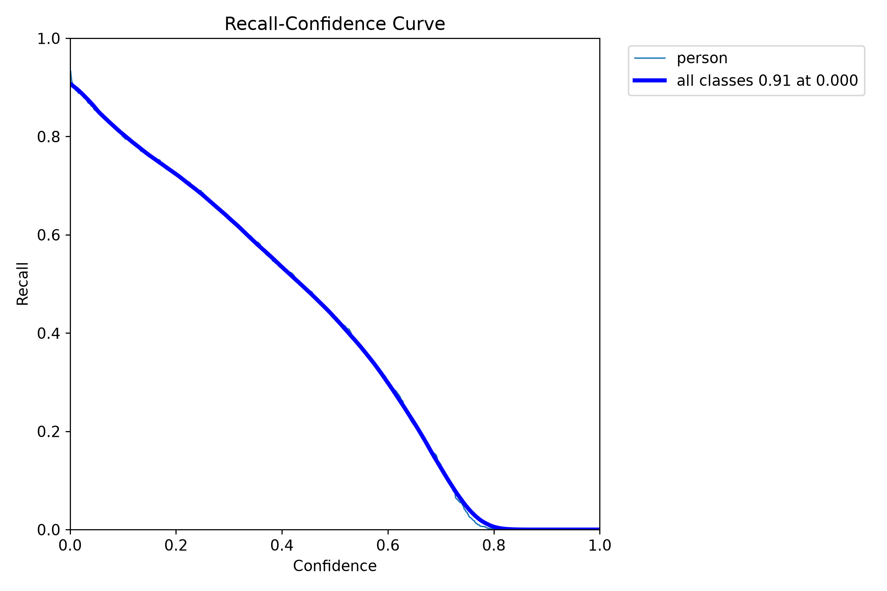
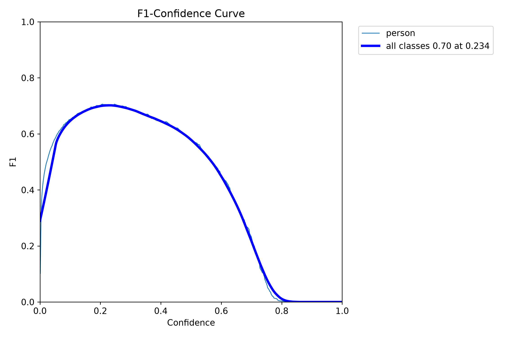
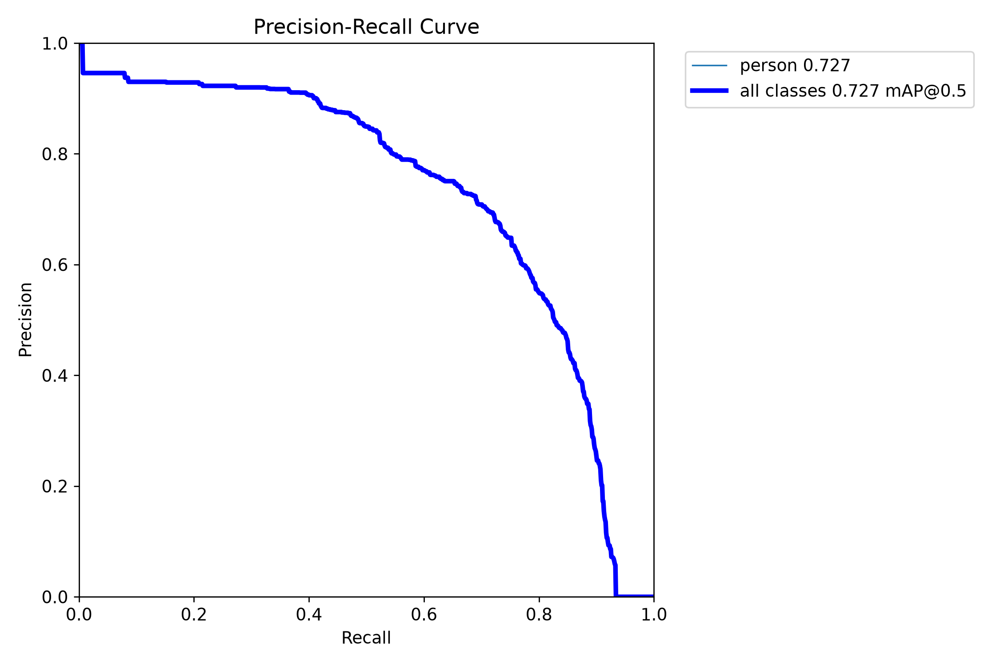
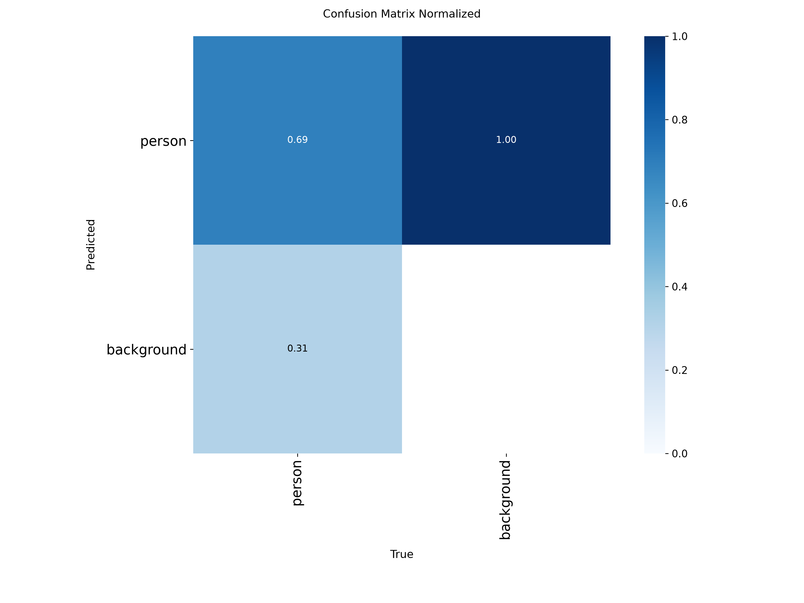
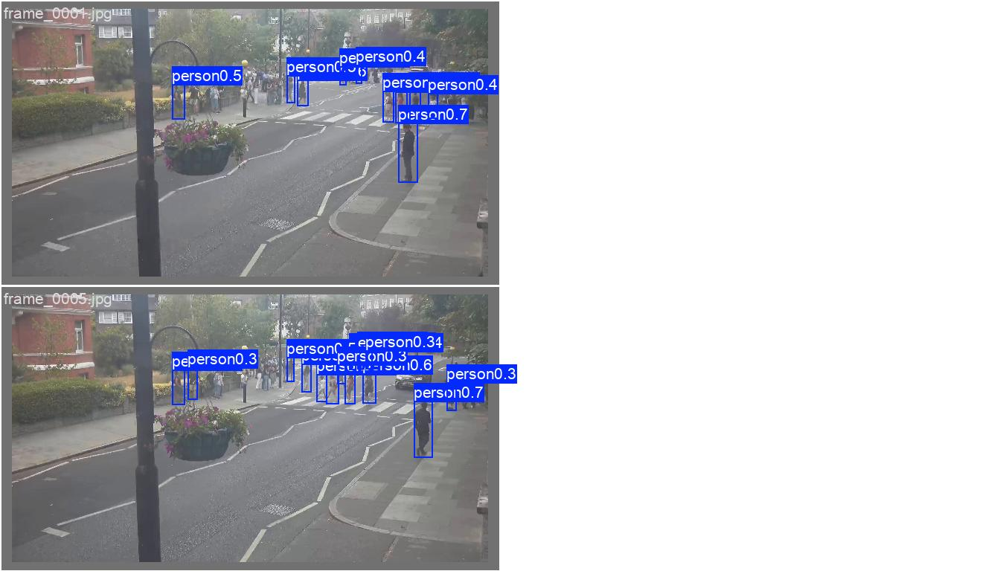
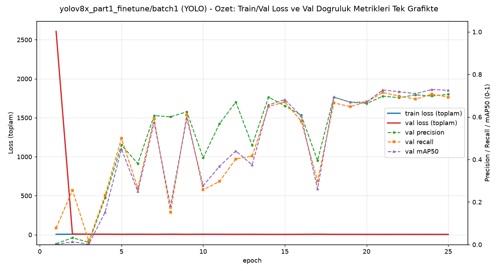

# Model Raporu — yolov8x_part1_finetune / batch1 (batch_size=1 denemesi)

*Bu dosya `outputs/models/yolov8x_part1_finetune/batch1/report_batch1.md` konumunda duruyor. [Orijinal AutoBatch sonucuna](../report.md) HİÇ dokunulmadı.*

**Ne test edildi:** [Orijinal YOLOv8x-25ep denemesinin](../report.md) BİREBİR AYNI verisiyle, `batch_size=1`.

## ÖNEMLİ METODOLOJİ NOTU: "batch=1" ilk denemede YANLIŞ ölçülmüştü, düzeltildi

Ultralytics'in `nbs` ("nominal batch size", varsayılan **64**) diye bir iç mekanizması var: `batch=1` verilse bile framework arka planda `nbs/batch_size = 64` adımı otomatik biriktirip ORTALAMA gradyanla güncelliyor — yani gerçekte "etkin batch=64" oluyor (orijinal AutoBatch'teki etkin=16'nın bile üstünde). İlk denemede bunu fark etmeden çalıştırdık; sonuç orijinal AutoBatch koşusuyla **virgülüne kadar aynı** çıkınca (11.63/5.90/1.22 — üçü de birebir) şüphelendik ve kaynağı bulduk. **Bu rapor DÜZELTİLMİŞ (`nbs=1`, gerçek/ham batch=1, hiç biriktirme yok) sonuçları gösteriyor** — RF-DETR'deki `grad_accum_steps=1` ayarıyla metodolojik olarak tutarlı.

---

## 1. Ayarlar / Configuration

| Ayar | Değer | Orijinal (AutoBatch) ile fark |
|---|---|---|
| Base model | `yolov8x.pt` | aynı |
| Epoch | 25 | aynı |
| Batch size | **1** | 16 → 1 |
| **nbs (nominal batch size)** | **1** (gizli biriktirme KAPALI) | 64 (varsayılan) → 1 |
| imgsz | 640 | aynı |
| Optimizer | `auto` (AdamW seçti) | aynı |
| Veri seti | 240 train / 60 val | aynı |
| Inference confidence threshold | 0.15 | aynı |
| Ağırlık dosyaları | `weights/best.pt` (epoch 25, final), `weights/last.pt` | — |

---

## 2. Eğitim ve Validation Eğrileri

**Epoch bazında ilerleme:**

| Epoch | Precision | Recall | mAP50 | mAP50-95 |
|---|---|---|---|---|
| 1 | 0.004 | 0.078 | 0.000 | 0.000 |
| 5 | 0.468 | 0.499 | 0.449 | 0.189 |
| 10 | 0.408 | 0.258 | 0.277 | 0.109 |
| 15 | 0.652 | 0.670 | 0.682 | 0.351 |
| 20 | 0.663 | 0.670 | 0.670 | 0.341 |
| **25 (final)** | **0.706-0.709** | **0.693-0.695** | **0.725-0.727** | **0.399-0.404** |

**Dikkat çeken bulgu (epoch 1):** Precision **0.004**, mAP50 **0.000** — modelin ilk epoch'ta neredeyse HİÇ öğrenmediği anlamına geliyor (orijinal AutoBatch'te epoch 1: 0.642/0.622). Bu, gerçek/ham batch=1'in beklediğimiz istikrarsızlığının somut kanıtı — tek örneklik gradyanlar ve ısınma (warmup) mekanizmasının küçük batch'te işe yaramaması, ilk epoch'u neredeyse boşa çıkarmış. Model epoch 5'ten itibaren toparlanmış, epoch 25'te orijinale yakın (hatta recall/mAP50'de hafif daha iyi) bir noktaya ulaşmış.

### Sonuç özeti — batch=1 (gerçek) vs orijinal (AutoBatch)

| Metrik | batch=1 (final) | Orijinal AutoBatch | Fark |
|---|---|---|---|
| Precision | 0.709 | 0.709 | 0.000 |
| Recall | 0.695 | 0.674 | +0.021 |
| mAP50 | 0.727 | 0.707 | +0.020 |
| mAP50-95 | 0.399 | 0.387 | +0.012 |

**Yorum:** Rastgele bir gürültü/dalgalanmadan mı yoksa gerçek bir iyileşmeden mi kaynaklandığı belirsiz (tek bir koşu, karşılaştırma için tekrar yok) ama sonuç kesinlikle bir ÇÖKÜŞ değil — kendi validation setinde orijinale eşit/hafif üstün.

---

## 3. Ek görsel analizler

### 3.1 Güven eşiği eğrileri

| Dosya | Ne gösteriyor |
|---|---|
|  `BoxP_curve.png` | Precision - eşik |
|  `BoxR_curve.png` | Recall - eşik |
|  `BoxF1_curve.png` | F1 - eşik |
|  `BoxPR_curve.png` | Precision-Recall |

### 3.2 Confusion Matrix

### 3.3 Eğitim verisi istatistiği

### 3.4 Eğitim sırasında örnek kareler

### 3.5 Gerçek vs Tahmin (validation seti)

**Gerçek:** 
**Tahmin:** 

---

## 4. Özet grafik

---

## 5. Inference Testleri

| Video | Ort. kişi/kare (batch=1, gerçek) | Orijinal (AutoBatch) | Fark |
|---|---|---|---|
| `part_1.mp4` (kendi verisi) | **25.14** | 11.63 | **+13.51 (~2.2 kat)** ⚠️ |
| `video01.mp4` (görülmemiş) | 7.43 | 5.90 | +1.53 |
| `Video1.mp4` (hedef kamera, görülmemiş) | 2.11 | 1.22 | +0.89 |

**⚠️ DOĞRULAMA GEREKİYOR (`part_1.mp4`'teki sıçrama):** 11.63'ten 25.14'e (~2.2 kat) çıkış, [YOLOv8x-50ep'teki overfitting deseniyle](../../yolov8x_part1_finetune_50ep/report.md) (kutu patlaması, gerçek olmayan tespitler) yüzeysel olarak benzer görünüyor. AMA validation metrikleri (P=0.709, R=0.695, mAP50=0.727) bunun aksini söylüyor — kendi 60 görsellik etiketli setinde model orijinalden KÖTÜ değil, hafif iyi. Bu çelişki henüz görsel olarak doğrulanmadı — çıktı videoyu (`inference_tests/part_1/part_1_detected.mp4`) izlemeden bunun "gerçek ek tespit" mi yoksa "gürültü" mü olduğunu kesin söyleyemem. `Video1.mp4`'teki artış (1.22→2.11) ise RF-DETR'nin (2.14) sonucuna yaklaştığı için OLUMLU bir işaret olabilir, ama bu da aynı şekilde doğrulanmadı.

Çıktı videolar: `inference_tests/part_1/`, `inference_tests/video01/`, `inference_tests/Video1/`

---

## Genel değerlendirme

YOLOv8x için gerçek batch=1, ilk epoch'ta ciddi bir istikrarsızlık yarattı (precision≈0) ama model toparlandı ve kendi validation setinde orijinale eşit/hafif üstün bir noktaya ulaştı — RF-DETR'deki kadar "sorunsuz" değil ama YOLOv8x-50ep'teki gibi kalıcı bir çöküş de değil. Video testlerindeki artışların (özellikle `part_1.mp4`'teki 2.2 kat) gerçek tespit mi gürültü mü olduğu görsel doğrulama bekliyor — bu belirsizlik açıkça not düşüldü, sessizce geçilmedi.
