# Model Raporu — yolov8x_part1_finetune

*Bu dosya `outputs/models/yolov8x_part1_finetune/report.md` konumunda duruyor. Ağırlıklar `weights/`, eğitim grafikleri `training/`, video testleri `inference_tests/` altında.*

**Ne eğitildi:** `yolov8x.pt` (COCO üzerinde hazır eğitilmiş model) başlangıç noktası alınarak, `part_1` klasöründeki 300 görselin Label Studio'da elle etiketlenmiş hali (294/300 karede etiket, 6'sında "kimse yok") ile fine-tune edildi.

---

## 1. Ayarlar / Configuration

| Ayar | Değer |
|---|---|
| Base model | `yolov8x.pt` (COCO ön-eğitimli) |
| Epoch | 25 |
| Batch size | **16** (AutoBatch, `batch=-1`) — bkz. not aşağıda |
| imgsz | 640 |
| Optimizer | `auto` (Ultralytics kendi seçti) |
| lr0 / lrf | 0.01 / 0.01 |
| momentum | 0.937 |
| weight_decay | 0.0005 |
| Veri seti | `part_1`, 300 görsel → 240 train / 60 validation (%80/%20) |
| Inference confidence threshold | 0.15 (`detector.py --conf`, bu kamera için ayrıca doğrulandı) |
| Ağırlık dosyaları | `weights/best.pt` (kullanılan), `weights/last.pt` |

**AutoBatch notu:** `batch=-1` verildiğinde Ultralytics eğitim başında GPU belleğine göre gerçek sayıyı kendisi hesaplıyor; bu değer eğitim anında konsola basılıyor ama `args.yaml`'a kaydedilmiyor, o yüzden orijinal eğitimin konsол çıktısı elimizde yoktu. Yukarıdaki **16** değeri, `ultralytics.utils.autobatch.check_train_batch_size(yolov8x, imgsz=640)` fonksiyonu bu makinede tekrar çalıştırılarak elde edildi (model YENİDEN EĞİTİLMEDİ, sadece AutoBatch hesaplaması tekrarlandı). Hesaplama veri setinden bağımsız, sadece model+çözünürlük+GPU'ya bağlı olduğu için orijinal eğitimdekiyle aynı sonucu vermesi beklenir.

**IMG_SIZE=640 notu:** İlk denemede imgsz=1280 (detector.py/roi.py ile aynı) ile GPU belleği (8GB, RTX 4070 Laptop) yetmemişti (CUDA out of memory). 640, YOLOv8'in standart/varsayılan eğitim çözünürlüğü — bellek ihtiyacını ~4'te 1'e indirdi, kartta rahat çalıştı. Eğitim çözünürlüğünün inference (detector.py/roi.py, 1280) ile birebir aynı olması şart değil.

---

## 2. Eğitim ve Validation Eğrileri

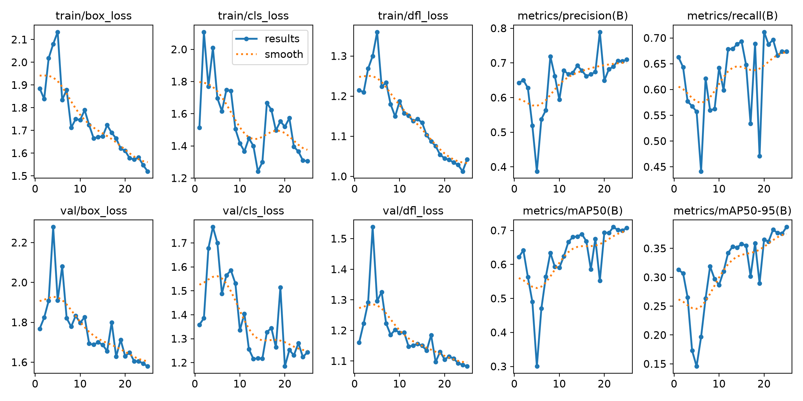

10 küçük grafik, iki grup halinde okunur:

- **Üstte "loss" grafikleri (box_loss, cls_loss, dfl_loss) + alttaki val versiyonları:** modelin "hata payı". **Düşmesi iyi** — grafiklerde net biçimde düşüyor, yani model gerçekten öğreniyor, ezberlemiyor (val loss da train loss ile birlikte düşüyor, bu önemli — sadece train düşüp val yükselseydi "ezberleme" (overfitting) işareti olurdu).
- **Sağdaki 4 grafik (precision, recall, mAP50, mAP50-95):** "başarı" ölçütleri. **Yükselmesi iyi** — inişli çıkışlı ama genel eğilim yukarı (epoch 5 civarında bir "çöküş" var, öğrenme oranının o dönemde yüksek olmasından kaynaklanan normal bir dalgalanma, sonrasında toparlanıyor).

**Epoch bazında ilerleme (tüm 25 epoch):**

| Epoch | Precision | Recall | mAP50 | mAP50-95 |
|---|---|---|---|---|
| 1 | 0.642 | 0.662 | 0.622 | 0.313 |
| 2 | 0.650 | 0.643 | 0.641 | 0.307 |
| 3 | 0.628 | 0.577 | 0.563 | 0.265 |
| 4 | 0.519 | 0.568 | 0.490 | 0.173 |
| 5 | 0.387 | 0.557 | 0.300 | 0.146 |
| 6 | 0.538 | 0.441 | 0.470 | 0.197 |
| 7 | 0.564 | 0.621 | 0.564 | 0.263 |
| 8 | 0.719 | 0.560 | 0.634 | 0.319 |
| 9 | 0.662 | 0.562 | 0.593 | 0.297 |
| 10 | 0.594 | 0.642 | 0.590 | 0.287 |
| 11 | 0.678 | 0.599 | 0.624 | 0.310 |
| 12 | 0.667 | 0.679 | 0.666 | 0.342 |
| 13 | 0.672 | 0.679 | 0.681 | 0.353 |
| 14 | 0.692 | 0.688 | 0.682 | 0.352 |
| 15 | 0.678 | 0.693 | 0.689 | 0.358 |
| 16 | 0.662 | 0.648 | 0.668 | 0.355 |
| 17 | 0.667 | 0.534 | 0.586 | 0.302 |
| 18 | 0.674 | 0.689 | 0.675 | 0.359 |
| 19 | 0.789 | 0.471 | 0.552 | 0.290 |
| 20 | 0.649 | 0.712 | 0.694 | 0.365 |
| 21 | 0.682 | 0.688 | 0.692 | 0.362 |
| 22 | 0.689 | 0.697 | **0.710** | 0.383 |
| 23 | 0.706 | 0.666 | 0.701 | 0.377 |
| 24 | 0.705 | 0.674 | 0.700 | 0.376 |
| **25 (best.pt)** | **0.709** | **0.674** | 0.707 | **0.387** |

### Sonuç özeti (best.pt — epoch 25)

| Metrik | Değer | Basitçe ne demek |
|---|---|---|
| Precision | **0.709** | Modelin "kişi" dediği şeylerin %70.9'u gerçekten kişi (geri kalanı yanlış alarm) |
| Recall | **0.674** | Gerçekte var olan kişilerin %67.4'ünü model buluyor (geri kalanını kaçırıyor) |
| mAP50 | **0.707** | IoU eşiği %50 iken genel doğruluk skoru (0-1 arası, yüksek iyi) |
| mAP50-95 | **0.387** | Daha katı/detaylı doğruluk skoru (kutunun konumu ne kadar hassas) |

---

## 3. Ek görsel analizler

### 3.1 Güven eşiği (confidence) eğrileri

| Dosya | Ne gösteriyor |
|---|---|
| 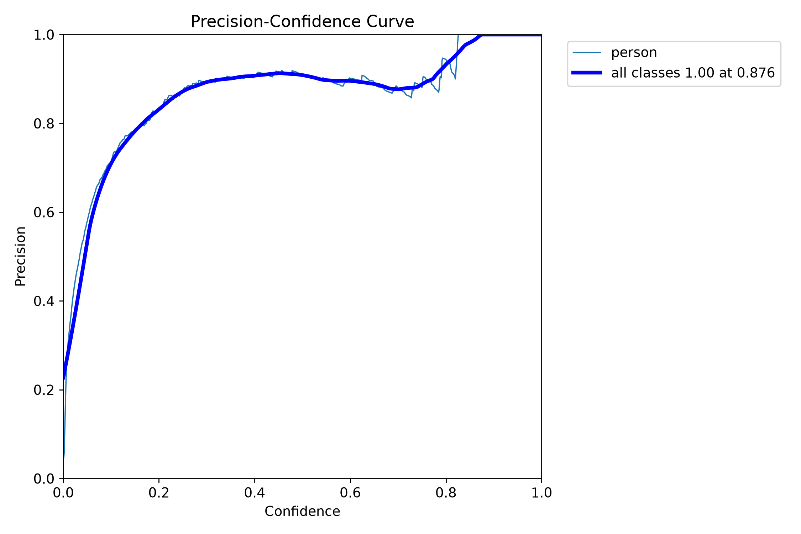 `BoxP_curve.png` | Eşik yükseldikçe **Precision** (yanlış alarm azalır) nasıl değişiyor |
| 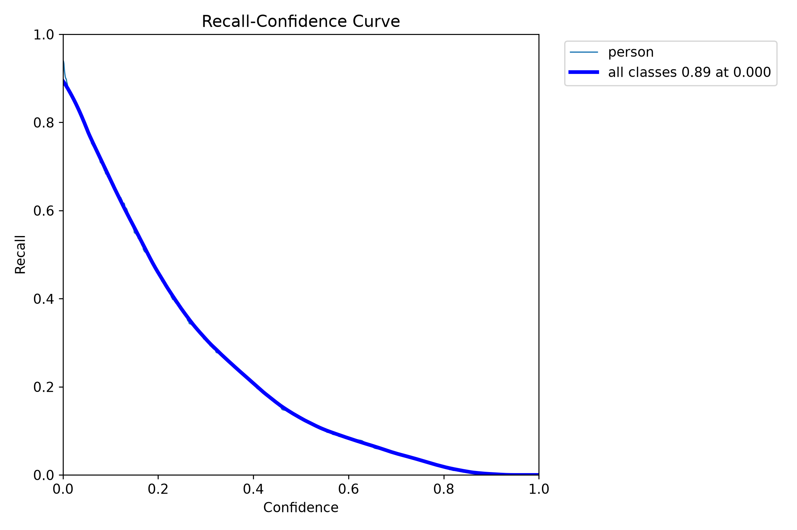 `BoxR_curve.png` | Eşik yükseldikçe **Recall** (kaçırma artar) nasıl değişiyor |
| 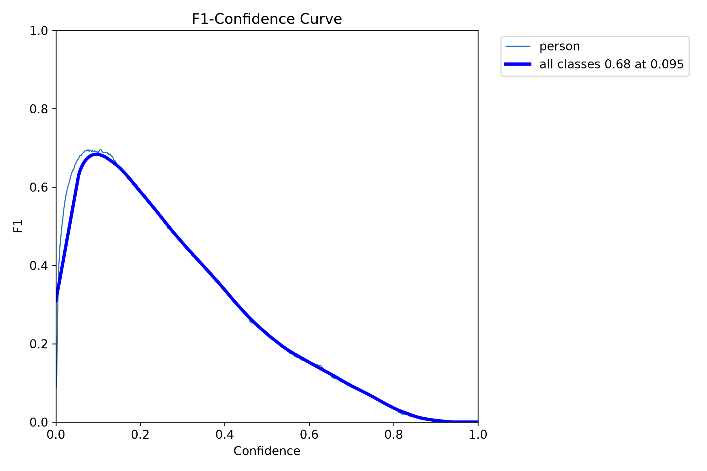 `BoxF1_curve.png` | İkisinin dengeli ortalaması — tepe noktası "en dengeli eşik" |
| 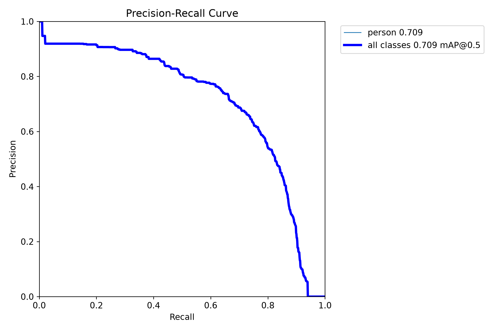 `BoxPR_curve.png` | Precision'ı Recall'a karşı çizer — eğri sağ-üst köşeye ne kadar yakınsa model o kadar iyi |

### 3.2 Confusion Matrix (Karışıklık Matrisi)

**Normalize edilmiş (yüzde olarak, okuması kolay):**

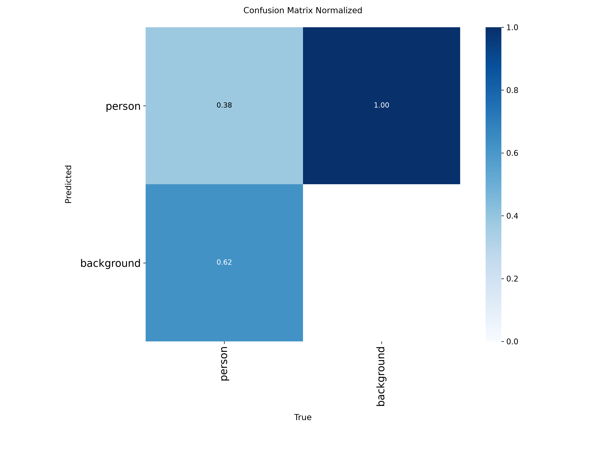

**Ham/sayısal versiyon (kaç kutu, ham adet olarak):**

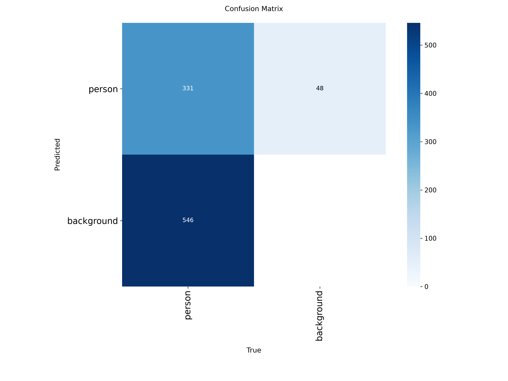

| | Gerçekte "person" | Gerçekte "background" (boş) |
|---|---|---|
| **Model "person" dedi** | %38 | (veri yok/az) |
| **Model "background" dedi (kaçırdı)** | %62 | %100 |

Bu sayı (%38 doğru bulma) ilk bakışta yukarıdaki Recall (%67.4) ile çelişiyor gibi görünebilir — sebebi, YOLO'nun bu matrisi hesaplama yönteminin standart olarak daha KATI olması (küçük konum hatalarını bile "kaçırılmış" sayabiliyor). Günlük değerlendirme için yukarıdaki **Recall (%67.4)** sayısına güvenmek daha doğru.

### 3.3 Eğitim verisi istatistiği

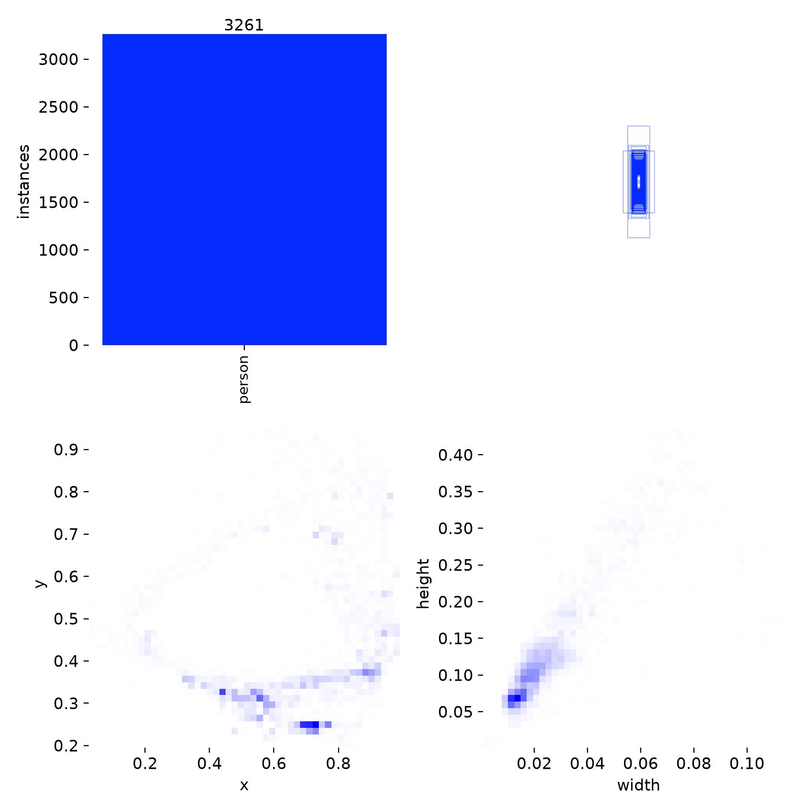

300 görseldeki tüm kutuların (etiketlerin) boyut/konum dağılımı — kutuların ekranda nerede yoğunlaştığı gibi. Sorun teşhisi için kullanılır (örn. "kutular hep aynı köşede mi" gibi), günlük takip için önemli değil.

### 3.4 Eğitim sırasında örnek kareler

Modele eğitim SIRASINDA gösterilen örnek kareler, üzerlerinde gerçek (insan etiketlemesi) kutular var — sadece "veri doğru okunuyor mu" diye görsel kontrol amaçlı.

**Eğitimin başından (batch 0-2, 3 örnek):**

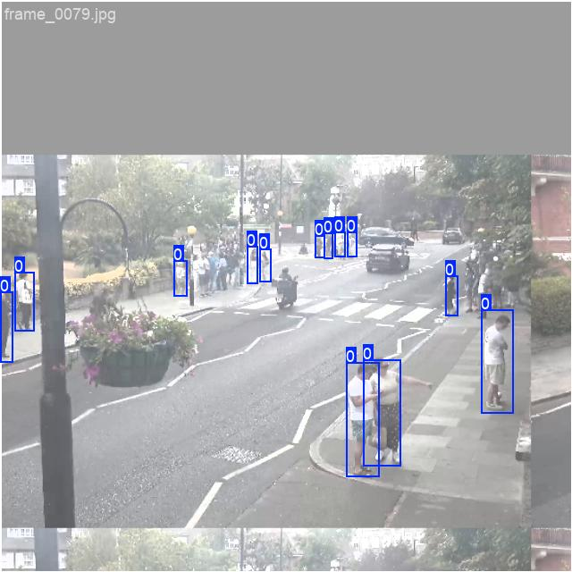

**Eğitimin sonundan (batch ~3600, 3 örnek):**

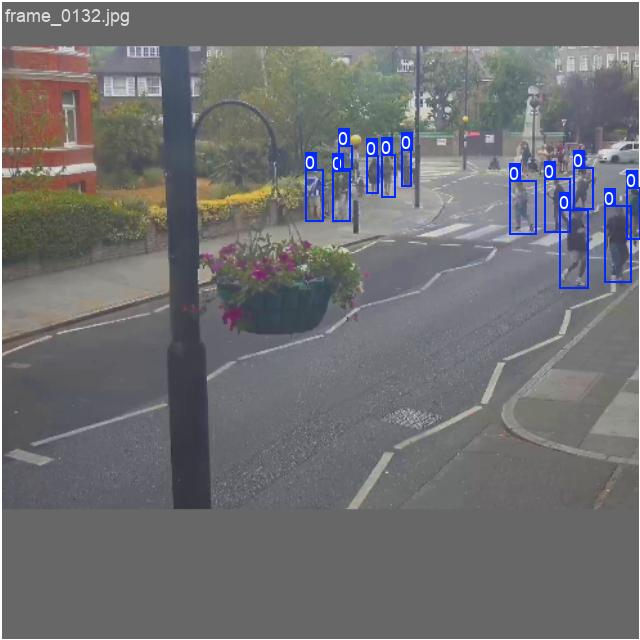
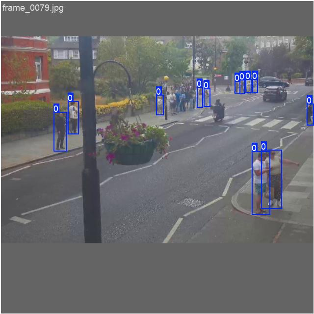
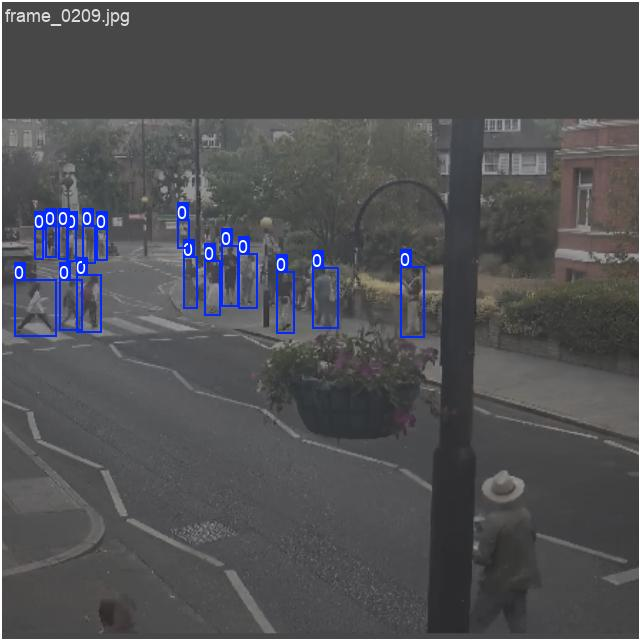

### 3.5 Gerçek vs Tahmin — en öğretici karşılaştırma

Aynı validation görüntüleri, iki versiyon: `_labels` = **gerçek** (insan etiketlemesi), `_pred` = **modelin tahmini**. Aradaki fark, modelin nerede eksik kaldığını gösteriyor.

**Grup 1 (val_batch0)**

**Gerçek etiketler (ground truth):**

**Model tahminleri (aynı görüntüler):**
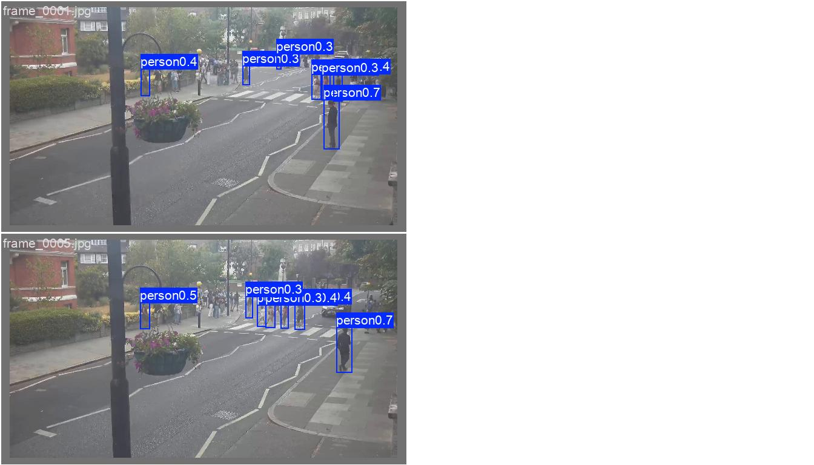

**Gözlem:** İnsan etiketlemesinde geçitteki hemen hemen herkes kutulanmış (~15+ kişi, kalabalık), model tahmininde ise daha azı (~6 kişi, güven skorlarıyla: person 0.7, person 0.4 gibi — düşük skorlar modelin "emin olamadığı" tespitler). Bu, modelin özellikle kalabalık/uzak kişilerde hâlâ geliştirilebilir olduğunu gösteriyor — 240 görsellik küçük bir pilot veri seti için beklenen bir durum, veri seti büyüdükçe (part_2, part_3...) düzelmesi beklenir.

**Grup 2 (val_batch1)**

**Gerçek etiketler:**
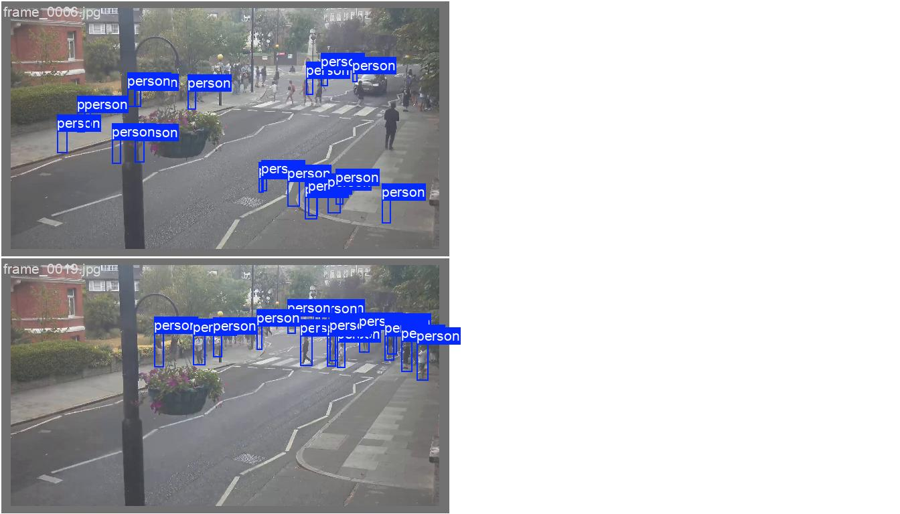

**Model tahminleri:**
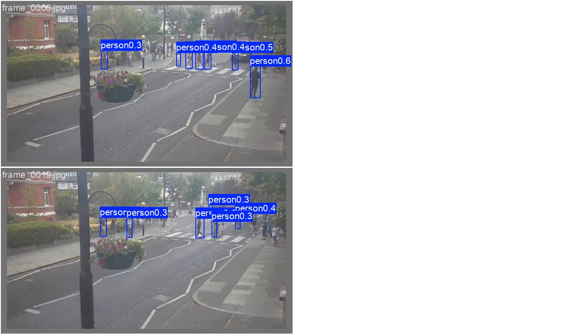

**Grup 3 (val_batch2)**

**Gerçek etiketler:**
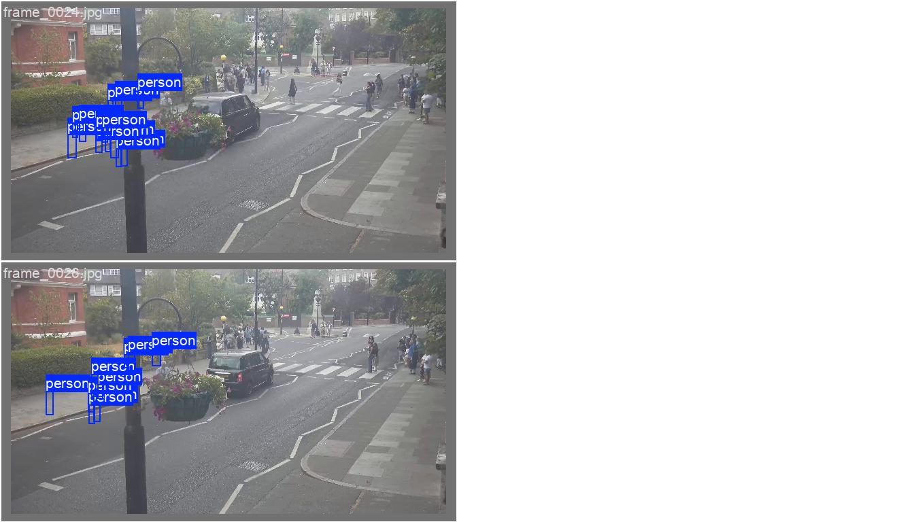

**Model tahminleri:**
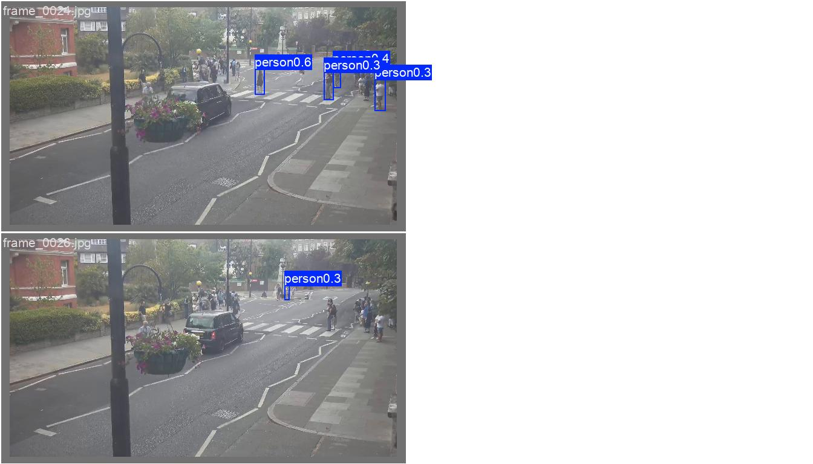

---

## 4. Özet grafik

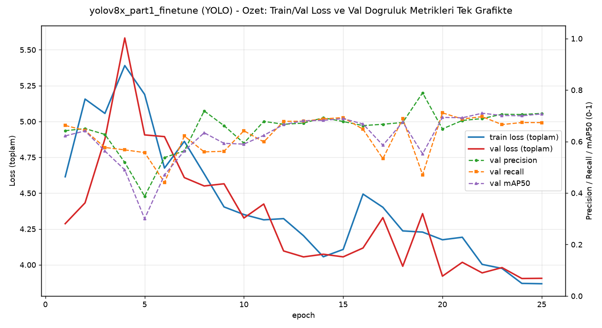

Tek pencerede: sol eksen train/val toplam loss (mavi/kırmızı, düşmesi iyi — ikisi birlikte düşüyor, ayrışma yok, ezberleme işareti YOK), sağ eksen val precision/recall/mAP50 (yeşil/turuncu/mor, yükselmesi iyi). Tek bakışta "bu model nasıl öğrendi" sorusunun cevabı.

---

## 5. Inference Testleri (video üzerinde gerçek çalıştırma)

Bu bölüm, modelin eğitim/validation metriklerinin ÖTESİNDE, gerçek video dosyaları üzerinde `detector.py` ile çalıştırılıp göz ile kontrol edildiği testleri listeler. Her test `inference_tests/<video_adı>/` altında kendi çıktı videosuyla duruyor.

| Video | Model bu videoyu eğitimde gördü mü? | Kare sayısı | Süre | Inference hızı | Ortalama kişi/kare | Çıktı |
|---|---|---|---|---|---|---|
| `part_1.mp4` | Evet (bu modelin TEK eğitim kaynağı) | 8992 | 5 dk (300sn) | ~10 fps (~900sn işlem süresi — dosya zaman damgalarından yaklaşık hesaplandı, kronometreyle ölçülmedi) | 11.63 | `inference_tests/part_1/part_1_detected.mp4` |
| `video01.mp4` | **Hayır — hiç görmedi** (gerçek "görülmemiş veri" testi) | 805 | 26.8sn | **10.79 fps** (`time` ile ölçüldü: 74.6sn / 805 kare, model yükleme dahil) | 5.90 | `inference_tests/video01/video01_detected.mp4` |
| `Video1.mp4` (`videos/`) | **Hayır — hiç görmedi.** Bu, `roi.py`/`tracker.py`'nin kullandığı `frames/` klasörüyle AYNI kamera (düşük çözünürlük, tepeden açı, gölgeli) — asıl hedef kamera | 463 | 15.4sn | **9.35 fps** (`time` ile ölçüldü: 49.5sn / 463 kare) | **1.22** (düşük — bkz. not) | `inference_tests/Video1/Video1_detected.mp4` |

**Önemli not (Video1.mp4):** Ortalama kişi/kare (1.22), diğer iki videoya (11.63 ve 5.90) göre belirgin düşük. Bu, daha önce statik karelerle (frames/ klasörü, label_frames.py) tespit ettiğimiz sorunla tutarlı: model sadece part_1'in kaynağı olan (net, aydınlık, Londra sokağı) tek bir kamerayla fine-tune edildiği için, görsel olarak FARKLI bu kamerada (düşük çözünürlük/gölgeli) bazı gerçek yayaları kaçırıyor. Bu videoyu izlerken özellikle buna dikkat et — muhtemelen orijinal (fine-tune edilmemiş) modelin bulduğu bazı kişileri bu model bulamayacak.

**Not:** `part_1.mp4` modelin KENDİ eğitim kaynağı olduğu için bu bir "görülmemiş veri" testi DEĞİL — modelin en iyi performans göstermesi BEKLENEN video budur. `video01.mp4` ise modelin HİÇ görmediği gerçek bir genelleme testi — sonucunu (kaç kişi doğru/eksik bulundu, kutuların ne kadar isabetli olduğu) gözle kontrol etmek en güvenilir yöntem, çıktı videoyu izleyerek değerlendir.

---

## Genel değerlendirme

Fine-tuning gerçekten öğrendi (loss düştü, mAP yükseldi) ama küçük/tek-kaynaklı bir pilot veri seti (sadece part_1, 240 görsel) olduğu için:
- Kendi kaynağında (part_1) makul ama mükemmel olmayan bir performans var (Recall %67.4 — 3 kişiden 1'ini bazı karelerde kaçırıyor).
- Farklı bir kamerada (`frames/` = `videos/Video1.mp4`) test edildiğinde performans daha da düşüyor (bkz. [COMPARISON.md](../COMPARISON.md)) — bu kameraya özel etiketli veri eklemek gerekiyor.

**Sonraki adım:** Video1.mp4 ve yeni veri kaynaklarından (Bellevue traffic dataset) örnekler etiketleyip, part_1 ile BİRLİKTE (üzerine yazmadan) fine-tuning'i tekrarlamak.
