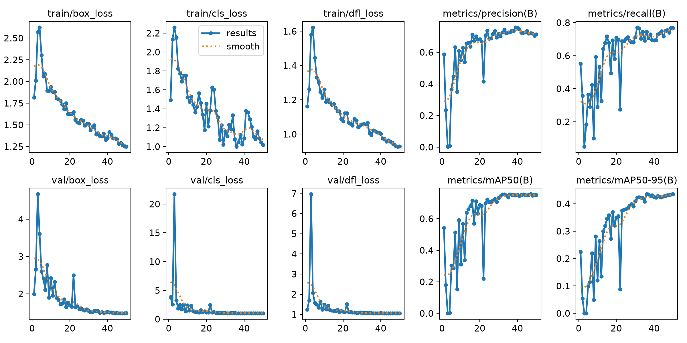
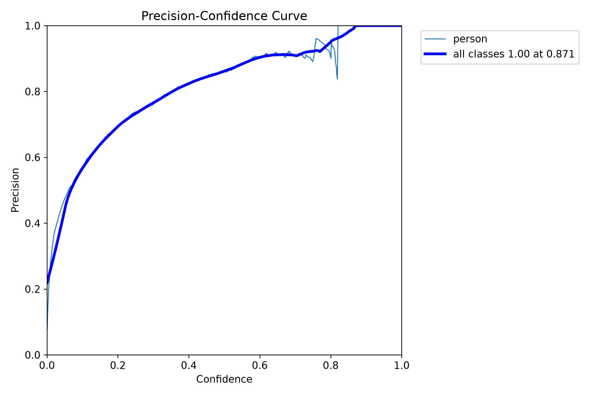
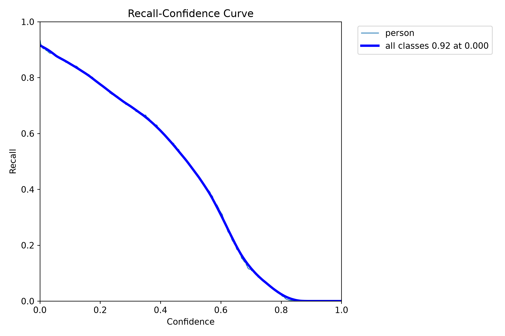
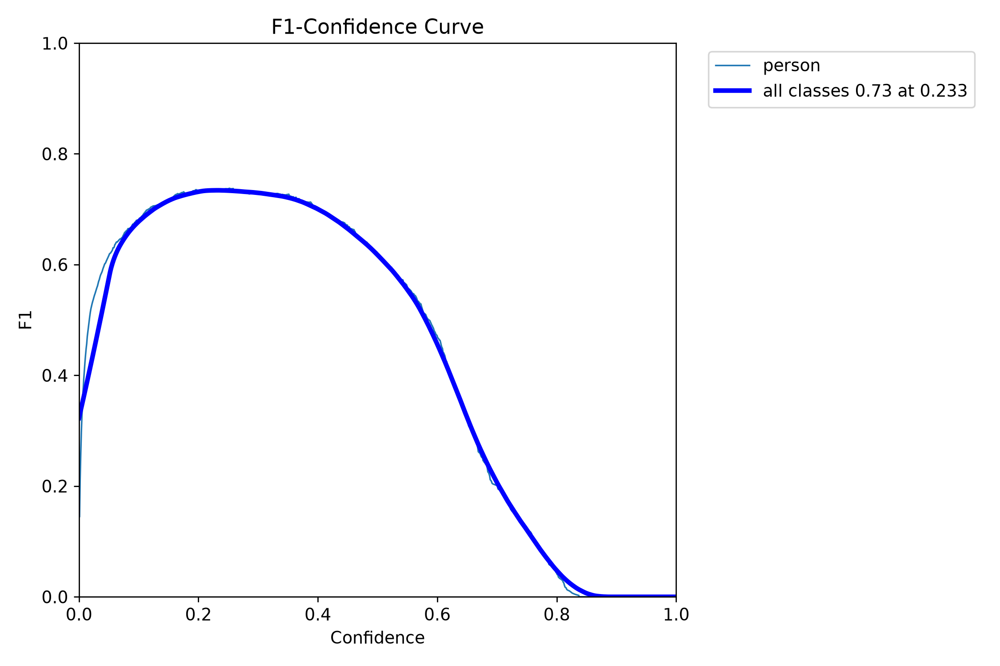
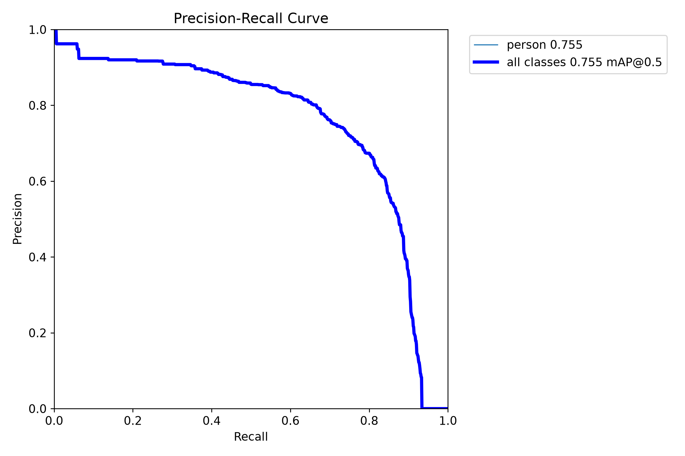
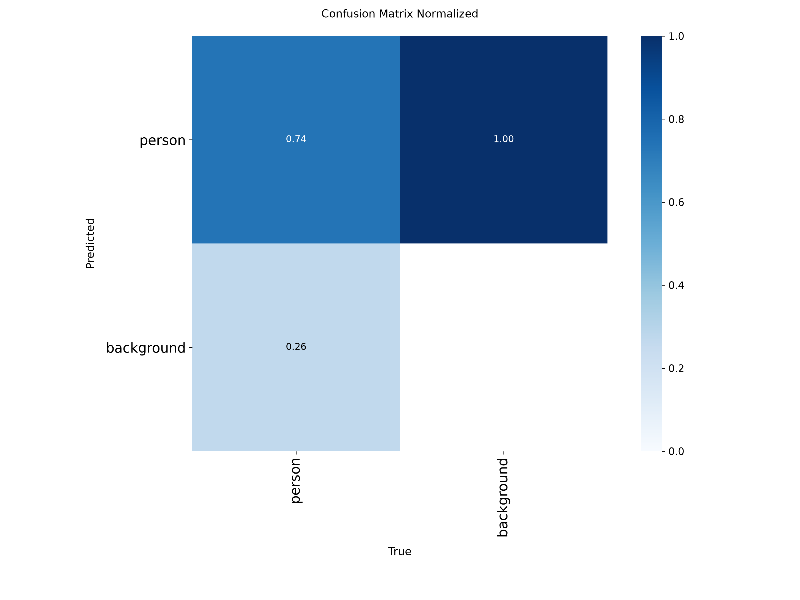
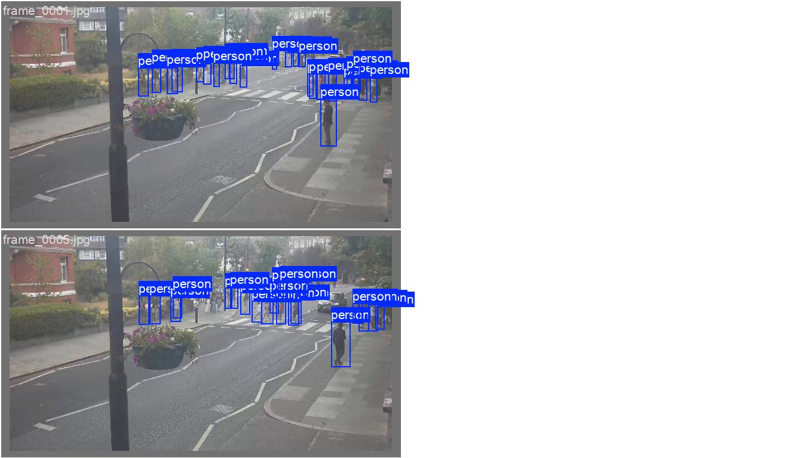
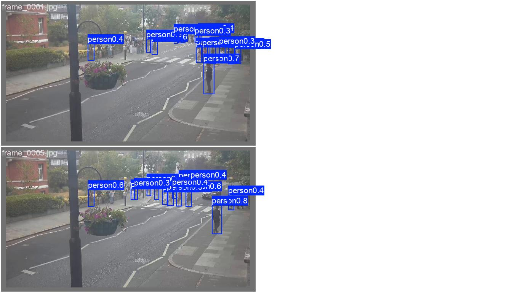
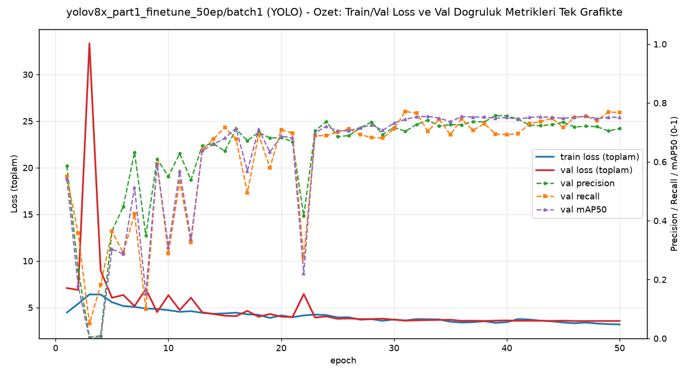

# Model Raporu — yolov8x_part1_finetune_50ep / batch1 (batch_size=1 denemesi)

*Bu dosya `outputs/models/yolov8x_part1_finetune_50ep/batch1/report_batch1.md` konumunda duruyor. [Orijinal AutoBatch sonucuna](../report.md) HİÇ dokunulmadı.*

**Ne test edildi:** [Orijinal YOLOv8x-50ep denemesinin](../report.md) BİREBİR AYNI verisiyle, gerçek/ham `batch_size=1` (`nbs=1` — [25ep batch1 raporundaki](../../yolov8x_part1_finetune/batch1/report_batch1.md) metodoloji düzeltmesiyle AYNI ayar, biriktirme yok).

---

## ÖNEMLİ BULGU: Aynı hedef kamerada (Video1.mp4), TERS yönde bir bozulma

[Orijinal AutoBatch/50ep](../report.md) modeli Video1.mp4'te (hedef kamera) **1.22'den 36.24'e** fırlayarak halüsinasyon görüyordu (ağaç/gölgeyi "insan" sanıyordu). Bu batch=1/50ep modeli ise TAM TERSİ bir davranış gösterdi: Video1.mp4'te ortalama **0.23** kişi/kare — yani neredeyse HİÇ tespit yapmıyor ([batch=1/25ep'in](../../yolov8x_part1_finetune/batch1/report_batch1.md) 2.11'inin ve orijinal 25ep'in 1.22'sinin bile çok altında). Kendi validation setinde (bölüm 2) model gayet iyi durumda (mAP50=0.751) — yani bu bir "eğitim başarısız oldu" durumu değil, iki farklı 50-epoch modelin (AutoBatch vs batch=1) hedef kamerada TAMAMEN ZIT yönlerde genelleme hatası yapması. AutoBatch fazladan-tespit (false positive/halüsinasyon) yönünde overfit oldu, batch=1 ise eksik-tespit (false negative/aşırı temkinli) yönünde. Bu, batch boyutunun sadece "iyi/kötü" değil, modelin HANGİ YÖNDE hata yapacağını da etkileyebildiğinin somut bir kanıtı — henüz görsel olarak doğrulanmadı (çıktı video izlenmedi), bu yüzden kesin "neden" iddiası yapılmıyor, ama sayısal fark çok büyük ve göz ardı edilemez.

---

## 1. Ayarlar / Configuration

| Ayar | Değer | Orijinal (AutoBatch) ile fark |
|---|---|---|
| Base model | `yolov8x.pt` | aynı |
| Epoch | 50 | aynı |
| Batch size | **1** | 16 → 1 |
| **nbs (nominal batch size)** | **1** (gizli biriktirme KAPALI) | 64 (varsayılan) → 1 |
| imgsz | 640 | aynı |
| Optimizer | `auto` (AdamW/MuSGD seçti) | aynı |
| Veri seti | 240 train / 60 val | aynı |
| Inference confidence threshold | 0.15 | aynı |
| Toplam eğitim süresi | 0.625 saat (~37.5 dk) | — |
| Ağırlık dosyaları | `weights/best.pt` (epoch 36, fitness'a göre en iyi — ama epoch 50'ye çok yakın, bkz. bölüm 2), `weights/last.pt` (epoch 50) | — |

---

## 2. Eğitim ve Validation Eğrileri

**Epoch bazında ilerleme:**

| Epoch | Precision | Recall | mAP50 | mAP50-95 |
|---|---|---|---|---|
| 1 | 0.587 | 0.551 | 0.541 | 0.225 |
| 5 | 0.365 | 0.364 | 0.304 | 0.100 |
| 10 | 0.551 | 0.290 | 0.311 | 0.120 |
| 15 | 0.637 | 0.717 | 0.680 | 0.345 |
| 20 | 0.682 | 0.709 | 0.687 | 0.350 |
| 25 | 0.686 | 0.701 | 0.705 | 0.380 |
| 30 | 0.717 | 0.712 | 0.732 | 0.409 |
| 35 | 0.726 | 0.692 | 0.736 | 0.409 |
| 36 (best.pt, mAP50-95'e göre en iyi) | — | — | — | **0.435** |
| 40 | 0.756 | 0.693 | 0.751 | 0.425 |
| 45 | 0.735 | 0.717 | 0.748 | 0.428 |
| **50 (final/last.pt)** | **0.713** | **0.767** | **0.751** | **0.435** |

**Doygunluk yok:** [Önceki modellerdeki](../../yolo26x_part1_finetune_50ep/report.md) gibi keskin bir "epoch X'ten sonra düşüş" yok — epoch 36 ile 50 pratik olarak aynı (0.43524 vs 0.43509), model 50 epoch boyunca istikrarlı şekilde iyileşmeye devam etmiş, aşırı ezberleme (kendi validation setinde) görünmüyor.

### Sonuç özeti — batch=1 (final) vs orijinal AutoBatch (final)

| Metrik | batch=1 (epoch 50) | Orijinal AutoBatch (epoch 50) | Fark |
|---|---|---|---|
| Precision | 0.713 | 0.719 | -0.006 |
| Recall | 0.767 | 0.721 | +0.046 |
| mAP50 | 0.751 | 0.720 | +0.031 |
| mAP50-95 | 0.435 | 0.402 | +0.033 |

**Yorum:** Kendi validation setinde batch=1 modeli orijinalden BELİRGİN ŞEKİLDE daha iyi (özellikle mAP50-95'te +0.033). Ama bölümdeki asıl bulgu (yukarıda) gösteriyor ki bu, hedef kamerada daha iyi genelleme anlamına gelmiyor — tam tersi yönde bir sorun ortaya çıkmış olabilir.

---

## 3. Ek görsel analizler

### 3.1 Güven eşiği eğrileri

| Dosya | Ne gösteriyor |
|---|---|
|  `BoxP_curve.png` | Precision - eşik |
|  `BoxR_curve.png` | Recall - eşik |
|  `BoxF1_curve.png` | F1 - eşik |
|  `BoxPR_curve.png` | Precision-Recall |

### 3.2 Confusion Matrix

### 3.3 Eğitim verisi istatistiği

### 3.4 Eğitim sırasında örnek kareler

### 3.5 Gerçek vs Tahmin (validation seti)

**Gerçek:** 
**Tahmin:** 

---

## 4. Özet grafik

---

## 5. Inference Testleri

| Video | Ort. kişi/kare (batch=1, 50ep) | Orijinal (AutoBatch, 50ep) | batch=1 (25ep, kıyaslama) | Orijinal (AutoBatch, 25ep) |
|---|---|---|---|---|
| `part_1.mp4` (kendi verisi) | 20.30 | 20.60 | 25.14 | 11.63 |
| `video01.mp4` (görülmemiş) | 6.20 | 7.84 | 7.43 | 5.90 |
| `Video1.mp4` (hedef kamera, görülmemiş) | **0.23** ⚠️ | 36.24 (halüsinasyon) | 2.11 | 1.22 |

**⚠️ DOĞRULAMA GEREKİYOR:** Video1.mp4'teki 0.23 sonucu HENÜZ görsel olarak izlenmedi (`inference_tests/Video1/Video1_detected.mp4`). Sayı bu kadar düşük olduğu için iki olası açıklama var: (1) model gerçekten bu kamerada aşırı temkinli hale gelmiş, gerçek kişileri kaçırıyor (asıl endişe verici olan), veya (2) videoda zaten çoğu karede kişi yok ve model bunu doğru okuyor (batch=1/25ep'in 2.11 sonucu ile karşılaştırıldığında bu ihtimal daha zayıf görünüyor, ama kesin değil). `part_1.mp4` ve `video01.mp4` sonuçları ise beklenen aralıkta, sorun yok.

Çıktı videolar: `inference_tests/part_1/`, `inference_tests/video01/`, `inference_tests/Video1/`

---

## Genel değerlendirme

YOLOv8x-50ep'te batch=1, kendi validation setinde orijinal AutoBatch'ten daha iyi sonuç verdi (mAP50-95: 0.402→0.435) ve [25ep'teki gibi](../../yolov8x_part1_finetune/batch1/report_batch1.md) epoch-1 istikrarsızlığı (bu sefer daha yumuşak, precision epoch 1'de 0.587) yaşandı ama toparlandı. Asıl dikkat çekici bulgu: hedef kamerada (Video1.mp4) orijinal AutoBatch modeli halüsinasyon yönünde overfit olurken (36.24), batch=1 modeli TERS yönde, neredeyse sıfır tespit yönünde bir soruna işaret ediyor (0.23) — bu henüz görsel olarak doğrulanmadı ve 6 modelin tamamı bitince yapılacak genel karşılaştırmada daha derin incelenebilir.
