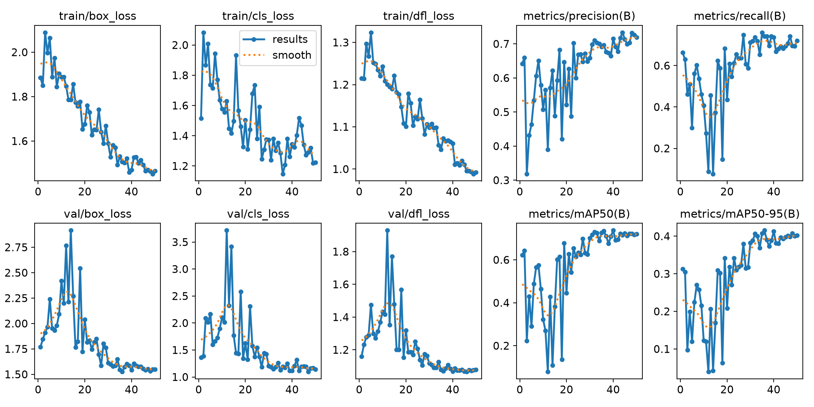
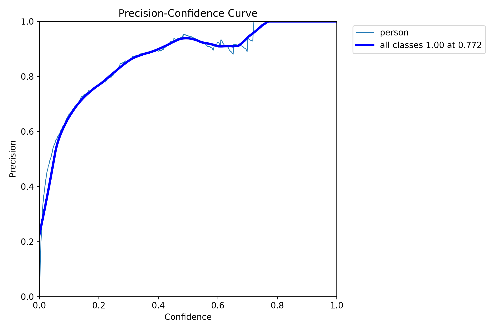
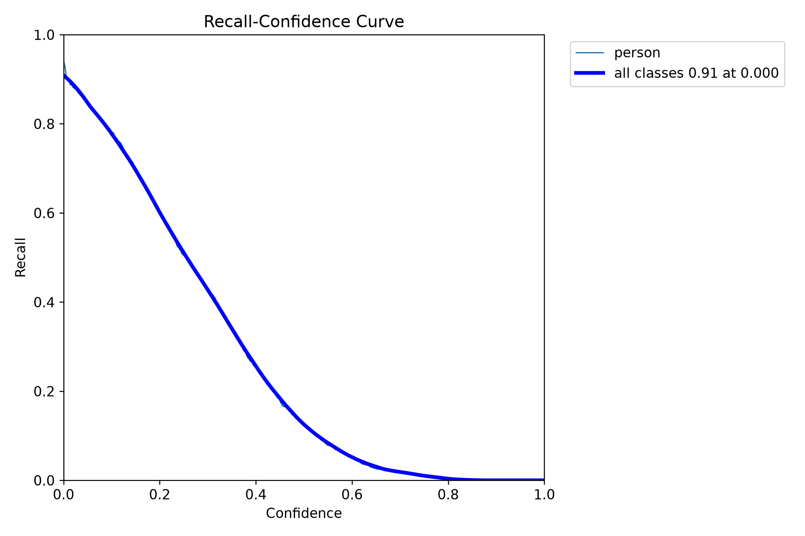
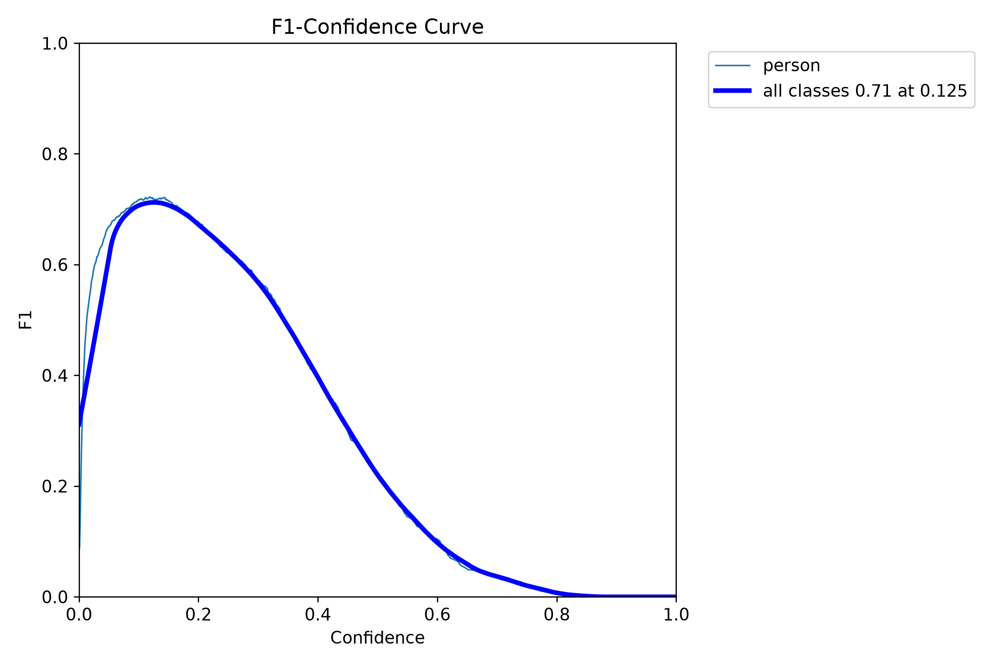
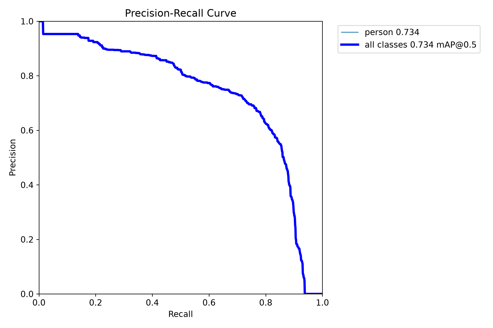
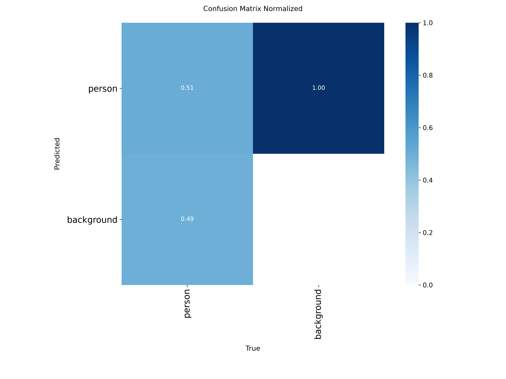
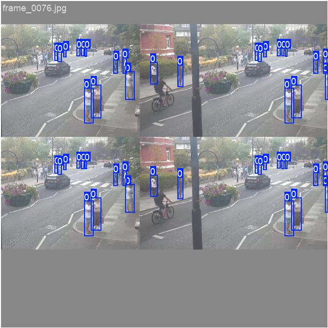
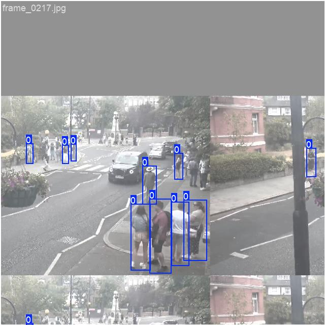
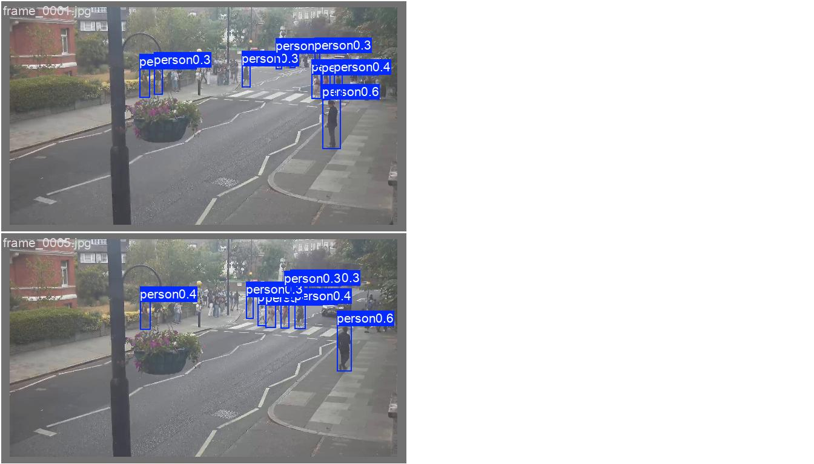
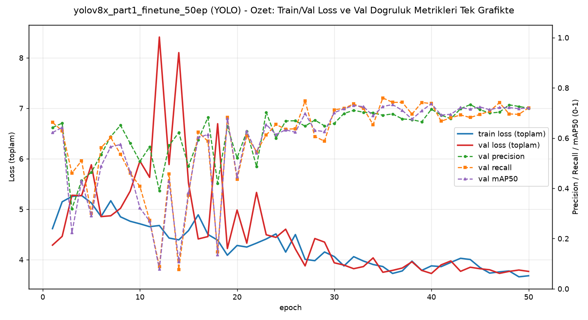

# Model Raporu — yolov8x_part1_finetune_50ep

*Bu dosya `outputs/models/yolov8x_part1_finetune_50ep/report.md` konumunda duruyor. Ağırlıklar `weights/`, eğitim grafikleri `training/`, video testleri `inference_tests/` altında.*

**Ne eğitildi:** `yolov8x.pt`, `part_1` verisiyle (240 train / 60 validation) **50 epoch** fine-tune edildi — [25 epoch'luk ilk denemenin](../yolov8x_part1_finetune/report.md) TEKRARI, sadece epoch sayısı 2 katına çıkarıldı, geri kalan tüm ayarlar (imgsz=640, batch=auto, veri) AYNI.

---

## ÖNEMLİ UYARI: Bu model OVERFIT olmuş, kullanma

**Özet:** 50 epoch, `part_1`'in KENDİ doğrulama setinde sayıları biraz iyileştirdi (mAP50 0.707→0.720) ama **hedef kamerada (`Video1.mp4`) modeli tamamen bozdu** — ortalama kişi/kare **1.22'den 36.24'e** fırladı. Bu daha fazla insan bulmak değil, modelin ağaç/çalı/gölge gibi rastgele dokuları "insan" sanmaya başlaması (bkz. bölüm 5).

**Neden eğitim grafikleri bunu göstermiyor:** Aşağıdaki `results.png` ve epoch tablosuna bakarsan her şey normal/iyi görünüyor — çünkü validation seti de `part_1`'in KENDİ kamerasından (aynı görsel "stil"). Model, part_1'in özel görünümüne o kadar alıştı ki kendi validation setinde hâlâ iyi skor alıyor, ama bu "ezberleme" farklı bir kamerada (Video1.mp4) tamamen çöküyor. **Bu, sadece formal validation metriklerine bakmanın neden yetmediğinin, gerçek video testi yapmanın neden şart olduğunun kanıtı.**

**Sonuç:** Gerçek kullanım için [25 epoch'luk modeli](../yolov8x_part1_finetune/report.md) kullan, bunu değil.

---

## 1. Ayarlar / Configuration

| Ayar | Değer |
|---|---|
| Base model | `yolov8x.pt` (COCO ön-eğitimli) |
| Epoch | 50 |
| Batch size | **16** (AutoBatch, `batch=-1` — [25ep raporundaki](../yolov8x_part1_finetune/report.md) gibi retroaktif olarak doğrulandı) |
| imgsz | 640 |
| Optimizer | `auto` |
| lr0 / lrf | 0.01 / 0.01 |
| momentum | 0.937 |
| weight_decay | 0.0005 |
| Veri seti | `part_1`, 240 train / 60 validation (25ep ile BİREBİR AYNI) |
| Inference confidence threshold | 0.15 (varsayılan), ayrıca 0.3 da denendi (bkz. bölüm 5) |
| Ağırlık dosyaları | `weights/best.pt`, `weights/last.pt` — **UYARI: yukarıdaki overfitting sorunu nedeniyle gerçek kullanım için önerilmiyor.** |

---

## 2. Eğitim ve Validation Eğrileri

Grafiklere bakınca hiçbir "kötüye gidiş" işareti YOK — loss düşüyor, mAP/precision/recall genel olarak yükseliyor (epoch 3-18 arasında birkaç sert dalgalanma var, muhtemelen öğrenme oranı programından kaynaklanıyor, sonra istikrarlı iyileşme). Bu TAM OLARAK sorunun can alıcı noktası: bu grafik **overfitting'i göstermiyor** çünkü onu ölçemez (validation seti aynı domain'den).

**Epoch bazında ilerleme (tüm 50 epoch, her 5'te bir):**

| Epoch | Precision | Recall | mAP50 | mAP50-95 |
|---|---|---|---|---|
| 1 | 0.642 | 0.662 | 0.622 | 0.313 |
| 5 | 0.464 | 0.300 | 0.290 | 0.120 |
| 10 | 0.507 | 0.408 | 0.321 | 0.122 |
| 15 | 0.488 | 0.373 | 0.382 | 0.169 |
| 20 | 0.521 | 0.436 | 0.446 | 0.208 |
| 25 | 0.668 | 0.635 | 0.633 | 0.318 |
| 30 | 0.658 | 0.713 | 0.701 | 0.383 |
| 35 | 0.691 | 0.760 | 0.726 | 0.408 |
| 40 | 0.715 | 0.737 | 0.737 | 0.413 |
| 45 | 0.713 | 0.694 | 0.724 | 0.398 |
| **50 (final)** | **0.719** | **0.721** | **0.720** | **0.402** |

*(Ham/tüm satırlar için `training/results.csv`'ye bakabilirsin — burada okunabilirlik için her 5 epoch'ta bir gösterildi.)*

### Sonuç özeti (best.pt — validation, part_1'in kendi seti)

| Metrik | Değer (epoch 50, final) |
|---|---|
| Precision | 0.719 |
| Recall | 0.721 |
| mAP50 | 0.720 |
| mAP50-95 | 0.402 |

(25 epoch'luk modelle neredeyse aynı/hafif iyi — ama bu sayılar YANILTICI, yukarıdaki uyarıya bak.)

---

## 3. Ek görsel analizler

### 3.1 Güven eşiği eğrileri

| Dosya | Ne gösteriyor |
|---|---|
|  `BoxP_curve.png` | Precision - eşik |
|  `BoxR_curve.png` | Recall - eşik |
|  `BoxF1_curve.png` | F1 - eşik (tepe noktası "en iyi eşik") |
|  `BoxPR_curve.png` | Precision-Recall |

**F1 eğrisinin tepe noktası: eşik≈0.125, F1=0.71** — kullandığımız 0.15 buna çok yakın, neredeyse ideal. **AMA bu eğri de `part_1`'in kendi validation setinden geliyor — Video1.mp4'teki gerçek sorunu (overfitting) göstermez.** Kullanıcı bunu fark edip "eşiği artıralım mı" diye sordu; cevap hayırdı çünkü sorun eşik değil, modelin kendisiydi (bkz. yukarıdaki uyarı).

### 3.2 Confusion Matrix

### 3.3 Eğitim verisi istatistiği

### 3.4 Eğitim sırasında örnek kareler

### 3.5 Gerçek vs Tahmin (validation seti)

**Gerçek:** 
**Tahmin:** 

---

## 4. Özet grafik

Sol eksen train/val toplam loss, sağ eksen val precision/recall/mAP50 — bu grafik de KENDİ validation setinden geldiği için overfitting'i GÖSTERMEZ (loss/mAP eğrileri normal görünüyor), asıl kanıt bölüm 5'teki gerçek video testinde.

---

## 5. Inference Testleri — asıl gerçeği burada gördük

| Video | Kare | Süre | Hız | Ort. kişi/kare (50ep) | Ort. kişi/kare (25ep, kıyaslama) | Çıktı |
|---|---|---|---|---|---|---|
| `Video1.mp4` (hedef kamera) | 463 | 15.4sn | — | **36.24** (!) | 1.22 | `inference_tests/Video1/Video1_detected.mp4` |
| `video01.mp4` | 805 | 26.8sn | — | 7.84 | 5.90 | `inference_tests/video01/video01_detected.mp4` |
| `part_1.mp4` (kendi verisi) | 8992 | 5dk | 15dk 6sn (~9.9 fps) | 20.60 | 11.63 | `inference_tests/part_1/part_1_detected.mp4` |
| `part_1.mp4` (conf=0.3 denemesi) | 8992 | 5dk | 14dk 52sn (~10.1 fps) | **11.66** | — | `inference_tests/part_1_conf0.3/part_1_detected_conf0.3.mp4` |

**conf=0.3 sonucu (part_1.mp4 üzerinde):** Eşiği 0.15'ten 0.3'e çıkarınca ortalama kişi/kare 20.60'tan **11.66**'ya düştü — 25 epoch'luk modelin sonucuna (11.63) çok yaklaştı, yani `part_1.mp4`'teki fazladan kutuların çoğu düşük güvenli (0.15-0.3 arası) gürültüymüş, kullanıcının şüphesi kısmen haklı çıktı. **AMA bu, Video1.mp4'teki asıl overfitting sorununu ÇÖZMEZ** — o kamerada model o kadar bozulmuş ki (36.24 ortalama) threshold ayarı yeterli olmaz, kök neden veri/eğitim, eşik değil. Bu yüzden hâlâ genel öneri aynı: gerçek kullanım için 25 epoch'luk modeli kullan.

**Video1.mp4'te 36.24 ortalama** — kanıt için bkz. proje sohbetinde paylaşılan kare: aynı sahne, aynı 2 gerçek kişi, ama artık ağaçlara/çalılara/boş kaldırıma onlarca hayali "person 0.15-0.29" kutusu düşmüş. Bu görsel kanıt, formal metriklerin (yukarıdaki tablo) neden tek başına yeterli olmadığını gösteriyor.

---

## Genel değerlendirme

Fine-tuning'de "daha fazla epoch = daha iyi model" VARSAYIMI burada YANLIŞ çıktı. Küçük/tek-kaynaklı (240 görsel, tek kamera) bir veri setinde epoch sayısını artırmak, modelin o TEK kameraya aşırı özelleşmesine (ve farklı kameralarda çökmesine) yol açtı. RF-DETR aynı deneyde bu sorunu yaşamadı (bkz. [RF-DETR 50ep raporu](../rfdetr_part1_finetune_50ep/report.md) ve [genel karşılaştırma](../COMPARISON.md)).
